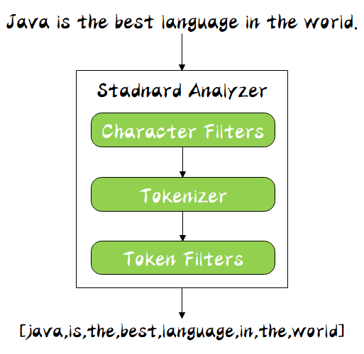

#### 什么是 Analysis

顾名思义，文本分析就是**把全文本转换成一系列单词的过程**，也叫**分词**。在 ES 中，Analysis 是通过**分词器（Analyzer）** 来实现的，可使用 ES 内置的分析器或者按需定制化分析器。

举一个分词简单的例子：比如你输入 `Mastering Elasticsearch`，会自动帮你分成两个单词，一个是 `mastering`，另一个是 `elasticsearch`，可以看出单词也被转化成了小写的。

#### 分词器的组成

分词器是专门处理分词的组件，分词器由以下三部分组成：

- **Character Filters**：针对原始文本处理，比如去除 html 标签
- **Tokenizer**：按照规则切分为单词，比如按照空格切分
- **Token Filters**：将切分的单词进行加工，比如大写转小写，删除 stopwords，增加同义语



同时 Analyzer 三个部分也是有顺序的，从图中可以看出，从上到下依次经过 `Character Filters`，`Tokenizer` 以及 `Token Filters`，这个顺序比较好理解，一个文本进来肯定要先对文本数据进行处理，再去分词，最后对分词的结果进行过滤。

其中，ES 内置了许多分词器：

- **Standard Analyzer** - 默认分词器，按词切分，小写处理（常用）
- **Simple Analyzer** - 按照非字母切分（遇到不是字母的就分割），小写处理
- **Stop Analyzer** - 小写处理，停用词过滤（遇到the ，a，is等词就分割）
- **Whitespace Analyzer** - 按照空格切分，不转小写（遇到空格就分割）
- **Keyword Analyzer** - 不分词，直接将输入当做输出
- **IK**-支持自定义词库，支持热更新分词字典（常用）

#### 安装IK分词器

+ 下载 es版本对应的 IK 版本
+ 进入容器docker exec -it es bash
+ 通过elasticsearch-plugin install 安装对应版本
+ 重启容器

#### IK分词器使用

+ 当我们存入数据时es会根据我们配置的分词器，将数据进行分词处理方便搜索查询

```
{
    "settings" : {
        "analysis" : {
            "analyzer" : {
                "ik" : {
                    "tokenizer" : "ik_max_word"
                }
            }
        }
    },
    "mappings" : {
        "motor_fans_short_topic" : {
            "dynamic" : true,
            "properties" : {
                "info" : { 
                		"type": "text",
                    "analyzer": "ik_max_word",
                    "search_analyzer": "ik_max_word"
                  },
                "title" : {
                    "type": "text",
                    "analyzer": "ik_max_word",
                    "search_analyzer": "ik_max_word"
                }
            }
        }
    }
}
```

ik_max_word 和 ik_smart 什么区别

+ ik_max_word: 会将文本做最细粒度的拆分，比如会将“中华人民共和国国歌”拆分为“中华人民共和国,中华人民,中华,华人,人民共和国,人民,人,民,共和国,共和,和,国国,国歌”，会穷尽各种可能的组合，适合 Term Query
+ ik_smart: 会做最粗粒度的拆分，比如会将“中华人民共和国国歌”拆分为“中华人民共和国,国歌”，适合短语查询

