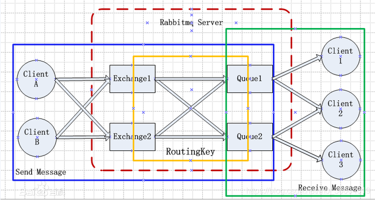

### 介绍

MQ全称为Message Queue, 消息队列（MQ）是一种应用程序对应用程序的通信方法，举例：微信用户A给微信用户B发送一条消息需要通过腾讯的服务器转发，那么这个腾讯服务器就是充当了MQ的角色。

### 组件说明

1. **RabbitMQ Server：**他的角色就是维护一条从Producer到Consumer的路线，保证数据能够按照指定的方式进行传输。

2. **Producer：**生产者,数据的发送方。

3. **Consumer：**消费者，数据的接收方。

4. **queue：**消息队列

5. **Connection：**Producer和Consumer都是通过TCP连接到RabbitMQ Server的。以后我们可以看到程序的起始处就是建立这个TCP连接。

6. **Channels：**

   建立和关闭TCP连接是有代价的，频繁的建立关闭TCP连接对于系统的性能有很大的影响，而且TCP的连接数也有限制，这也限制了系统处理高并发的能力，所以channel可以将不同的TCP进行复用。

7. **使用ack确认Message的正确传递：**

   默认情况下，如果Message 已经被某个Consumer正确的接收到了，那么该Message就会被从queue中移除。当然也可以让同一个Message发送到很多的Consumer。管理消息是否被接收，从而进行是否清除消息。 

8. **Exchanges：**

   从架构图可以看出，Producer的Message进入了Exchange。接着通过“routing keys”会安排把这个Message放到哪个queue里。queue是通过这个routing keys来做的绑定。如果 routing key 匹配, 那么Message就会被传递到相应的queue中。其实在queue创建时，它会自动的以queue的名字作为routing key来绑定那个exchange。

9. **Virtual hosts：**

   每个virtual host本质上都是一个RabbitMQ Server，拥有它自己的queue，exchagne，和bings rule等等。这保证了你可以在多个不同的application中使用RabbitMQ，类似在一个mysql中建立不同的数据库一样。

### 结构图

