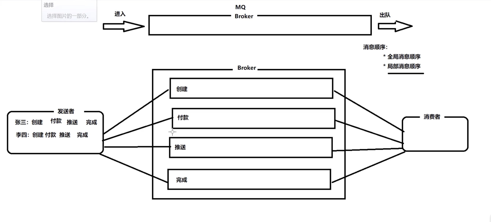
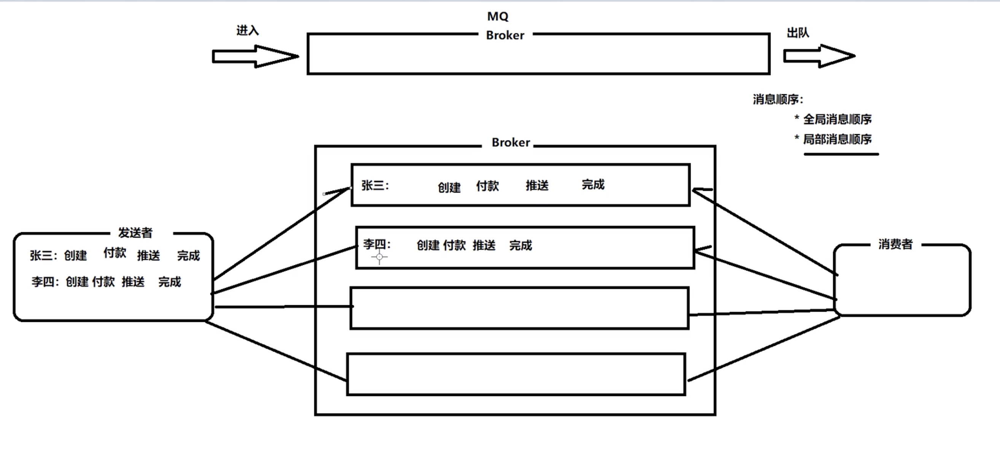

####  顺序消息

消息有序指的是可以按照消息的发送顺序来消费。RocketMQ可以严格的保证消息有序，可以分为分区有序或者全局有序。

下面用订单进行分区有序的示例。一个订单的顺序流程是：创建、付款、推送、完成。使用顺序消息后订单号相同的消息会被先后发送到同一个队列中，消费时，同一个OrderId获取到的肯定是同一个队列。

##### 使用顺序消息前

##### 使用顺序消息后

##### 
