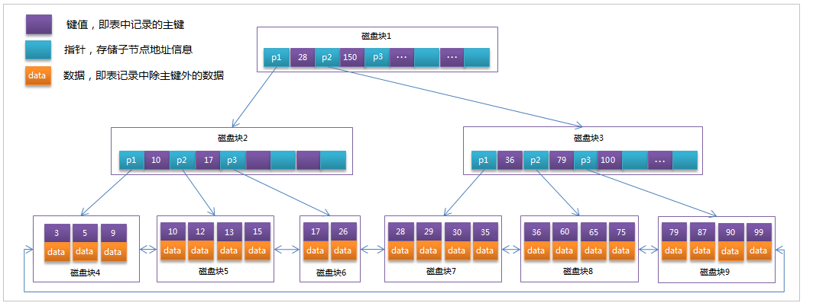

#### 索引概述

+ MySQL官方对索引的定义为：索引（index）是帮助MySQL高效获取数据的数据结构（有序）。
+ 在数据之外，数据库系统还维护着满足特定查找算法的数据结构，这些数据结构以某种方式引用（指向）数据， 这样就可以在这些数据结构上实现高级查找算法，这种数据结构就是索引。如图所示 : 
  + MySql索引数据结构对经典的B+Tree进行了优化。在原B+Tree的基础上，增加一个指向相邻叶子节点的链表指针，就形成了带有顺序指针的B+Tree，提高区间访问的性能。
  + 
  + 每个节点分别包含索引键值和一个指向对应数据记录物理地址的指针（类似一本书目录，这个目录指向的页数就是数据物理地址）
  + 一般来说索引本身也很大，不可能全部存储在内存中，因此索引往往以索引文件的形式存储在磁盘上。索引是数据库中用来提高性能的最常用的工具。
  + 类似一本字典如果没有目录结构，每一次查询汉字时都要从头开始翻阅直到找到要查询的汉字，这个过程相当耗费人力（CPU、I/O）,所以会增加目录这个东西方便查阅，对于mysql来说当我们每添加一条数据时，这个B+Tree都要进行维护，所以对于创建索引要权衡考虑。

#### 索引优势劣势

+ 优势
  +  类似于书籍的目录索引，提高数据检索的效率，降低数据库的IO成本。
  + 通过索引列对数据进行排序，降低数据排序的成本，降低CPU的消耗。

+ 劣势
  + 实际上索引也是一张表，该表中保存了主键与索引字段，并指向实体类的记录，所以索引列也是要占用空间的。
  + 虽然索引大大提高了查询效率，同时却也降低更新表的速度，如对表进行INSERT、UPDATE、DELETE。**因为更新表时，MySQL 不仅要保存数据，还要操作索引结构的节点内容**

#### 索引查询流程（user_id已被创建好索引）

1. 先从跟节点开始扫描
2. 利用B+Tree的数据结构优势进行定位
3. 找到对应的user_id时，通过指针获取该条数据存储的物理地址拿到数据即可。

#### 索引结构

+ 索引是在MySQL的存储引擎层中实现的，而不是在服务器层实现的。所以每种存储引擎的索引都不一定完全相同，也不是所有的存储引擎都支持所有的索引类型的。MySQL目前提供了以下4种索引：
  + BTREE 索引 ： 最常见的索引类型，大部分索引都支持 B 树索引。
  + HASH 索引：只有Memory引擎支持 ， 使用场景简单 。
  + R-tree 索引（空间索引）：空间索引是MyISAM引擎的一个特殊索引类型，主要用于地理空间数据类型，通常使用较少，不做特别介绍。
  + Full-text （全文索引） ：全文索引也是MyISAM的一个特殊索引类型，主要用于全文索引，InnoDB从Mysql5.6版本开始支持全文索引。

<b>MyISAM、InnoDB、Memory三种存储引擎对各种索引类型的支持</b>

| 索引        | InnoDB引擎      | MyISAM引擎 | Memory引擎 |
| ----------- | --------------- | ---------- | ---------- |
| BTREE索引   | 支持            | 支持       | 支持       |
| HASH 索引   | 不支持          | 不支持     | 支持       |
| R-tree 索引 | 不支持          | 支持       | 不支持     |
| Full-text   | 5.6版本之后支持 | 支持       | 不支持     |

**我们平常所说的索引，如果没有特别指明，都是指B+树（多路搜索树，并不一定是二叉的）结构组织的索引。其中聚集索引、复合索引、前缀索引、唯一索引默认都是使用 B+tree 索引，统称为索引。**

#### 索引设计原则

- 对查询频次较高，且数据量比较大的表建立索引,如果一张表查询要求不是很高就没有必要建索引。

- 索引字段的选择，最佳候选列应当从where子句的条件中提取。

- 使用唯一索引，区分度越高，使用索引的效率越高。

- 索引可以有效的提升查询数据的效率，但索引数量不是多多益善，索引越多，维护索引的代价自然也就水涨船高。对于插入、更新、删除等DML操作比较频繁的表来说，索引过多，会引入相当高的维护代价，降低DML操作的效率，增加相应操作的时间消耗。

