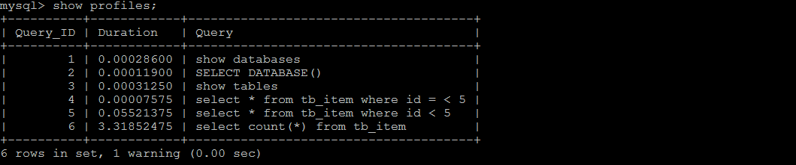

#### 慢查询日志 : 通过慢查询日志定位那些执行效率较低的 SQL 语句。

#### explain分析执行计划

通过以上步骤查询到效率低的 SQL 语句后，可以通过 EXPLAIN命令获取 MySQL如何执行 SELECT 语句的信息，包括在 SELECT 语句执行过程中表如何连接和连接的顺序。

查询SQL语句的执行计划 ： 

```sql
explain  select * from tb_item where id = 1;
```

  

| 字段          | 含义                                                         |
| ------------- | ------------------------------------------------------------ |
| id            | 一条sql语句中执行的sql语句的顺序，id值越大，优先级越高，越先被执行 |
| select_type   | 表示 SELECT 的类型，查看那些有没有使用嵌套查询的sql,SIMPLE说明最规范的sql |
| table         | 输出结果集的表                                               |
| type          | 表示表的连接类型，性能由好到差的连接类型为( system  --->  const  ----->  eq_ref  ------>  ref  ------->  ref_or_null---->  index_merge  --->  index_subquery  ----->  range  ----->  index  ------> all ) |
| possible_keys | 表示查询时，可能使用的索引                                   |
| key           | 表示实际使用的索引                                           |
| key_len       | 索引字段的长度                                               |
| rows          | 扫描行的数量 行数越少越好                                    |
| extra         | 其他的额外的执行计划信息，在该列展示 。                      |

##### explain 之 id

id值越大，优先级越高，越先被执行，先执行t_user再执行user_role最后执行t_role

 

##### explain 之 select_type

| select_type | 含义                                                         |
| ----------- | ------------------------------------------------------------ |
| SIMPLE      | 简单的select查询，查询中不包含子查询                         |
| PRIMARY     | 从一个嵌套查询的结果集里，查找索引的值                       |
| SUBQUERY    | 在SELECT 或 WHERE 列表中包含了子查询                         |
| DERIVED     | 在FROM 列表中包含的子查询，被标记为 DERIVED（衍生） MYSQL会递归执行这些子查询，把结果放在临时表中 |

##### explain 之  key

+ possible_keys : 当前sql可能应用在这张表的索引， 一个或多个。 
+ key ： 当前sql实际使用的索引， 如果为NULL， 则没有使用索引。
+ key_len : 表示索引中使用的字节数， 该值为索引字段最大可能长度，并非实际使用长度，在不损失精确性的前提下， 长度越短越好 

##### explain 之 extra

| extra            | 含义                                                         |
| ---------------- | ------------------------------------------------------------ |
| using  filesort  | 常见于 order by 和 group by对应的字段不是索引； 效率低       |
| using  temporary | 常见于 order by 和 group by对应的字段不是索引； 效率低       |
| using  index     | 表示相应的select操作使用了覆盖索引， 避免访问表的数据行， 效率不错。 |

#### show profile分析SQL

通过profile，我们能够更清楚地了解SQL执行的过程。首先，我们可以执行一系列的操作，如下图所示：

```sql
show databases;

use db01;

show tables;

select * from tb_item where id < 5;

select count(*) from tb_item;
```

执行完上述命令之后，再执行show profiles 指令， 来查看SQL语句执行的耗时：

  

通过show  profile for  query  query_id 语句可以查看到该SQL执行过程中每个线程的状态和消耗的时间：

 

```tex
Sending data 状态表示MySQL线程开始访问数据行并把结果返回给客户端，而不仅仅是返回个客户端。由于在Sending data状态下，MySQL线程往往需要做大量的磁盘读取操作，所以经常是整各查询中耗时最长的状态。
```
