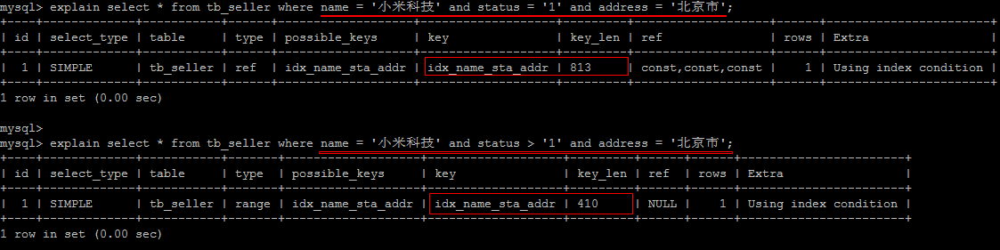

#### 索引的使用

##### 1. 准备环境

```sql
create table `tb_seller` (
	`sellerid` varchar (100),
	`name` varchar (100),
	`nickname` varchar (50),
	`password` varchar (60),
	`status` varchar (1),
	`address` varchar (100),
	`createtime` datetime,
  primary key(`sellerid`)
)engine=innodb default charset=utf8mb4; 
create index idx_seller_name_sta_addr on tb_seller(name,status,address); //联合索引
```

##### 2. 避免索引失效

1).  全值匹配 ，对索引中所有列都指定具体值。 该情况下，索引生效，执行效率高。类似爬楼梯（name,status,address）分别为1楼、二楼、三楼。每个层楼都是一个索引，但是想用三个索引必须从一楼开始往上爬。

```sql
explain select * from tb_seller where name='小米科技' and status='1' and address='北京市'\G;
```

 


2). 最左前缀法则

如果索引了多列，要遵守最左前缀法则。指的是查询从索引的最左前列开始，并且不跳过索引中的列。

匹配最左前缀法则，走索引：

  


违法最左前缀法则 ， 索引失效：

 


如果符合最左法则，但是出现跳跃某一列，只有最左列索引生效：

 


3). 范围查询右边的列，不能使用索引 。

 

4). 不要在索引列上进行运算操作， 索引将失效。

 


5). 字符串不加单引号，造成索引失效。在查询时，没有对字符串加单引号，MySQL的查询优化器，会自动的进行类型转换，造成索引失效。

 


6). 尽量使用覆盖索引，减少select * 。

 

如果查询列，超出索引列，也会降低性能。

 

```
TIP : 
	
    using index ：使用覆盖索引的时候就会出现

    using where：在查找使用索引的情况下，需要回表去查询所需的数据

    using index condition：查找使用了索引，但是需要回表查询数据

    using index ; using where：查找使用了索引，但是需要的数据都在索引列中能找到，所以不需要回表查询数据
```


7). 用or分割开的条件， 如果or前的条件中的列有索引，而后面的列中没有索引，那么涉及的索引都不会被用到。示例，name字段是索引列 ， 而createtime不是索引列，中间是or进行连接是不走索引的 ： 

 


8).  以%开头的Like模糊查询，索引失效。如果仅仅是尾部模糊匹配，索引不会失效。如果是头部模糊匹配，索引失效。

 

解决方案 ： 

通过覆盖索引来解决 

 

9). is  NULL ， is NOT NULL  有时索引失效。

  


10). in 走索引， not in 索引失效。

  


11). 单列索引和复合索引。

尽量使用复合索引，而少使用单列索引 。因为在进行复合查询时，复合索引都会用到，但是单列索引mysql只选择一个最优的

创建复合索引 

```
create index idx_name_sta_address on tb_seller(name, status, address);

就相当于创建了三个索引 ： 
	name
	name + status
	name + status + address
```

创建单列索引 

```
create index idx_seller_name on tb_seller(name);
create index idx_seller_status on tb_seller(status);
create index idx_seller_address on tb_seller(address);
```

数据库会选择一个最优的索引（辨识度最高索引）来使用，并不会使用全部索引 。