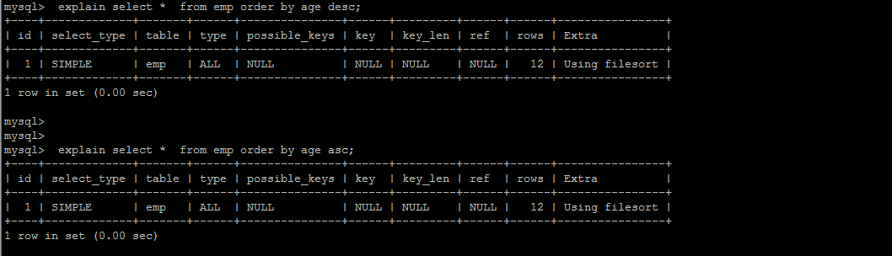
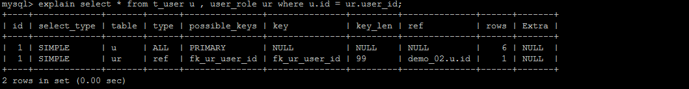

+ **优化insert语句**

  如果需要同时对一张表插入很多行数据时，应该尽量使用多个值表的insert语句，这种方式将大大的缩减客户端与数据库之间的连接、关闭等消耗。使得效率比分开执行的单个insert语句快。

+ **优化order by语句**

  #####  环境准备

  ```SQL
  CREATE TABLE `emp` (
    `id` int(11) NOT NULL AUTO_INCREMENT,
    `name` varchar(100) NOT NULL,
    `age` int(3) NOT NULL,
    `salary` int(11) DEFAULT NULL,
    PRIMARY KEY (`id`)
  ) ENGINE=InnoDB  DEFAULT CHARSET=utf8mb4;
  create index idx_emp_age_salary on emp(age,salary);//联合索引
  ```

  #####  两种排序方式

  1). 第一种通过索引排序，但是查询结果不只有索引，查询排序效率低（Filesort）

   

  2). 第二种通过索引排序，查询结果只有索引，操作效率高。

   

  3).多字段排序 Order By 的顺序和索引顺序不相同和相同的差别

   

  ##### 优化思路：

  + 尽量减少额外的排序，通过索引直接返回有序数据。
  + where 条件和Order by 使用相同的索引，并且Order By 的顺序和索引顺序相同，
  +  并且Order  by 的字段都是升序，或者都是降序。否则肯定需要额外的操作，这样就会出现FileSort。

+ **优化group by 语句**

  执行计划为 : 

    

  优化后

    

  ##### 优化思路：

  group by  内部自动会进行排序操作，从上面的例子可以看出，第一个SQL语句需要进行"filesort"，而第二个SQL由于order  by  null 不需要进行 "filesort"， 而上文提过Filesort往往非常耗费时间。

+ **优化嵌套查询**

  执行计划为 : 

     

  优化后 :
  
     

  ##### 优化思路：

  连接(Join)查询之所以更有效率一些 ，是因为MySQL不需要在内存中创建临时表来完成这个逻辑上需要两个步骤的查询工作。

+ **优化OR条件** 

  执行计划为： 

    

  建议使用 union 替换 or ： 

   

  我们来比较下重要指标，发现主要差别是 type 和 ref 这两项，type 显示的是访问类型，是较为重要的一个指标，结果值从好到坏依次是：

  ```
  system > const > eq_ref > ref > fulltext > ref_or_null  > index_merge > unique_subquery > index_subquery > range > index > ALL
  ```

  ##### 优化思路：

  UNION 要优于 OR 。

+ **优化分页查询**

  一般分页查询时，通过创建覆盖索引能够比较好地提高性能。一个常见又非常头疼的问题就是 limit 2000000,10  ，此时需要MySQL排序前2000010 记录，仅仅返回2000000 - 2000010 的记录，其他记录丢弃，查询排序的代价非常大 。

   

  ##### 优化思路：

  在索引上完成排序分页操作，最后根据主键关联回原表查询所需要的其他列内容。

   

  
