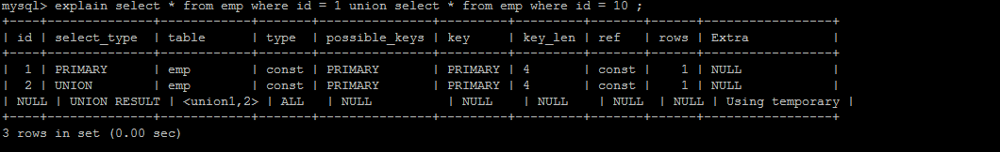

#####  环境准备

结果值从好到坏依次是：

```
system > const > eq_ref > ref > fulltext > ref_or_null  > index_merge > unique_subquery > index_subquery > range > index > ALL
```

```SQL
CREATE TABLE `emp` (
  `id` int(11) NOT NULL AUTO_INCREMENT,
  `name` varchar(100) NOT NULL,
  `age` int(3) NOT NULL,
  `salary` int(11) DEFAULT NULL,
  PRIMARY KEY (`id`)
) ENGINE=InnoDB  DEFAULT CHARSET=utf8mb4;
create index idx_emp_age_salary on emp(age,salary);//联合索引
```

+ **优化嵌套查询**

  执行计划为 : 

     

  优化后 :

     

  ##### 优化思路：

  连接(Join)查询之所以更有效率一些 ，是因为MySQL不需要在内存中创建临时表来完成这个逻辑上需要两个步骤的查询工作。

+ **优化OR条件** 

  执行计划为： 

    

  建议使用 union 替换 or ： 

   

  ##### 优化思路：

  UNION 要优于 OR 。

  

+ **优化分页查询**

  执行计划为：

  ```
  select * from news order by id desc limit 0,10
  耗时0.003秒
  select * from news order by id desc limit 10000,10
  耗时0.058秒
  select * from news order by id desc limit 100000,10 
  耗时0.575秒
  select * from news order by id desc limit 1000000,10
  耗时7.28秒
  ```

  ##### 改进方案 1

  我们使用条件对id进行了筛选，在子查询 (select id from news order by id desc limit 1000000, 1) 中我们只查询了id这一个字段比起select * 或 select 多个字段 节省了大量的查询开销！

  ```
  select * from news  where id >  (select id from news order by id desc  limit 1000000, 1) order by id desc limit 0,10
  耗时0.365秒
  ```

  ##### 改进方案2

  适合id连续的系统，速度极快！不适合带有条件的、id不连续的查询。速度非常快！

  ```
  select * from news 
  where id  between 1000000 and 1000010 
  order by id desc
  ```


