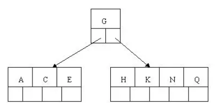

 #### BTREE 结构

BTree又叫多路平衡搜索树，一颗m叉的BTree特性如下：

- 树中每个节点最多包含m个孩子。
- 除根节点与叶子节点外，每个节点至少有[ceil(m/2)]个孩子。
- 若根节点不是叶子节点，则至少有两个孩子。
- 所有的叶子节点都在同一层。
- 每个非叶子节点由n个key与n+1个指针组成，其中[ceil(m/2)-1] <= n <= m-1 

以5叉BTree为例，key的数量：公式推导[ceil(m/2)-1] <= n <= m-1。所以 2 <= n <=4 。当n>4时，中间节点分裂到父节点，两边节点分裂。

插入 C N G A H E K Q M F W L T Z D P R X Y S 数据为例。

演变过程如下：

1). 插入前4个字母 C N G A 

 

2). 插入H，n>4，中间元素G字母向上分裂到新的节点

 

3). 插入E，K，Q不需要分裂

 

4). 插入M，中间元素M字母向上分裂到父节点G

 

5). 插入F，W，L，T不需要分裂

 

6). 插入Z，中间元素T向上分裂到父节点中 

 

7). 插入D，中间元素D向上分裂到父节点中。然后插入P，R，X，Y不需要分裂

 

8). 最后插入S，NPQR节点n>5，中间节点Q向上分裂，但分裂后父节点DGMT的n>5，中间节点M向上分裂

 

到此，该BTREE树就已经构建完成了， **BTREE树 和 二叉树 相比， 查询数据的效率更高， 因为对于相同的数据量来说，BTREE的层级结构比二叉树小，因此搜索速度快。**