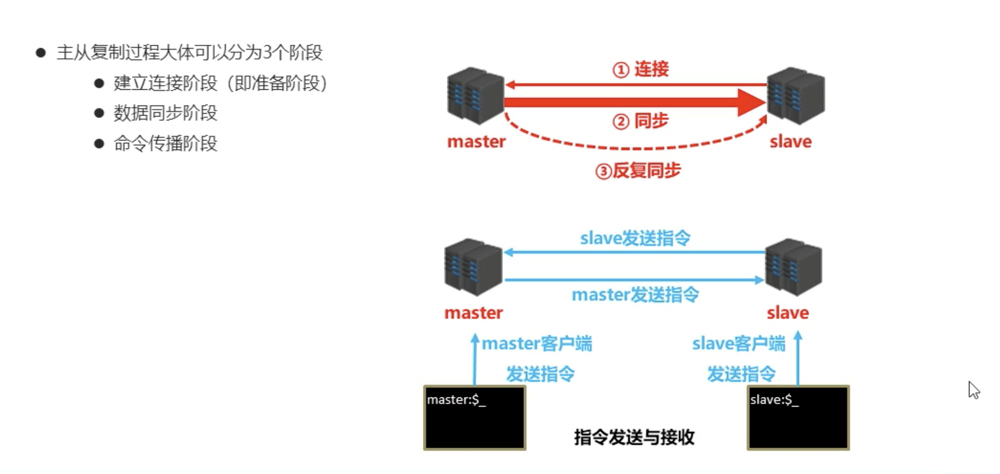

+ **建立连接阶段工作流程**

  

  

  

  

  主从连接（slave连接master）

  ```
  方式一：客户端发送命令
  slaveof <masterip> <masterport>
  
  方式二：启动服务器参数
  redis-server -slaveof <masterip> <masterport>
  
  方式三：服务器配置
  slaveof <masterip> <masterport>
  ```

  授权访问

  ```
  #master设置密码 （没有启动）
  requirepass <password>
  
  #master配置文件设置密码（已经启动）
  config set requirepass <password>
  config get requirepass
  *********************************************
  #slave配置文件设置密码连接master
  masterauth <password>
  
  #slave启动服务器设置密码连接master
  redis-server –a <password>
  ```

+ **数据同步阶段工作流程**

  + 

  + 数据同步阶段master说明
    1. 如果master数据量巨大，数据同步阶段应避开流量高峰期，避免造成master阻塞，影响业务正常执行

    2. 复制缓冲区大小设定不合理，会导致数据溢出。如进行全量复制周期太长，进行部分复制时发现数据已经存在丢失的情况，必须进行第二次全量复制，致使slave陷入死循环状态。

       解决：

       1. 在maxter 修改赋值缓冲区的大小：`repl-backlog-size 1mb`
       2. master单机内存占用主机内存的比例不应过大，建议使用50%-70%的内存，留下30%-50%的内存用于执行bgsave命令和创建复制缓冲区（复制缓冲区：就是在没有写入到磁盘的数据，还在内存里存着）
  + 数据同步阶段slave说明（这里指的是在第一次进行主从复制时）
    1. 为避免slave进行全量复制、部分复制时服务器响应阻塞或数据不同步，建议关闭此期间的对外服务`slave-serve-stale-data yes|no`
    2. 多个slave同时对master请求数据同步，master发送的RDB文件增多，会对带宽造成巨大冲击，如果master带宽不足，因此数据同步需要根据业务需求，适量错峰
    3. slave过多时，建议调整拓扑结构，由一主多从结构变为树状结构，中间的节点既是master，也是slave。注意使用树状结构时，由于层级深度，导致深度越高的slave与最顶层master间数据同步延迟较大，数据一致性变差，应谨慎选择

+ **命令传播阶段及心跳机制**

  进入命令传播阶段时，master与slave间需要进行信息交换，使用心跳机制进行维护，实现双方连接保持在线

  1. master心跳

     ```
     指令：PING
     周期：由repl-ping-slave-period决定，默认10秒 
     作用：判断slave是否在线
     查询：INFO replication 获取slave最后一次连接时间间隔，lag项维持在0或1视为正常
     ```

  2. slave心跳

     ```
     指令：REPLCONF ACK {offset}
     周期：1秒
     作用1：汇报slave自己的复制偏移量，获取最新的数据变更指令
     作用2：判断master是否在线
     ```

+ **主从复制工作流程（完整）**

  

+ **主从复制问题**

  ```
  问题现象：频繁的全量复制
  问题原因：复制缓冲区过小slave的offset越界，触发全量复制
  最终结果：slave反复进行全量复制
  解决方案：修改复制缓冲区大小 repl-backlog-size
  ```
