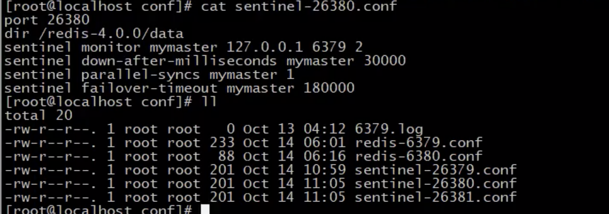
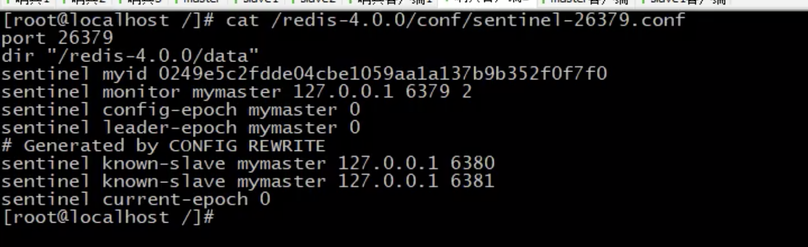

**哨兵简介**

+ 哨兵(sentinel) 是一个分布式系统，用于对主从结构中的每台服务器进行监控，当出现故障时通过投票机制选择新的master并将所有slave连接到新的master。
+ 哨兵也是一台redis服务器，只是不提供数据服务通常哨兵配置数量为单数，因为选举可能出现打平

**配置哨兵**

将所有哨兵监听的服务统称为myaster，然后针对mymaster进行调控处理

```
port 26379 自己的端口
sentinel auth-pass mymaster 123456 监听主服务器密码
sentinel monitor mymaster 127.0.0.1 6379 2 监听服务器地址
sentinel down-after-milliseconds mymaster 3000 监听的服务如果3000毫秒没有相应则认定服务挂掉
sentinel parallel-syncs mymaster 2  如果mymaster超过2个出现问题，则认定服务挂掉了
sentinel failover-timeout mymaster 1800 如果指定出现故障后，故障切换的最大超时时间18秒，超过该值，认定切换失败，默认3分钟
```




**哨兵服务启动**

配置文件会发生变化




**哨兵工作原理**

当发现主节点挂掉后哨兵服务会推举某个从节点作为主节点

1. 哨兵服务启动阶段

   + 

   + redis节点和哨兵节点互联信息同步互联，相当于哨兵节点的每个节点都存了一份全局数据

     

2. 哨兵服务通过cmd通道和redis服务进行监听，然后告知其他哨兵服务

   

3. 故障转移阶段

   1. 通知阶段

      

   2. 派一个哨兵去处理redis主从问题（哨兵选举阶段，ruft协议选举规则）

      

   3. 哨兵进行redis主从选举，挑选条件

      

