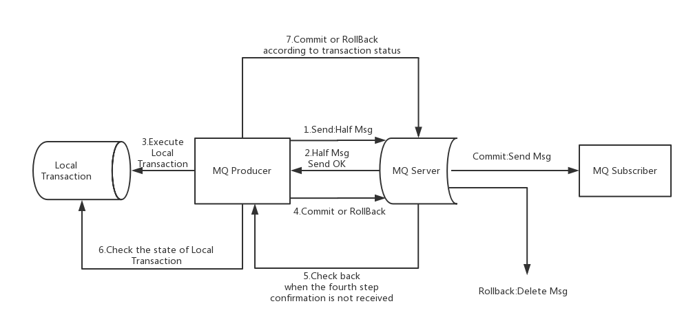

####  1. 顺序消息

消息有序指的是可以按照消息的发送顺序来消费。RocketMQ可以严格的保证消息有序，可以分为分区有序或者全局有序。

下面用订单进行分区有序的示例。一个订单的顺序流程是：创建、付款、推送、完成。订单号相同的消息会被先后发送到同一个队列中，消费时，同一个OrderId获取到的肯定是同一个队列。

##### 使用顺序消息前


##### 使用顺序消息后


#### 2. 延时消息

比如电商里，提交了一个订单就可以发送一个延时消息，1h后去检查这个订单的状态，如果还是未付款就取消订单释放库存。

##### 启动消息消费者

```
// 注册消息监听者
consumer.registerMessageListener(new MessageListenerConcurrently() {}
```

##### 发送延时消息

```
// 设置延时等级3,这个消息将在10s之后发送(现在只支持固定的几个时间,详看delayTimeLevel)
message.setDelayTimeLevel(3);
// 发送消息
producer.send(message);
```

#### 3. 批量消息

批量发送消息能显著提高传递小消息的性能。限制是这些批量消息应该有相同的topic，相同的waitStoreMsgOK，而且不能是延时消息。此外，这一批消息的总大小不应超过4MB。

##### 发送批量消息

如果您每次只发送不超过4MB的消息，则使用批处理，大于4MB则进行分割

```
List<Message> messages = new ArrayList<>();
messages.add(new Message(topic, "TagA", "OrderID001", "Hello world 0".getBytes()));
messages.add(new Message(topic, "TagA", "OrderID002", "Hello world 1".getBytes()));
messages.add(new Message(topic, "TagA", "OrderID003", "Hello world 2".getBytes()));
```

#### 4. 过滤消息

1. 在大多数情况下，TAG是一个简单而有用的设计，其可以来选择您想要的消息。例如：

```java
DefaultMQPushConsumer consumer = new DefaultMQPushConsumer("CID_EXAMPLE");
consumer.subscribe("TOPIC", "TAGA || TAGB || TAGC");
```

2. 使用SQL表达式筛选消息。SQL特性可以通过发送消息时的属性来进行计算

```
------------
| message  |
|----------|  a > 5 AND b = 'abc'
| a = 10   |  --------------------> Gotten
| b = 'abc'|
| c = true |
------------
------------
| message  |
|----------|   a > 5 AND b = 'abc'
| a = 1    |  --------------------> Missed
| b = 'abc'|
| c = true |
------------
```

消息生产者

```
msg.putUserProperty("a", String.valueOf(i));
```

消息消费者

```
// 只有订阅的消息有这个属性a, a >=0 and a <= 3
consumer.subscribe("TopicTest", MessageSelector.bySql("a between 0 and 3");
```

#### 5.  事务消息

##### 流程分析



上图说明了事务消息的大致方案，其中分为两个流程：正常事务消息的发送及提交、事务消息的补偿流程。

##### 1. 事务消息发送及提交

(1) 发送消息（half消息）。

(2) 服务端响应消息写入结果。

(3) 根据发送结果执行本地事务（如果写入失败，此时half消息对业务不可见，本地逻辑不执行）。

(4) 根据本地事务状态执行Commit或者Rollback（Commit操作生成消息索引，消息对消费者可见）

##### 2. 事务补偿

(1) 对没有Commit/Rollback的事务消息（pending状态的消息），从服务端发起一次“回查”

(2) Producer收到回查消息，检查回查消息对应的本地事务的状态

(3) 根据本地事务状态，重新Commit或者Rollback其中，补偿阶段用于解决消息Commit或者Rollback发生超时或者失败的情况。

##### 3. 事务消息状态

事务消息共有三种状态，提交状态、回滚状态、中间状态：

* TransactionStatus.CommitTransaction: 提交事务，它允许消费者消费此消息。
* TransactionStatus.RollbackTransaction: 回滚事务，它代表该消息将被删除，不允许被消费。
* TransactionStatus.Unknown: 中间状态，它代表需要检查消息队列来确定状态。

##### 创建事务性生产者

```
public class Producer {
    public static void main(String[] args) throws MQClientException, InterruptedException {
        //创建事务监听器
        TransactionListener transactionListener = new TransactionListenerImpl();
        //创建消息生产者
        TransactionMQProducer producer = new TransactionMQProducer("group6");
        producer.setNamesrvAddr("192.168.25.135:9876;192.168.25.138:9876");
        //生产者这是监听器
        producer.setTransactionListener(transactionListener);
        //启动消息生产者
        producer.start();
        String[] tags = new String[]{"TagA", "TagB", "TagC"};
        for (int i = 0; i < 3; i++) {
            try {
                Message msg = new Message("TransactionTopic", tags[i % tags.length], "KEY" + i,
                        ("Hello RocketMQ " + i).getBytes(RemotingHelper.DEFAULT_CHARSET));
                SendResult sendResult = producer.sendMessageInTransaction(msg, null);
                System.out.printf("%s%n", sendResult);
                TimeUnit.SECONDS.sleep(1);
            } catch (MQClientException | UnsupportedEncodingException e) {
                e.printStackTrace();
            }
        }
        //producer.shutdown();
    }
}
```

##### 实现事务的监听接口

```
public class TransactionListenerImpl implements TransactionListener {
    @Override
    public LocalTransactionState executeLocalTransaction(Message msg, Object arg) {
        System.out.println("执行本地事务");
        if (StringUtils.equals("TagA", msg.getTags())) {
            return LocalTransactionState.COMMIT_MESSAGE;
        } else if (StringUt   ils.equals("TagB", msg.getTags())) {
            return LocalTransactionState.ROLLBACK_MESSAGE;
        } else {
            return LocalTransactionState.UNKNOW;
        }

    }
    @Override
    public LocalTransactionState checkLocalTransaction(MessageExt msg) {
        System.out.println("MQ检查消息Tag【"+msg.getTags()+"】的本地事务执行结果");
        return LocalTransactionState.COMMIT_MESSAGE;
    }
}
```


