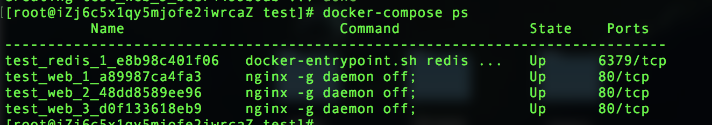
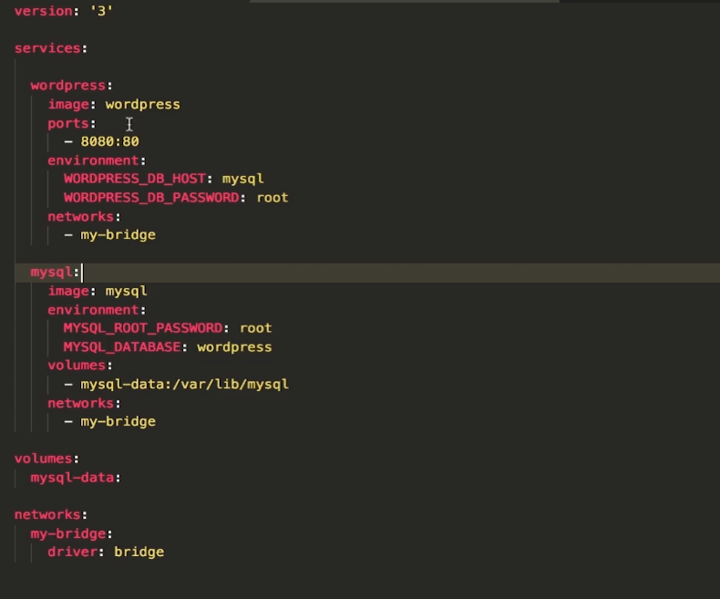
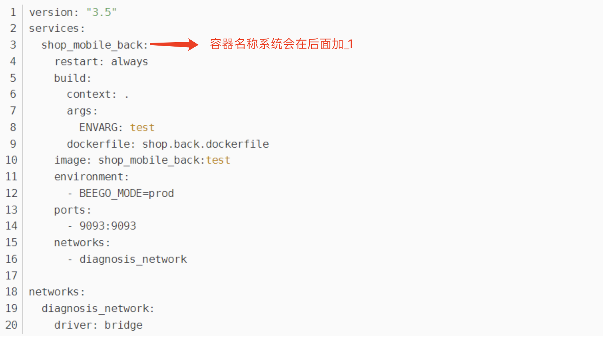
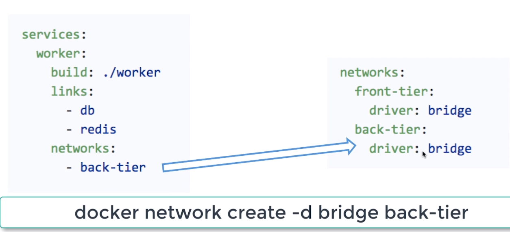

#### Docker Compose 概述

- Docker Compose是一个方便操作docker命令（方便管理docker）的工具，可以通过docker-compose操作任意的docker命令。
- 这个工具可以通过一个yml文件定义多容器的docker应用
- 通过一条命令就可以根据yml文件的定义去创建或者管理这多个容器

#### 安装 Docker Compose

- 安装 Docker Compose 可以通过下面命令自动下载适应版本的 Compose可执行文件，并为安装脚本添加执行权限

```ruby
sudo curl -L https://github.com/docker/compose/releases/download/1.21.2/docker-compose-$(uname -s)-$(uname -m) -o /usr/local/bin/docker-compose
sudo chmod +x /usr/local/bin/docker-compose
```

- 查看安装是否成功

```undefined
docker-compose -v
```

#### Docker Compose 常用命令与配置

- **ps**：列出所有运行容器

```undefined
docker-compose ps
```

- **logs**：查看服务日志输出

```undefined
docker-compose logs
```

- **port**：打印绑定的公共端口，下面命令可以输出 redis 服务 3367端口所绑定的公共端口

```undefined
docker-compose port redis 3367
```

- **build**：构建或者重新构建服务(加载dockerfile)

```undefined
docker-compose build
```

- **start**：启动指定服务已存在的容器

```undefined
docker-compose start redis 
```

- **stop**：停止已运行的服务的容器

```undefined
docker-compose stop redis 
```

- **rm**：删除指定服务的容器

```undefined
docker-compose rm redis 
```

- **up**：构建、启动容器

```undefined
docker-compose up
```

+ **down**：停止和删除容器、网络、卷、镜像

```
-v, –volumes，删除已经在compose文件中定义的和匿名的附在容器上的数据卷
```

**scale**：docker 的水平拓展和负载均衡 

+ docker-compose.yml 文件

  ```
  #请注意，这里因为我们要使用到水平拓展，所以是不能绑定端口的
  version: '3'
  services:
    web:
      image: nginx
  ```

+ 执行 scale 

  ```
  docker-compose up --scale web=3 -d #这里的 --scale web=3，是我们设定的服务里面的web 需要启动三个容器 
  ```

+ 我们使用 docker-compose ps ，能够查看到此时三个 web 的容器都开启了5000端口，但是并没有映射到本地。如下：自然生成了三个 web 服务

  


#### docker-compose.yml 属性





+ **version**：指定 compose 文件的版本

+ **services**：多个容器集合

  + 一个service代表一个container，这个container可以从dockerhub的image来创建，或者从本地的Dockerfile中build出来的image来创建
  + service的启动类似docker run，我们可以给其指定network和valume，所以可以给service指定network和Volume的引用

+ **build**：配置构建时，Compose 会利用它自动构建镜像，该值可以是一个路径，也可以是一个对象，用于指定 Dockerfile 参数

  ```undefined
build:
      context: ./dir #Dockerfile所在目录
      dockerfile: Dockerfile #Dockerfile名称
      args: #Dockerfile 在 build 过程中需要的参数
  ```

+ **environment**：环境变量配置，可以用数组或字典两种方式

  ```bash
  environment:
      MYSQL_ROOT_PASSWORD: root
      MYSQL_DATABASE：shop
  ```

- **expose**：暴露端口，只将端口暴露给连接的服务，而不暴露给主机

  ```bash
  expose:
      - "3000"
      - "8000"
  ```

+ **ports**：对外暴露

  ```objectivec
  ports:   # 暴露端口信息  - "宿主机端口:容器暴露端口"
  - "8763:8763"
  - "8763:8763"
  ```

+ **image**：指定服务所使用的镜像（build时是规定镜像名称）

  ```undefined
  image: java
  ```

+ **depends_on**：默认情况下 compose 启动容器的顺序是不确定的，但是有些场景下我们希望能够控制容器的启动顺序，比如应该让运行数据库的程序先启动。我们可以通过 depends_on 来解决有依赖关系的容器的启动顺序问题

  ```
  version: '3'
  services:
    proxy:
      image: nginx
      ports:
        - "80:80"
      depends_on:
        - webapp
        - redis
    webapp:
      build: .
      depends_on:
        - redis
    redis:
      image: redis
  ```

  

+ **network_mode**：设置网络模式

  

+ **volumes**：卷挂载路径

  ```csharp
  services
      mysql:
  	  images: mysql
        volumes:
  		-mysql-data:/var/lib/mysql #挂载
  volumes:
  	mysql-data #创建volumes
  ```

