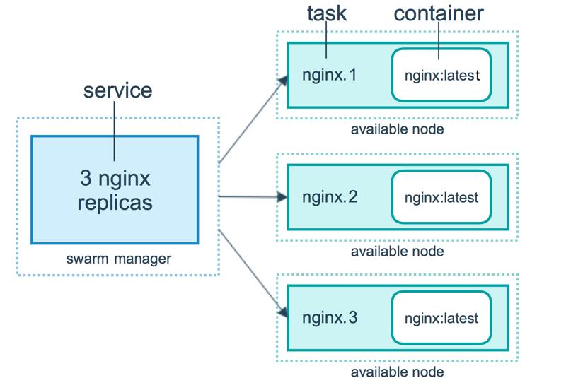

#### 什么是Docker Swarm

+ Docker Swarm是一个可以让容器部署在不同的服务器上，并且统一进行管理的工具。
+ 在微服务使用场景中，比如订单服务、商品服务、用户服务、分别部署不同的服务器上运行，通常的做法是分别在每台服务器上运行docker-compose脚本进行部署，相当浪费时间。
+ 使用Docker Swarm只需要创建一个**mananger**，然后让不同机器加入这个**mananger**，然后统一在**mananger**执行所有服务的启动脚本即可，**mananger**会自动将容器放在不同的节点上运行，只需要通过**mananger**管理所有的服务。

#### Docker Swarm 基本结构图

如下图所示，swarm 集群由管理节点（manager）和工作节点（work node）构成。

- **swarm mananger**：负责整个集群的管理工作包括集群配置、服务管理等所有跟集群有关的工作。
- **work node**：即图中的 available node，主要负责运行相应的服务来执行任务（task）。



#### 使用步骤

1. 创建 swarm 集群管理节点（manager）

2. 初始化 swarm 集群，进行初始化的这台机器，就是集群的管理节点

   ```
   docker swarm init --advertise-addr 192.168.205.10 #这里的 IP 为创建机器时分配的 ip。
   ```

   

   以上输出，证明已经初始化成功。需要把以下这行复制出来，在增加工作节点时会用到：

   ```
   docker swarm join --token SWMTKN-1-6beh04s14g0dw2jdcwhywwkzsmoa0xr7rmj5pxmhf33f074er4-5gxaicgptdr85km0x81nb1aym 192.168.205.10:2377
   ```

3. 创建 swarm 集群工作节点（worker）

   这里直接创建好俩台机器，swarm-worker1 和 swarm-worker2 。

   

   分别进入两个机器里，指定添加至上一步中创建的集群，这里会用到上一步复制的内容。

4. 查看集群信息

   进入管理节点，执行：docker info 可以查看当前集群的信息。

   

   通过画红圈的地方，可以知道当前运行的集群中，有三个节点，其中有一个是管理节点。

5. 部署服务到集群中

   **注意**：跟集群管理有关的任何操作，都是在管理节点上操作的。在swarm 中启动容器用docker service ，类似docker run 。

   以下例子，在一个工作节点上创建一个名为 helloworld 的服务，这里是随机指派给一个工作节点

   ```
   docker@swarm-manager:~$ docker service create --replicas 1 --name helloworld alpine ping docker.com
   ```

6. 查看服务部署情况

   ```
   docker service ls #查看当前所有服务
   docker service ps name #查看服务分部情况
   ```

   查看 helloworld 服务运行在哪个节点上，可以看到目前是在 swarm-worker1 节点：

   

 7. 扩展集群服务

    我们将上述的 helloworld 服务扩展到俩个节点。

    ```
    docker@swarm-manager:~$ docker service scale helloworld=2
    ```

    

8. 删除服务

   ```
   docker@swarm-manager:~$ docker service rm helloworld
   ```

#### 什么是overlay网络

overlay网络用于连接不同机器上的docker容器，允许不同机器上的容器相互通信，同时支持对消息进行加密，当我们初始化一个swarm或是加入到一个swarm中时，在docker主机上会出现两种网络：

1. 称为ingress的overlay网络，用于传递集群服务的控制或是数据消息，若在创建swarm服务时没有指定连接用户自定义的overlay网络，将会加入到默认的ingress网络

2. 名为docker_gwbridge桥接网络会连接swarm中所有独立的docker系统进程

可以使用docker network create创建自定义的overlay网络，容器以及服务可以加入多个网络，只有同一网络中的容器可以相互交换信息，可以将单一容器或是swarm服务连接到overlay网络中，但是两者在overlay网络中的行为会有所不同，接下来会描述两者在overlay网络中的共同行为以及不同行为

#### swarm 部署wordpress

```
#启动 三个节点分别是 manager worker1 worker2
docker network create -d overlay demo #创建overlay网落
docker network list #查看当前网络
#docker service部署mysql服务
docker service create --name mysql --env MYSQL_ROOT_PASSWORD=root --env MYSQL_DATABASE=wordpress --network demo --mount type=volume,source=mysql-data,destination=/var/lib/mysql mysql
docekr service ps msyql #查看容器部署在哪个节点 在manager
docker service create --name wordpress -p 80:80 --network demo mysql #在worker1
结果：三个节点都能访问（swarm内置DNS原理）
```

#### 集群服务间通信之Routing Mesh

Routing Mesh 两种体现

+ Internal
  1. 当使用 docker service创建容器服务时会默认创建一条DNS记录 
  2. DNS记录的是虚拟IP(VIP)，为了在扩展集群时定位到不同服务之间的ip地址进行通信
  3. VIP所指的服务ip是通过LVS处理的（自动负载均衡）

+ Ingress
  1. 如果服务有绑定端口，则此服务可以通过任意swarm节点相应接口访问【三个节点都能访问】

#### Docker Stack部署

+ Docker Stack的作用就是在swarm进行部署、设置服务器方便管理(集群管理工具)
+ 部署步骤
  1. 编写docker-compose.yml 遵循deploy语法规则即可
  2. 部署命令：docker stack deploy wordpress --compose-file=docker-compose.yml

+ 查看命令

  ```
  #查看集群服务个数
  docker stack ls
  #查看某个集群部署个数
  docker stack services name
  ```

+ Docker Stack部署分销商城
  1. 搭建好swarm集群分别为manager、user、goods、order节点
  2. 编写compose.yaml文件
     1. 不能build只能从远程拉取，需要提前准备好镜像
     2. 通过deploy参数设置每个节点，部署的位置，manager节点不做任何服务部署，只负责管理。
     3. 通过docker stack deploy shop --compose-file=docker-compose.yml部署即可

#### Docker Stack和Docker Compose区别

- Docker stack会忽略了“构建”指令，无法使用stack命令构建新镜像，它是需要镜像是预先已经构建好的。 所以docker-compose更适合于开发场景；
- Docker Compose是一个Python项目，在内部，它使用Docker API规范来操作容器。所以需要安装Docker -compose，以便与Docker一起在您的计算机上使用；
- Docker Stack功能包含在Docker引擎中。你不需要安装额外的包来使用它，docker stacks 只是swarm mode的一部分。
- Docker stack不支持基于第2版写的docker-compose.yml ，也就是version版本至少为3。然而Docker Compose对版本为2和3的 文件仍然可以处理；
- docker stack把docker compose的所有工作都做完了，因此docker stack将占主导地位。同时，对于大多数用户来说，切换到使用docker stack既不困难，也不需要太多的开销。如果您是Docker新手，或正在选择用于新项目的技术，请使用docker stack。

#### Docker Secret的管理和使用

+ 由于docker-compose.yml中的密码都是明文，这样就导致了不是很安全
+ 我们知道manager节点保持状态的一致是通过Raft Database这个分布式存储的数据库，它本身就是将信息进行了secret，所以可以利用这个数据库将一些敏感信息，例如账号、密码等信息保存在这里。
+ 然后通过给service授权的方式允许它进行访问，这样达到避免密码明文显示的效果。
+ secret的Swarm中secret的管理通过以下步骤完成：
  1. secret存在于Swarm Manager节点的的Raft Database里
  2. secret可以分配一个service，然后这个service就可以看到这个secret
  3. 在container内部secret看起来像文件，实际上就是内存 

##### Secret的创建有两种方式

1. 基于文件的创建

     ```
     #首先先创建一个文件用于存放密码
     [root@centos-7 ~]# vim mysql-password
     root 	
     #然后再进行创建secret
     [root@centos-7 ~]# docker secret create mysql-pass mysql-password 
     #其中，mysql-pass是secret的名称，mysql-password是我们建立存储密码的文件，这样执行后就相当于将文件中的密码存储在Swarm中manager节点的Raft Database中了。为了安全起见，现在可以直接将这个文件删掉，因为Swarm中已经有这个密码了。
     [root@centos-7 ~]# rm -f mysql-password 
     #现在可以查看一下secret列表：已经存在了。
     [root@centos-7 ~]# docker secret ls
     ```

2. 基于命令行创建 

     ```
     #这种方式还是很简单的就创建成功了
     [root@centos-7 ~]# echo "root" | docker secret create mysql-pass2 -
     hrtmn5yr3r3k66o39ba91r2e4
     [root@centos-7 ~]# docker secret ls
     ```

