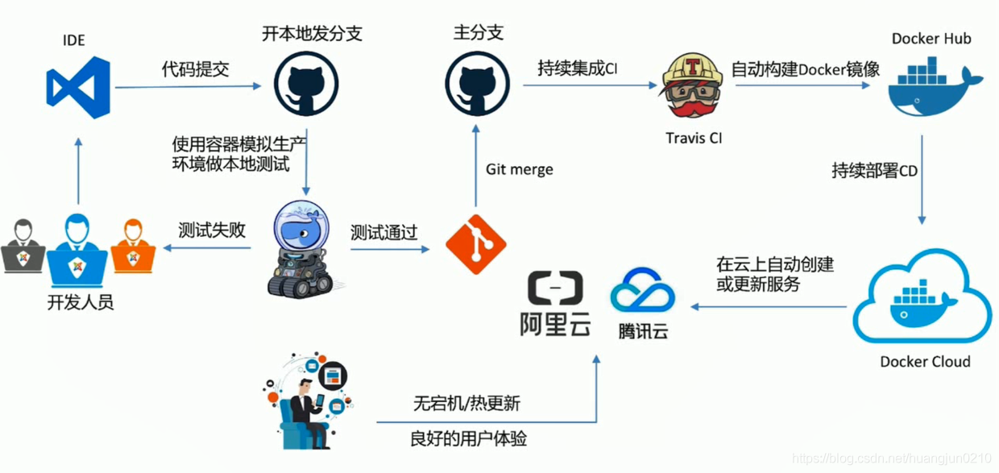

#### 什么是DevOps

+ 纵向集成：打通应用全生命周期（需求、设计、开发、编译、构建、测试、打包、发布、配置、监控等）的工具集成。纵向集成中DevOps强调的重点是跨工具链的「自动化」，最终实现全部人员的「自助化」。举个例子，项目组的开发人员可以通过DevOps的平台上，自主申请开通需要的各种服务，比如开通开发环境、代码库等。
+ 横向集成：打通架构、开发、管理、运维等部门墙。横向集成中DevOps强调的重点是跨团队的「线上协作」，也即是通过IT系统，实现信息的「精确传递」。举个例子，传统的系统上线部署方式，可能是一个冗长的说明文档，上百页都有可能，但在DevOps的平台下，就应该是通过标准运行环境的选择、环境配置的设置、部署流程的编排，实现数字化的「部署手册」，并且这样的手册，不仅操作人员可以理解，机器也能够执行，过程可以被追踪和审计。

##### DevOps工作流程



##### 操作过程描述

1. 开发人员在修改完代码并且本地测试没有问题
2. 提交代码到远程分支
3. 触发Git Hooks、GitLab CI持续集成以及使用Jenkins实现自动化任务
4. Jenkins在测试服务器上进行安装依赖、运行测试、编译、部署测试服务器、部署生产服务器等流程
5. 生成测试结果
6. 运维人员根据测试结果判定是否需要合并到master
7. 当代码合并完之后
8. 当修改dockerfile时docker cloud会自动build成新的镜像
9. docker cloud检测到image有修改会自动部署一个新的服务
10. Devops流程部署完毕

#### 小项目部署流程

1. 开发人员在修改完代码并且本地测试没有问题

2. 提交代码到远程代码仓库，并触发Git Hooks

3. Git Hooks触发sheel脚本

   1. 重新拉取最新代码
   2. 重新编译生成二进制

4. Dockerfile文件将新编译的二进制文件拷贝到容器即可

   ```
   FROM 39.96.27.29:5000/library/golang:runner
   WORKDIR /app
   #变量程序名称
   COPY 宿主机目录/release/conf  ../conf
   COPY 宿主机目录/release  .
   EXPOSE 4043
   ENTRYPOINT ["./mall_user_cmd"]
   ```

5. 运维人员通过Makefile部署对应的容器服务即可

   ```
   MOBILE_TYPE = mobile
   common_dev:
      @./$(MOBILE_TYPE)/common/dev/up.sh 	#up.sh执行compose编译命令，里面写的是【docker-compose up --build -d】
   ```

