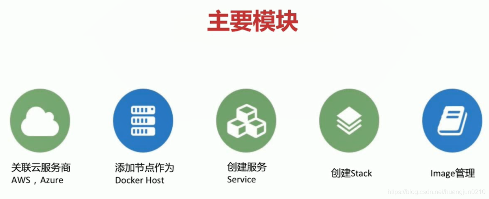

#### 什么是Docker Cloud

- Docker Cloud是提供容器的管理，编排，部署的托管服务。

##### 主要模块

##### 操作

1. 登录 docker cloud服务商平台
2. 将docker cloud和自己的gitHub仓库进行关联
3. 配置自动部署
4. gitHub中dockerfile发生修改时docker cloud会自动build成新的镜像
5. docker cloud检测到image有修改时，会自动在阿里云上部署一个新的服务

