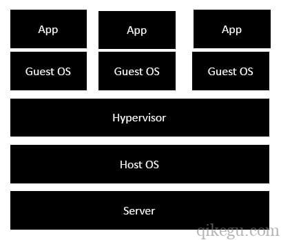
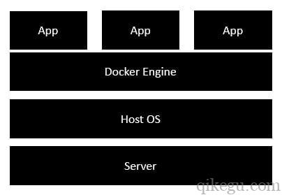

#### Docker和虚拟机的区别

##### 虚拟机的体系结构

+ **server** - 表示真实电脑

+ **Host OS** - 真实电脑的操作系统，例如：Windows，Linux

+ **Hypervisor** - 虚拟机平台，模拟硬件，如VMWare，VirtualBox

+ **Guest OS** - 虚拟机平台上安装的操作系统，例如CentOS Linux

+ **App** - 虚拟机操作系统上的应用，例如nginx

  

##### Docker的体系结构

- **server** - 表示真实电脑。
- **Host OS** - 真实电脑的操作系统，例如：Windows，Linux。
- **Docker Engine** - 新一代虚拟化技术，不需要包含单独的操作系统。
- **App** - 所有的应用程序现在都作为Docker容器运行。

##### docker优势

Docker不需要为虚拟机操作系统提供硬件模拟。所有应用程序都作为Docker容器工作，性能更好

#### Docker 资源隔离

+ ⼀个没有资源限制的容器、基本可以使⽤宿主机器的所有资源、如果可以使⽤所有资源那么和直接部署在宿主机没什么区别

+ Docker 控制内存、cpu、io、提出了资源隔离资源隔离引入了、 Linux系统内核的机制

  + namespace
    1. ⽂件系统需要是被隔离的
    2. ⽹络也是需要被隔离的
    3. 进程间的通信也要被隔离
    4. 针对权限，⽤户和⽤户组也需要隔离
    5. 进程内的PID也需要与宿主机中的PID进⾏隔离
    6. 容器也要有⾃⼰的主机名Namespace 可以做到这些、但是有很多资源不能被隔离⽐如容器内的时间、和宿主机的时间、就隔离不了、再⽐如 任务的挂起 恢复等操作

  + cgroup
    1. cgroups 为资源管理提供了⼀个统⼀接⼝、从单个资源的控制、到操作系统层⾯的虚拟化资源限制、⽐如使⽤内存的上限、CPU的上限任务控制 ⽐如 容器的暂停 就是使⽤这个资源统计 CPU使⽤时⻓ 内存⽤量等

+ 总的来说、 Docker 是借助linux内核的 namespace、cgroup 实现的资源隔离、 资源限额、包括⼀定的虚拟化技术namespace使得容器像⼀台独⽴的计算机，namespace实现容器间资源隔离，cgroup 实现限制 容器使⽤的内存、CPU、IO写⼊。

