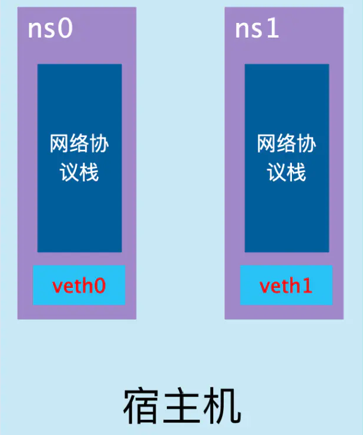
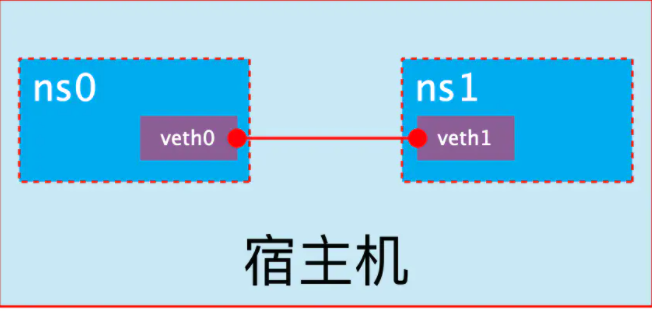
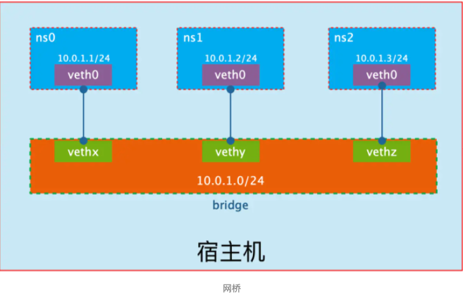

#### Network Namespace

+ Network Namespace 是 Linux 内核提供的功能，是实现网络虚拟化的重要功能，它能创建多个隔离的网络空间，它们有独自网络栈信息。不管是虚拟机还是容器，运行的时候仿佛自己都在独立的网络中。而且不同Network Namespace的资源相互不可见，彼此之间无法通信。

  

+ 可以借助`ip netns`命令来完成对 Network Namespace 的各种操作

+ veth pair

  + veth pair 全称是 Virtual Ethernet Pair，是一个成对的端口，所有从这对端口一 端进入的数据包都将从另一端出来，反之也是一样。

  + 引入veth pair是为了在不同的 Network Namespace 直接进行通信，利用它可以直接将两个 Network Namespace 连接起来。

    

  + 实现Network Namespace间通信

    创建两个Network Namespace，命名为`ns0、ns1`

    ```ruby
    $ ip netns add ns0
    $ ip netns add ns1
    $ ip netns list
    ns1
    ns0
    ```

    然后我们将veth0加入到ns0，将veth1加入到ns1，如下所示：

    ```bash
    $ ip link set veth0 netns ns0
    $ ip link set veth1 netns ns1
    ```

    然后我们分别为这对veth pair配置上ip地址，并启用它们：

    ```bash
    $ ip netns exec ns0 iplink set veth0 up
    $ ip netns exec ns0 ip addr add 10.0.1.1/24 dev veth0
    $ ip netns exec ns1 iplink set veth1 up
    $ ip netns exec ns1 ip addr add 10.0.1.2/24 dev veth1
    ```

    查看这对veth pair的状态

    ```ruby
    $ ip netns exec ns0 ip addr
    61: veth0@if62: <BROADCAST,MULTICAST,UP,LOWER_UP> mtu 1500 qdisc noqueue state UP group default qlen 1000
        link/ether e6:39:e1:e0:3a:a0 brd ff:ff:ff:ff:ff:ff link-netnsid 1
        inet 10.0.1.1/24 scope global veth0
           valid_lft forever preferred_lft forever
        inet6 fe80::e439:e1ff:fee0:3aa0/64 scope link
           valid_lft forever preferred_lft forever
    
    $ ip netns exec ns1 ip addr
    62: veth1@if61: <BROADCAST,MULTICAST,UP,LOWER_UP> mtu 1500 qdisc noqueue state UP group default qlen 1000
        link/ether be:41:49:42:23:6a brd ff:ff:ff:ff:ff:ff link-netnsid 0
        inet 10.0.1.2/24 scope global veth1
           valid_lft forever preferred_lft forever
        inet6 fe80::bc41:49ff:fe42:236a/64 scope link
           valid_lft forever preferred_lft forever
    ```

    从上面可以看出，我们已经成功启用了这个veth pair，并为每个veth设备分配了对应的ip地址。我们尝试在`ns1`中访问`ns0`中的ip地址：

    ```python
    $ ip netns exec ns1 ping -c 3 10.0.1.1
    sudo: unable to resolve host zormshogu
    PING 10.0.1.1 (10.0.1.1) 56(84) bytes of data.
    64 bytes from 10.0.1.1: icmp_seq=1 ttl=64 time=0.091 ms
    64 bytes from 10.0.1.1: icmp_seq=2 ttl=64 time=0.035 ms
    64 bytes from 10.0.1.1: icmp_seq=3 ttl=64 time=0.037 ms
    
    --- 10.0.1.1 ping statistics ---
    3 packets transmitted, 3 received, 0% packet loss, time 1999ms
    rtt min/avg/max/mdev = 0.035/0.054/0.091/0.026 ms
    ```

    可以看到，veth pair成功实现了两个不同Network Namespace之间的网络交互。

#### 网桥

+ 网桥就是把一台机器上的若干个网络接口“连接”起来。其结果是，其中一个网口收到的报文会被复制给其他网口并发送出去。以使得网口之间的报文能够互相转发。

  

+ Linux通过Network Namespace实现了网络的隔离，使网络协议栈之间互不干扰；并通过veth pair和网桥实现了相同主机上多个Network Namespace之间的数据通信


