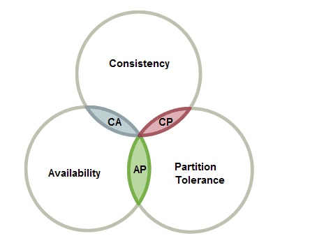

#### etcd概述

etcd 是一个分布式、可靠 key-value 存储的分布式系统。当然，它不仅仅用于存储，还提供共享配置及服务发现。

#### etcd vs Zookeeper区别

+ 提s供配置共享和服务发现的系统比较多，其中最为大家熟知的是 Zookeeper，而 etcd 可以算得上是后起之秀了。在项目实现、一致性协议易理解性、运维、安全等多个维度上，etcd 相比 zookeeper 都占据优势，Consul 的可靠性和稳定性还需要时间来验证。
+ 一致性协议： etcd 使用 Raft 协议，Zookeeper 使用 ZAB（类PAXOS协议），前者容易理解，方便工程实现
+ 运维方面：etcd 方便运维，Zookeeper 难以运维
+ 数据存储：etcd 多版本并发控制（MVCC）数据模型 ， 支持查询先前版本的键值对
+ 项目活跃度：etcd 社区与开发活跃，Zookeeper 感觉已经快死了
+ API：etcd 提供 HTTP+JSON, gRPC 接口，跨平台跨语言，Zookeeper 需要使用其客户端
+ 访问安全方面：etcd 支持 HTTPS 访问，Zookeeper 在这方面缺失

#### Raft选举过程（动画效果https://raft.github.io/）

1. 初始状态时各个节点都是follower（奴隶），当随机选举开始执行，若某一个节点的倒计时为0时，级别变为candidate（竞选者）。并会给其他节点发送竞选信号，当这个节点收到半数的回答之后自己会变成leader，然后再告诉其他节点我现在是主节点，其它节点收到信息并通过权重判断，然后自己变成follower，此时进入稳定状态，在整个选举的过程中每一个节点只有一次投票机会，遵循先来后到原则。
2. leader节点会每隔一段时间给其他follower节点发送心跳信息，当follower节点在这段时间没有收到心跳消息时，就会变成candidate节点进行竞选并重复上面【1】的流程。

#### Raft数据更新

 	1. 只有leader节点能进行更新操作
 	2. 当接收到数据更新的请求时，当前节点若是follower将会把信息转发给leader节点
 	3. 然后通过两阶段提交
 	  	1. leader节点首先发送给其他follower节点日志包，说我要更新数据。
 	  	2. follower节点收到日志包后，会告诉主节点说准备就绪
 	  	3. leader节点收到回复后会下commit命令，然后所有节点统一更，并返回客户端相应成功

#### CAP原理

+ 一致性（Consistency）：在同一时刻服务器返回的数据一样

+ 可用性（Availability）：只要请求就会相应

+ 分区容错性（Partition tolerance）：出现两台服务器

图示：

​	CA：单机

​	AP：两台独立的服务器

​	CP：etcd

