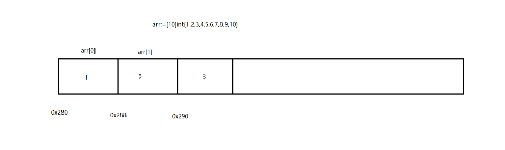

#### 数组：

一组具有相同**数据类型**在内存中**有序存储**的数据集合，数组的**长度在定义后不可以修改**。

#### 切片：

+ 一组具有**相同数据类型**在内存中**有序存储**的**可扩容的数据集合**
+ 切片扩容为偶数的值  小于1024 为上一次的两倍 大于1024为上一次的1/4
+ 切片截取：
  + 切片名[起始下标：结束下标：容量]  左闭右开 包含起始下标 不包含结束下标
  + s := slice[2:5:6] //实际容量=容量-起始下标
  + 切片的截取是将新的切片指向源切片的内存地址  修改一个会影响另外一个

+ 切片的拷贝：
  + 新开辟一块内存,存储两个内容完全相同 但是不会相互影响

#### **指针**：

+ 只要将数据存储在内存中都会为其分配内存地址。可以使用运算符 & （取地址运算符）来获取数据的内存地址。

