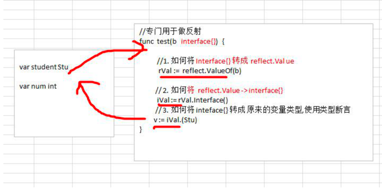
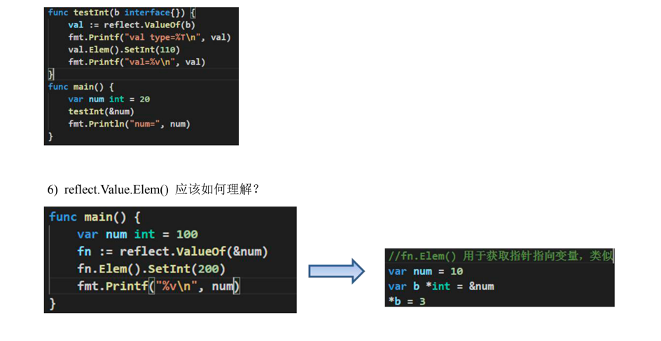

#### 概念

+ 反射可以在运行时动态获取代码文件的各种信息, 比如变量的类型(type)，类别(kind)

+ 如果是结构体变量，还可以获取到结构体本身的信息(包括结构体的字段、方法)
+ 可以修改变量对的值

#### reflect.Value.Kind和reflect.Value.Type区别

+ 比如: `var num int = 10` num 的 Type 是 int , Kind 也是 int
+ 比如: `var stu Student `stu 的 Type 是 Student , Kind 是 struct，Type 是类型，Kind 是类别， Type 和 Kind 可能是相同的，也可能是不同的。

#### 注意事项

+ 方法的排序默认是按照 函数名的排序（ASCII 码）

+ 获取到 struct 标签, 需要通过 reflect.Type 来获取 tag 标签的值

+ 反射修改变量需要对应的指针类型来完成，这样才能改变传入的变量的值, 同时需要使用到 reflect.Value.Elem()方法

  

#### 应用场景

+ 权限管理时通过反射将项目里所模块中的接口名读取出来维护到库里，避免了手工录入
+ 注解路由就是利用了反射原理，通过在方法名上填写注释，然后通过反射进行读取和请求的url进行对号入座。

