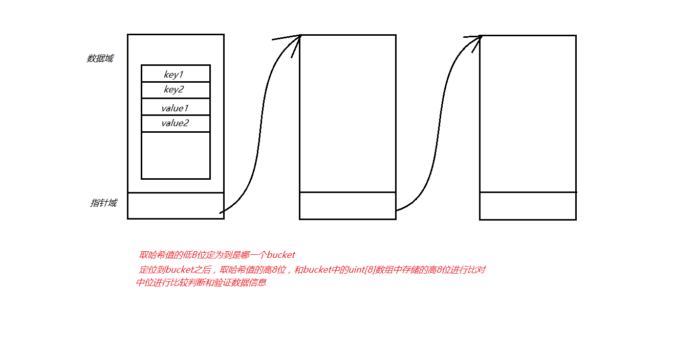

+ 当申明一个map时会在全局区产生一个map结构体的指针`8个字节`指向虚拟内存的桶【桶就是存放数据的节点】：

  ```
  这个桶（结构体）存储的主要内容
  1、hash函数算出来的哈希值的高8位
  2、哈希数组
  3、hash函数算出来的哈希值的低8位
  ```

+ 存储原理

  + 以`key0、key1、key2... value0、value1、value2`这种形式存储，目的是为了内存对齐，节省资源提高读取速度，右侧图是go语言的map存储方式

  

  + map通过哈希结构加链表结构进行存储数据，如果桶不够添加时会对会进行扩容，删除时不会删除多余的桶

+ map中key查找的流程

  1. 根据传入的key用对应的hash函数算出哈希值
  2. 取哈希值的低B位定为到是哪一个bucket
  3. 定位到bucket之后，取哈希值的高8位，和bucket中的uint[8]数组中存储的高8位进行比对，根据接收的index在key，value字节数组中查找对应的key，若匹配上则返回 key，value，否则当前map不含有此key。

  


