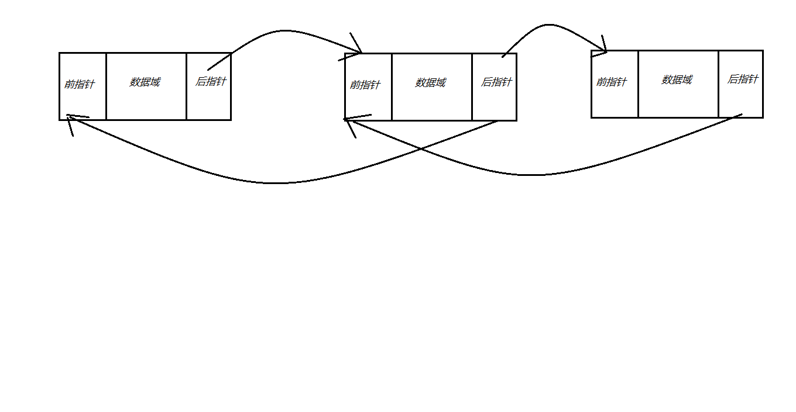
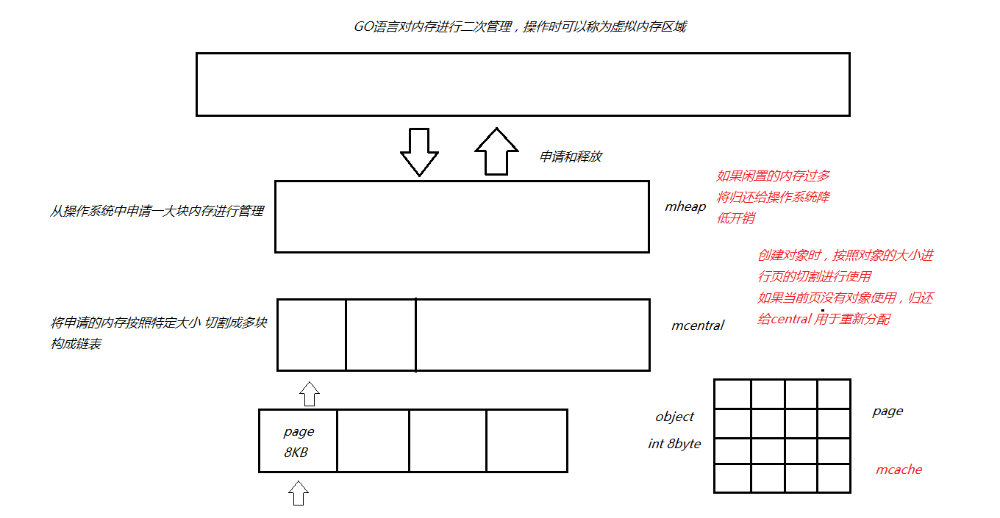
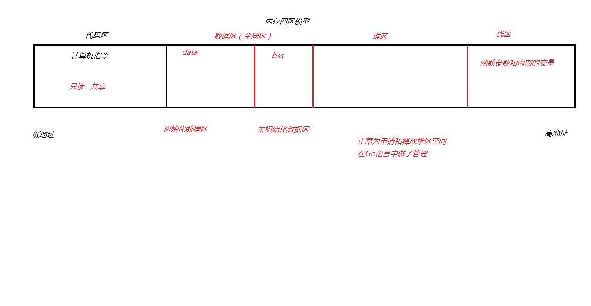
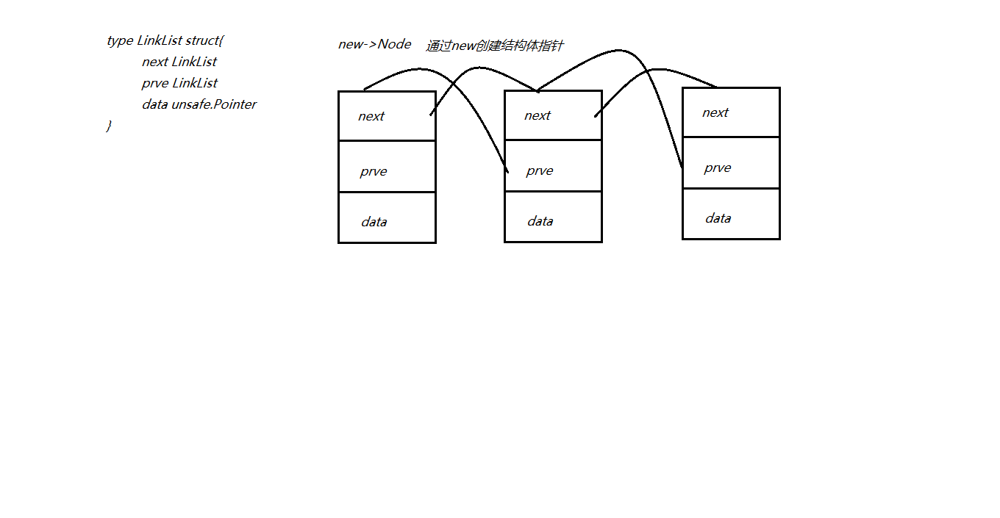
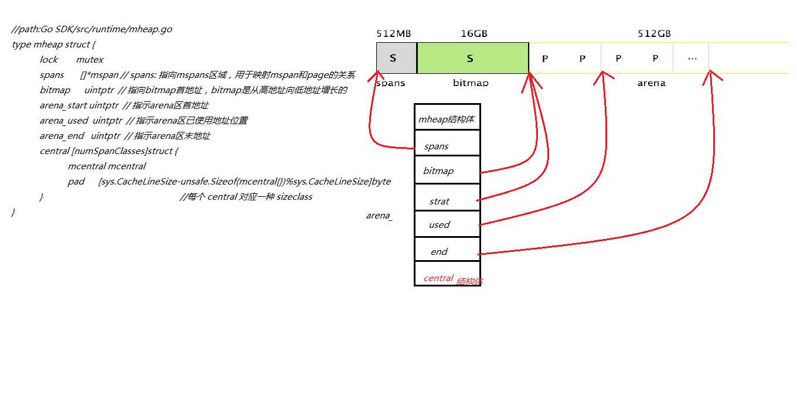
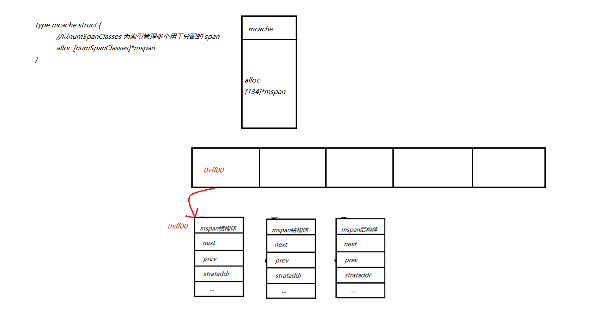
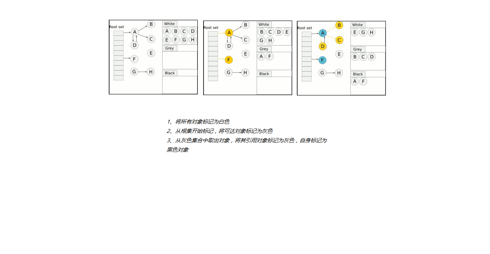

### Runtime介绍

+ Go语言自主管理内存。这样可以自主地实现更好的内存使用模式，不会每次内存分配都需要进行系统调用。
+ Golang运行时的内存分配算法主要源自 Google 为 C 语言开发的TCMalloc算法，全称ThreadCaching Malloc。
+ 核心思想就是把内存分为多级管理，从而降低锁的粒度。
+ 每个线程都会自行维护一个独立的内存池，进行内存分配时优先从该内存池中分配，当内存池不足时才会向全局内存池申请，以避免不同线程对全局内存池的频繁竞争。

#### 基本策略

+ 每次启动程序时从操作系统申请一大块内存，以减少系统调用(mheap)。
+ 将申请的大块内存按照特定的大小预先的进行切分成小块，构成链表（mcentral）。
+ 为对象分配内存时，只需从大小合适的链表提取一个小块即可（cache）。
+ 回收对象内存时，将该小块内存重新归还到原链表，以便复用。
+ 如果闲置内存过多，则尝试归还部分内存给操作系统，降低整体开销。

#### 内存分配图形

#### mheap：向操作系统申请内存，申请到的内存块被分配了三个区域，在X64上分别是512MB，16GB，512GB大小。

+ 

  

  

  

  

  

  

  

  

  

  
+ mcentral：切分好的内存块（mspan）以链表形式链接。
  
  + 
  
    
  
    
  
    
  
    
  
    
+ mcache：每个运行期工作协程都会绑定一个cache，用于无锁 object 的分配。
  
  + 
  
    
  
    
  
    
  
    
  
    

#### 释放流程

+ 将标记为可回收的object交还给所属的span.freelist，放回到central，可以提供cache重新获取
+ 如果span以全部回收object，将其交还给heap，以便重新分切复用定期扫描heap里闲置的span，释放其占用的内存

#### 总结

1. Go在程序启动时，会向操作系统申请一大块内存，之后自行管理。
2. Go内存管理的基本单元是mspan，它由若干个页组成，每种mspan可以分配特定大小的
   object。
3. mcache, mcentral, mheap是Go内存管理的三大组件，层层递进。
   1. mcache管理线程在本地缓存的mspan；
   2. mcentral管理全局的mspan供所有线程使用；
   3. mheap管理Go的所有动态分配内存。
4. 一般小对象通过mspan分配内存；大对象则直接由mheap分配内存

