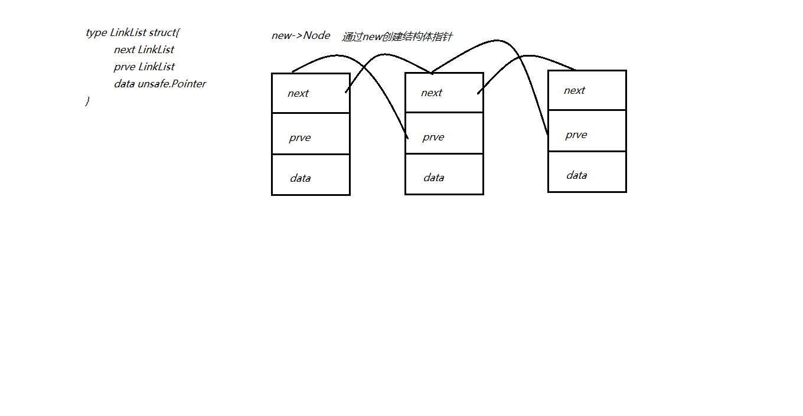
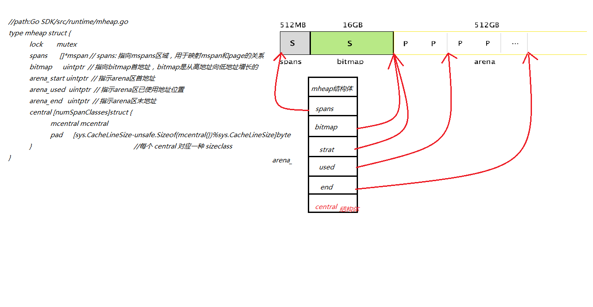
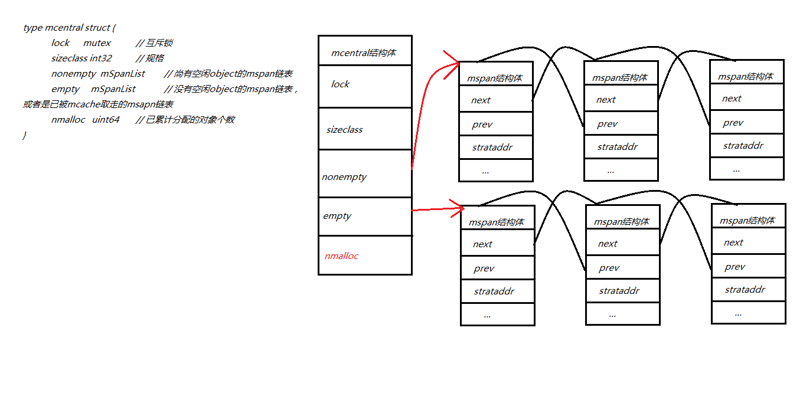
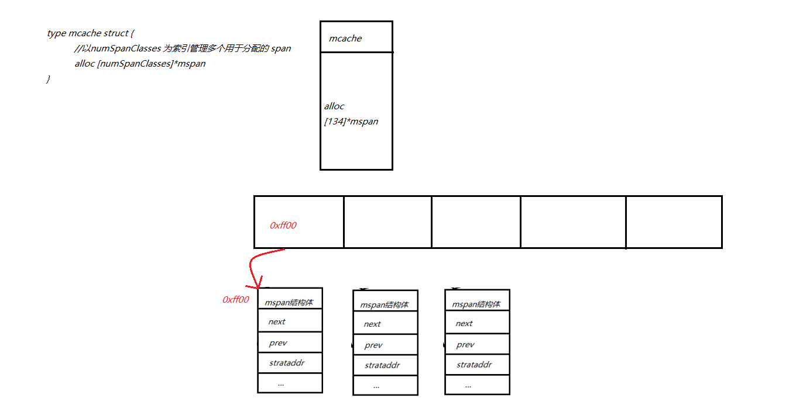
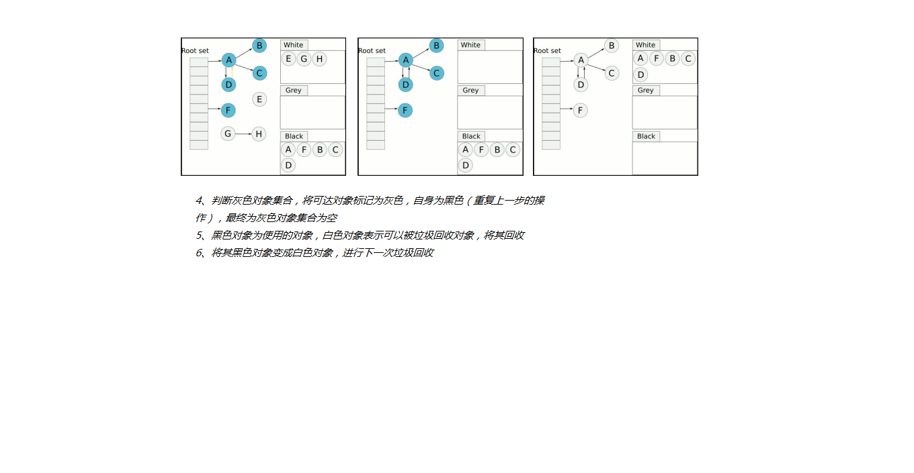
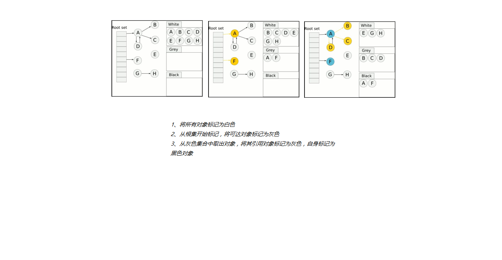

#### 垃圾回收(Garbage Collection，简称GC)是内存管理功能。

+ 在传统的系统级编程语言（主要指C/C++）中，程序员定义了一个变量，就是在内存中开辟了一段相应的空间来存值。由于内存是有限的，所以当程序不再需要使用某个变量的时候，就需要销毁该对象并释放其所占用的内存资源，好重新利用这段空间。C/C++中，释放无用变量内存空间的事情需要由程序员自己来处理。就是说当程序员认为变量没用了，就手动地释放其占用的内存。但是这样显然非常繁琐，如果有所遗漏，就可能造成资源浪费甚至内存泄露。当软件系统比较复杂，变量多的时候程序员往往就忘记释放内存或者在不该释放的时候释放内存了。这对于程序开发人员是一个比较头痛的问题。
+ 为了解决这个问题，后来开发出来的几乎所有新语言（java，python，php等等）都引入了语言层面的自动内存管理 – 也就是语言的使用者只用关注内存的申请而不必关心内存的释放，内存释放由虚拟机（virtual machine）或运行时（runtime）来自动进行管理。而这种对不再使用的内存资源进行自动回收的功能就被称为垃圾回收。

### 垃圾回收常见的方法

+ 引用计数 ：
  1. 通过在对象上增加自己被引用的次数，被其他对象引用时加1，引用自己的对象被回收时减1，引用数为0的对象即为可以被回收的对象。这种算法在内存比较紧张和实时性比较高的系统中使用的比较广泛，如php，python等。
+ 三色标记：
  1. 起初所有对象都是白色。
  2. 从根出发扫描所有可达对象`要被使用的对象`，标记为灰色，放入待处理集合中。
  3. 从集合取出灰色对象，将其引用对象标记为灰色放入队列，自身标记为黑色。
  4. 重复 3，直到灰色对象队列为空。此时白色对象即为垃圾，进行回收。
  5. 等到黑色对象被使用后将其全部标记为白色对象，等待下一次回收。

### 三色标记图解

1. 

   

   

   

   

   

2. 

   

   

   

   

   

   

   

   

   

   