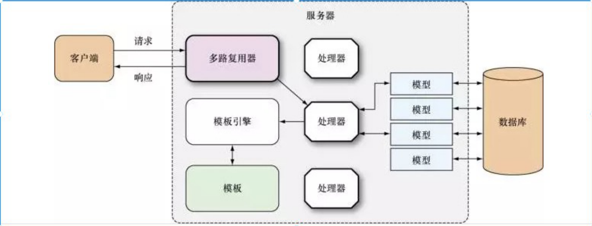

#### 多路复⽤器

⼀个典型的 Go Web 程序结构如下：

+ 客户端发送请求；

+ 服务器中的多路复⽤器收到请求；
+ 多路复⽤器根据请求的 URL 找到注册的处理器，将请求交由处理器处理；
+ 处理器执⾏程序逻辑，必要时与数据库进⾏交互，得到处理结果；
+ 处理器调⽤模板引擎将指定的模板和上⼀步得到的结果渲染成客户端可识别的数据格式；
+ 最后将数据通过响应返回给客户端；
+ 客户端拿到数据，执⾏对应的操作，例如渲染出来呈现给⽤户。



net/http 包内置了⼀个默认的多路复⽤器 DefaultServeMux 。定义如下：

```
// src/net/http/server.go
// DefaultServeMux is the default ServeMux used by Serve.
var DefaultServeMux = &defaultServeMux
var defaultServeMux ServeMux
```

net/http 包中很多⽅法都在内部调⽤ DefaultServeMux 的对应⽅法，如 HandleFunc 。我们知道， HandleFunc 是为指定的 URL 注册⼀个处理器。其内部实现如下：

```
// src/net/http/server.go
func HandleFunc(pattern string, handler func(ResponseWriter, *Request)) {
	DefaultServeMux.HandleFunc(pattern, handler) 
}
```

实际上， http.HandleFunc ⽅法是将处理器注册到 DefaultServeMux 中的。另外，我们使⽤ ":8080" 和 nil 作为参数调⽤ http.ListenAndServe 时，会创建⼀个默认的服务器：

```
// src/net/http/server.go
func ListenAndServe(addr string, handler Handler) {
  server := &Server{Addr: addr, Handler: handler}
  return server.ListenAndServe()
}
```

这个服务器默认使⽤ DefaultServeMux 来处理器请求：

```
type serverHandler struct {
	srv *Server
}

func (sh serverHandler) ServeHTTP(rw ResponseWriter, req *Request) {
  handler := sh.srv.Handler
  if handler == nil {
    handler = DefaultServeMux
  }
  handler.ServeHTTP(rw, req) 
}
```

服务器收到的每个请求会调⽤对应多路复⽤器（即 ServeMux ）的 ServeHTTP ⽅法。在 ServeMux 的ServeHTTP ⽅法中，根据 URL 查找我们注册的处理器，然后将请求交由它处理。

虽然默认的多路复⽤器使⽤起来很⽅便，但是在⽣产环境中不建议使⽤。由于 DefaultServeMux 是⼀个全局变量，所有代码，包括第三⽅代码都可以修改它。 有些第三⽅代码会在 DefaultServeMux 注册⼀些处理器，这可能与我们注册的处理器冲突

#### 创建多路复⽤器

创建多路复⽤器也⽐较简单，直接调⽤ http.NewServeMux ⽅法即可。然后，在新创建的多路复⽤器上注册处理器：

```
package main
import (
  "fmt"
  "log"
  "net/http"
)
func hello(w http.ResponseWriter, r *http.Request) {
  fmt.Fprintf(w, "Hello, Web") 
}
func main() {
  //创建Mux
  mux := http.NewServeMux()
  mux.HandleFunc("/", hello)
  server := &http.Server{
    Addr: ":8080",
    Handler: mux, //注册处理器
  }
  if err := server.ListenAndServe(); err != nil {
  	log.Fatal(err) 
  } 
}
```

这⾥我们还⾃⼰创建了服务器对象。通过指定服务器的参数，我们可以创建定制化的服务器。

```
server := &http.Server{
  Addr: ":8080",
  Handler: mux,
  ReadTimeout: 1 * time.Second,
  WriteTimeout: 1 * time.Second, 
}
```

在上⾯代码，创建了⼀个读超时和写超时均为1s的服务器

#### 处理器和处理器函数

服务器收到请求后，会根据其 URL 将请求交给相应的处理器处理。处理器实现了 Handler 接⼝的结构， Handler 接⼝定义在 net/http 包中：

```
// src/net/http/server.go
type Handler interface {
	 func ServeHTTP(w Response.Writer, r *Request) 
}
```

```
// src/net/http/server.go
func (mux *ServeMux) HandleFunc(pattern string, handler func(ResponseWriter, *Request)) {
	if handler == nil {
    panic("http: nil handler") 
  }
  mux.Handle(pattern, HandlerFunc(handler))
}
```

HandlerFunc 是底层类型为 func (w ResponseWriter, r *Request) 的新类型，它可以⾃定义其⽅法。由于 HandlerFunc 类型实现了 Handler 接⼝，所以它也是⼀个处理器类型，最终使⽤ Handle 注册。

```
// src/net/http/server.go
type HandlerFunc func(w *ResponseWriter, r *Request)
func (f HandlerFunc) ServeHTTP(w ResponseWriter, r *Request) {
	f(w, r) 
}
```

注意，这⼏个接⼝和⽅法名很容易混淆：

+ Handler ：处理器接⼝，定义在 net/http 包中。实现该接⼝的类型，其对象可以注册到多路复⽤器中；

+ Handle ：注册处理器的⽅法；

+ HandleFunc ：注册处理器函数的⽅法；

+ HandlerFunc ：底层类型为 func (w ResponseWriter, r *Request) 的新类型，实现了Handler 接⼝。它连接了处理器函数与处理器。

#### http 请求

请求的结构 `func (w http.ResponseWriter, r *http.Request)`其中， http.Request 就是请求的类型。客户端传递的数据都可以通过这个结构来获取。

结构 Request定义在包 net/http 中：

```
// src/net/http/request.go
type Request struct {
  Method string
  URL *url.URL
  Proto string
  ProtoMajor int
  ProtoMinor int
  Header Header
  Body io.ReadCloser
  ContentLength int
  // 省略⼀些字段...
}
```

#### http 响应

```
// src/net/http/
type ReponseWriter interface {
Header() Header
Write([]byte) (int, error)
WriteHeader(statusCode int) 
}
```

#### net/http的执⾏流程

+ ⾸先调⽤Http.HandleFunc

  按顺序做了⼏件事：

  1. 调⽤了DefaultServeMux的HandleFunc
  2. 调⽤了DefaultServeMux的Handle
  3. 往DefaultServeMux的map[string]muxEntry中增加对应的handler和路由规则

+ 其次调⽤http.ListenAndServe(":8080", nil)

  按顺序做了⼏件事情：

  1. 实例化Server
  2. 调⽤Server的ListenAndServe()
  3. 调⽤net.Listen("tcp", addr)监听端⼝
  4. 启动⼀个for循环，在循环体中Accept请求
  5. 对每个请求实例化⼀个Conn，并且开启⼀个goroutine为这个请求进⾏服务go c.serve()
  6. 读取每个请求的内容w, err := c.readRequest()
  7. 判断handler是否为空，如果没有设置handler（这个例⼦就没有设置handler），handler就设置为DefaultServeMux
  8. 调⽤handler的ServeHttp，进⼊到DefaultServeMux.ServeHttp
  9. 根据request选择handler，并且进⼊到这个handler的ServeHTTP


