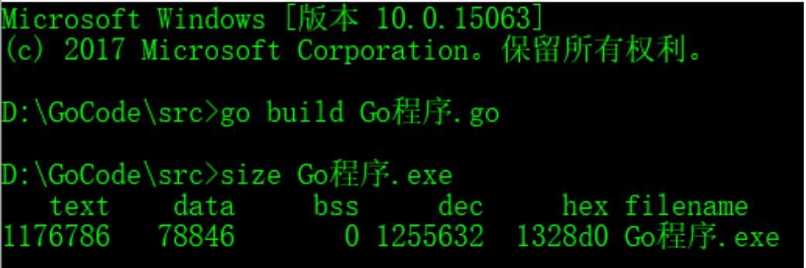

+ 代码经过预处理、编译、汇编、链接4步后⽣成⼀个可执⾏程序。程序是⼀个普通的可执⾏⽂件，以下列出⼀个⼆进制可执⾏⽂件的基本情况：
+ 

+ 通过上图可以得知，也就是说程序没有加载到内存前，可执⾏程序内部已经分好三段信息，分别为代码区（**text**）、数据区（**data**）和未初始化数据区（**bss**）3 个部分。有些⼈直接把data和bss合起来叫做静态区或全局区。
+ 

+ **栈区**

  存放函数的参数值，局部变量的值等。如a int ; *p int; 这儿的a和p都存放在栈中，由编译器自动分配释放。

+ **堆区**

  存放由程序员动态申请的变量。由程序员手动分配/释放。若程序员不释放，程序结束时可能由操作系统回收。

+ **数据区 (包含常量区和全局区)**

  ①常量区：存放常量。 包含字符串常量和其他常量。 char *p = "I love u"; 指针p指向的这块内存属于常量区。

  ②全局区/静态区：存放全局变量和静态变量。如程序内的a int；初始化的全局变量和静态变量在一块区域，未初始化的全局变量和未初始化的静态变量在相邻的另一块区域。 数据区在程序结束后由操作系统释放

+ **代码区**

  存放程序的二进制代码。当定义一个指针类型` var p *int`此时会存在代码区，当`p = new(int)`此时会在堆区开启一个内存空间用来操作

+ **内存四区模型**

**代码区、堆区、栈区、数据区的区别**

代码区就相当于一个菜谱仅仅一张纸而已（代码）

堆区主要负责菜谱里所要求做菜的场地空间进行布置（实例化一个结构体、map等等）

栈区主要负责炒菜步骤的空间进行布置（程序内部的函数）

数据区主要负责存放菜谱所有的材料（存放常量等等）

只有所有准备好齐全厨师才能开始展示（CPU）

