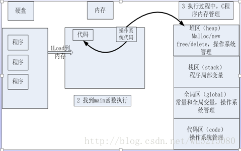

+ 代码经过预处理、编译、汇编、链接4步后⽣成⼀个可执⾏程序。程序是⼀个普通的可执⾏⽂件，以下列出⼀个⼆进制可执⾏⽂件的基本情况：

+ 

+ 通过上图可以得知，也就是说程序没有加载到内存前，可执⾏程序内部已经分好三段信息，分别为代码区（**text**）、数据区（**data**）和未初始化数据区（**bss**）3 个部分。

+ 

+ **栈区**

  存放函数的参数值、返回值和局部变量，在程序运行过程中实时分配和释放，栈区由操作系统自动管理，无须程序员手动管理。

+ **堆区**

  由程序员手动分配/释放。若程序员不释放，程序结束时可能由操作系统回收。

+ **数据区**

  1. 常量区：存放已初始化的全局变量、静态变量（全局和局部）、常量数据、结构体等等。

  2. 未初始化数据区：存放的是未初始化的全局变量和静态变量。

+ **代码区**

  存放CPU执行的机器指令（判断语句、函数方法），代码区是可共享，并且是只读的。

+ **内存四区模型**

**代码区、堆区、栈区、数据区的区别**

代码区就相当于一个菜谱仅仅一张纸而已（代码）

堆区主要负责菜谱里所要求做菜的场地空间进行布置（实例化一个结构体、map等等）

栈区主要负责炒菜步骤的空间进行布置（程序内部的函数）

数据区主要负责存放菜谱所有的材料（存放常量等等）

只有所有准备好齐全厨师才能开始展示（CPU）
