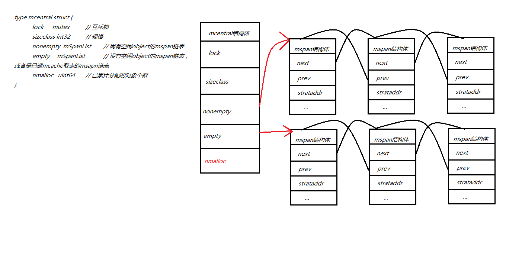

### Runtime介绍

+ Go语言自主管理内存。这样可以自主地实现更好的内存使用模式，不会每次内存分配都需要进行系统调用。
+ 核心思想就是把内存分为多级管理，一层包含一层，从而降低锁的粒度。
+ 每个线程都会自行维护一个独立的内存池，进行内存分配时优先从该内存池中分配，当内存池不足时才会向全局内存池申请，以避免不同线程对全局内存池的频繁竞争。

#### 内存分配图形

#### mcache, mcentral, mheap是Go内存管理的三大组件，层层递进。

#### mheap：向操作系统申请内存，申请到的内存块被分配了三个区域

+ 

#### mcentral：将申请的大块内存按照特定的大小预先的进行切分成小块(mspan)，构成链表

#### mcache：每个运行期工作协程都会绑定一个本地cache(从span中获取内存区)，以page形式用于object 的分配。

#### 释放流程

+ 将标记为可回收的object交还给所属的mspan再放回到mcentral，可以提供mcache重新获取
+ 如果span全部回收object，将其交还给heap，以便重新分切复用定期扫描mheap里闲置的span，释放其占用的内存

#### 总结

1. Go在程序启动时，会向操作系统申请一大块内存mheap，之后自行管理。
2. mcentral管理全局的mspan供所有线程使用
3. mcache管理线程在本地缓存的mspan，以page形式用于object 的分配
4. Go内存管理的基本单元是mspan，它由若干个页（page）组成，每种mspan可以分配特定大小的object。
5. 一般小对象通过mspan分配内存，大对象则直接由mheap分配内存

