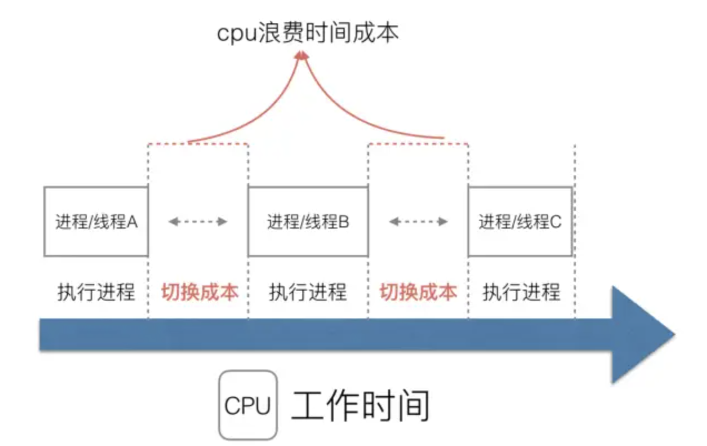
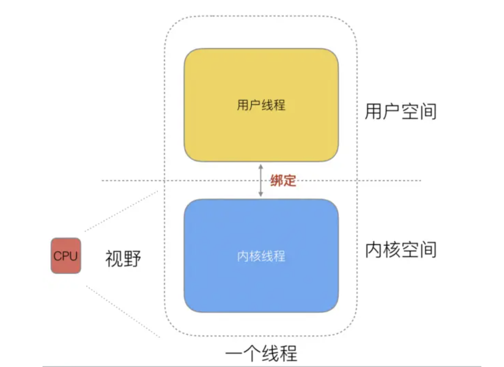
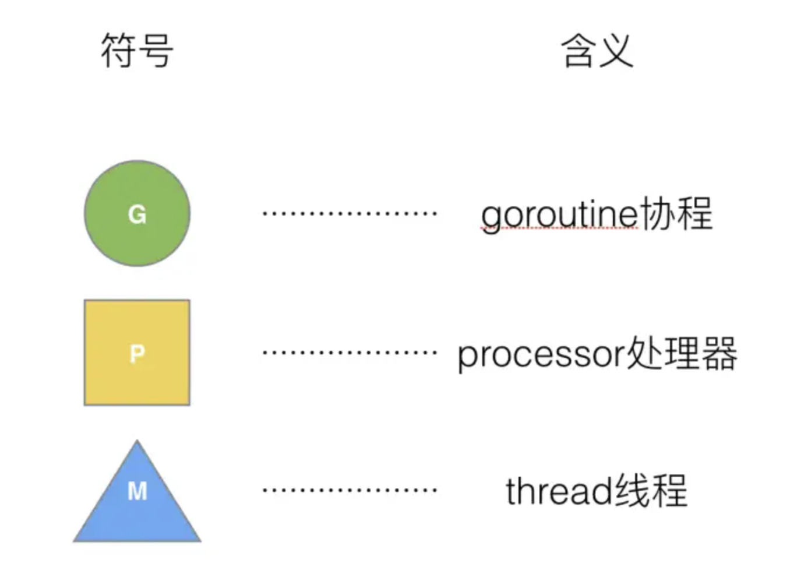
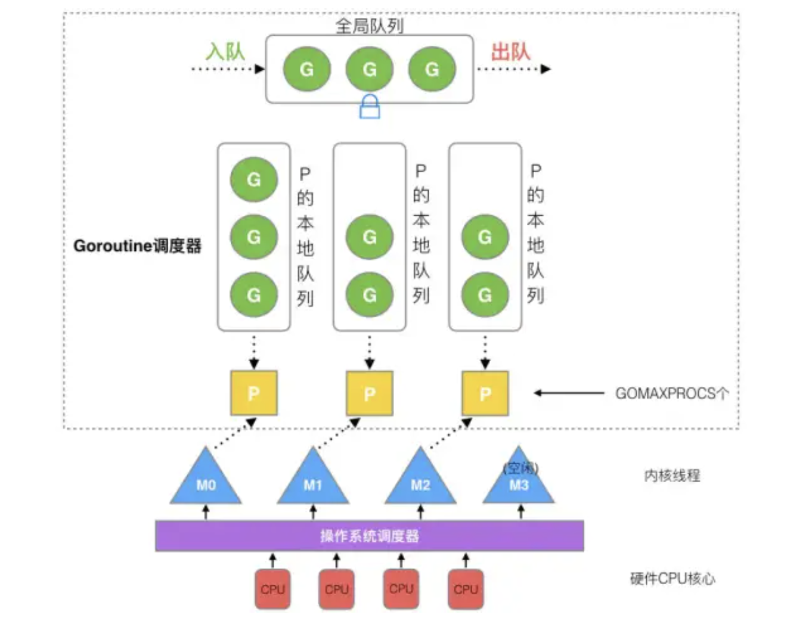
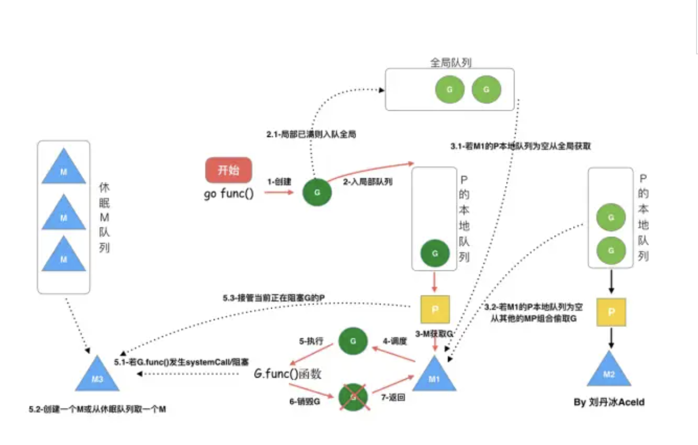

#### 单进程时代不需要调度器

单进程时代问题：

1. 单一的执行流程，计算机只能一个任务一个任务处理。
2. 进程阻塞所带来的CPU时间浪费。

#### 多进程/线程时代有了调度器需求

在多进程/多线程的操作系统中，就解决了阻塞的问题，因为一个进程阻塞cpu可以立刻切换到其他进程中去执行，而且调度cpu的算法可以保证在运行的进程都可以被分配到cpu的运行时间片。这样从宏观来看，似乎多个进程是在同时被运行。

多进程/线程时代问题：

进程拥有太多的资源，进程的创建、切换、销毁，都会占用很长的时间，CPU虽然利用起来了，但如果进程过多，CPU有很大的一部分都被用来进行进程调度了。

#### 怎么才能提高CPU的利用率呢

对于Linux操作系统来讲，cpu对进程的态度和线程的态度是一样的。



很明显，CPU调度切换的是进程和线程。尽管线程看起来很美好，但实际上多线程开发设计会变得更加复杂，要考虑很多同步竞争等问题，如锁、竞争冲突等。多进程、多线程已经提高了系统的并发能力，但是在当今互联网高并发场景下，为每个任务都创建一个线程是不现实的，因为会消耗大量的内存(进程虚拟内存会占用4GB[32位操作系统], 而线程也要大约4MB)。

大量的进程/线程出现了新的问题

- 高内存占用

- 调度的高消耗CPU

  

#### 协程提高CPU利用

其实一个线程分为“内核态“线程和”用户态“线程。 一个“用户态线程”必须要绑定一个“内核态线程”，但是CPU并不知道有“用户态线程”的存在，它只知道它运行的是一个“内核态线程”(Linux的PCB进程控制块)。




#### Go语言的协程Goroutine

Go中，协程被称为goroutine，它非常轻量，一个goroutine只占几KB，并且这几KB就足够goroutine运行完，这就能在有限的内存空间内支持大量goroutine，支持了更多的并发。虽然一个goroutine的栈只占几KB，但实际是可伸缩的，如果需要更多内容，`runtime`会自动为goroutine分配。


**Goroutine调度器的GMP模型设计思想**

Processor，它包含了运行goroutine的资源，如果线程想运行goroutine，必须先获取P，P中还包含了可运行的G队列。



在Go中，线程是运行goroutine的实体，调度器的功能是把可运行的goroutine分配到工作线程上。



```
1. 全局队列（Global Queue）：存放等待运行的G。
2. P的本地队列：同全局队列类似，存放的也是等待运行的G，存的数量有限，不超过256个。新建G时，G优先加入到P的本地队列，如果队列满了，则会把本地队列中一半的G移动到全局队列。
3. GOMAXPROCS：在Go语言程序运行时（runtime）实现了一个小型的任务调度器。这套调度器的工作原理类似于操作系统调度线程，Go程序调度器可以高效地将 CPU 资源分配给每一个任务。
4. P列表：所有的P都在程序启动时创建，并保存在数组中，最多有GOMAXPROCS(可配置)个。
5. M：线程想运行任务就得获取P，从P的本地队列获取G，P队列为空时，M也会尝试从全局队列拿一批G放到P的本地队列，或从其他P的本地队列偷一半放到自己P的本地队列。M运行G，G执行之后，M会从P获取下一个G，不断重复下去。
```

Goroutine调度器和OS调度器是通过M结合起来的，每个M都代表了1个内核线程，OS调度器负责把内核线程分配到CPU的核上执行。

M与P的数量没有绝对关系，一个M阻塞，P就会去创建或者切换另一个M，所以，即使P的默认数量是1，也有可能会创建很多个M出来。

**P的数量** 

`GOMAXPROCS`的默认值是CPU的数量。这意味着在程序执行的任意时刻都只有`$GOMAXPROCS`个goroutine在同时运行。

**M的数量**

1. go程序启动时，会设置M的最大数量，默认10000。

2. runtime/debug中的SetMaxThreads函数，设置M的最大数量

3. 一个M阻塞了，会创建新的M。

**P何时创建**

在确定了P的最大数量n后，运行时系统会根据这个数量创建n个P。

**M何时创建**

比如所有的M此时都阻塞住了，而P中还有很多就绪任务，就会去寻找空闲的M，而没有空闲的，就会去创建新的M。


#### 调度器的设计策略

**复用线程**

避免频繁的创建、销毁线程，而是对线程的复用。

1）work stealing机制：当本线程无可运行的G时，尝试从其他线程绑定的P偷取G，而不是销毁线程。

2）hand off机制：当本线程因为G进行系统调用阻塞时，线程释放绑定的P，把P转移给其他空闲的线程执行。

**并行利用**

`GOMAXPROCS`设置P的数量，最多有`GOMAXPROCS`个线程分布在多个CPU上同时运行。`GOMAXPROCS`也限制了并发的程度，比如`GOMAXPROCS = 核数/2`，则最多利用了一半的CPU核进行并行。

**抢占**

在coroutine中要等待一个协程主动让出CPU才执行下一个协程，在Go中，一个goroutine最多占用CPU 10ms，防止其他goroutine被饿死，这就是goroutine不同于coroutine的一个地方。

**全局G队列**

在新的调度器中依然有全局G队列，但功能已经被弱化了，当M执行work stealing从其他P偷不到G时，它可以从全局G队列获取G。

#### go func()调度过程



```
1、我们通过 go func()来创建一个goroutine
2、有两个存储G的队列，一个是局部调度器P的本地队列、一个是全局G队列。新创建的G会先保存在P的本地队列中，如果P的本地队列已经满了就会保存在全局的队列中
3、G只能运行在M中，一个M必须持有一个P，M与P是1：1的关系。M会从P的本地队列弹出一个可执行状态的G来执行，如果P的本地队列为空，就会向其他的MP组合偷取一个可执行的G来执行
4、一个M调度G执行的过程是一个循环机制
5、当M执行某一个G时候如果发生了syscall或则其余阻塞操作，M会阻塞，如果当前有一些G在执行，runtime会把这个线程M从P中摘除(detach)，然后再创建一个新的操作系统的线程(如果有空闲的线程可用就复用空闲线程)来服务于这个P
6、当M系统调用结束时候，这个G会尝试获取一个空闲的P执行，并放入到这个P的本地队列。如果获取不到P，那么这个线程M变成休眠状态， 加入到空闲线程中，然后这个G会被放入全局队列中
```

