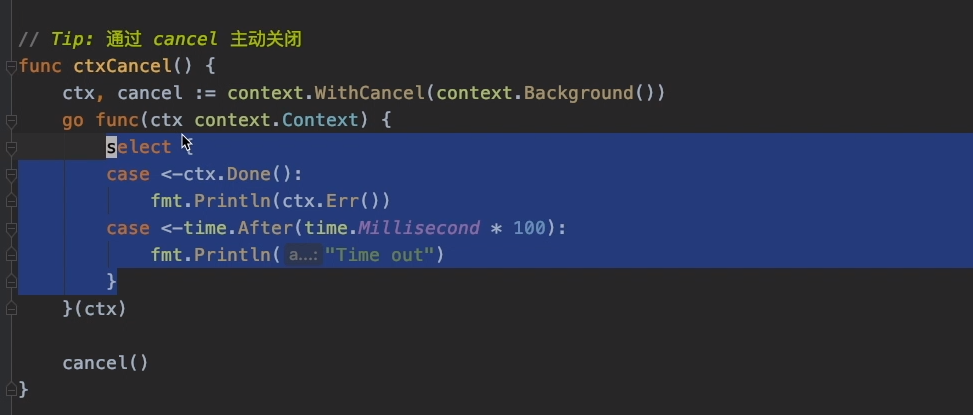
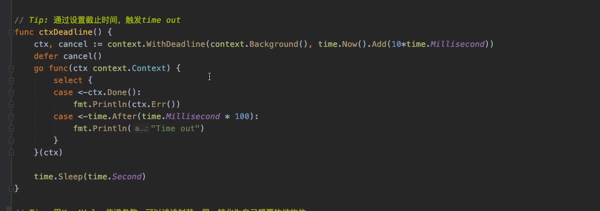
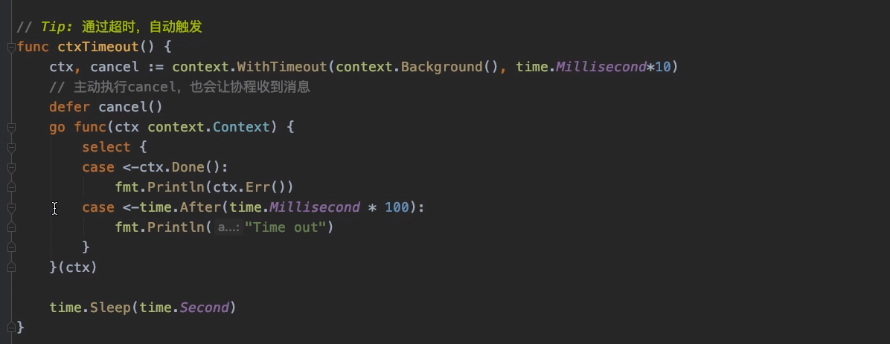
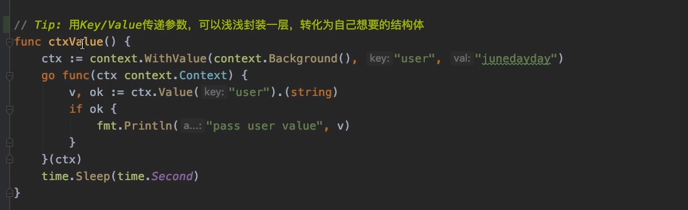

## 什么是Context

`Context`通常被译作`上下文`，一般理解为程序单元的一个运行状态、快照，上下则是存在上下层的传递，`上`会把内容传递给`下`。在Go语言中，程序单元也就指的是Goroutine。

每个Goroutine在执行之前，都要先知道程序当前的执行状态，通常将这些执行状态封装在一个`Context`变量中，传递给要执行的Goroutine中。上下文则几乎已经成为传递与请求同生存周期变量的标准方法。

在网络编程下，当接收到一个网络请求Request，处理Request时，我们可能需要开启不同的Goroutine来获取数据与逻辑处理，即一个请求Request，会在多个Goroutine中处理。而这些Goroutine可能需要共享Request的一些信息。

## context包

`context`包不仅实现了在程序单元之间共享状态变量的方法，同时能通过简单的方法，使我们在被调用程序单元的外部，通过设置ctx变量值，给被调用的程序单元传递过期或撤销信号。

Goroutine的创建和调用关系就是层层调用进行的，而更靠顶部的Goroutine才能主动关闭其下属的Goroutine的执行。为了实现这种关系，Context结构也应该像一棵树，叶子节点须总是由根节点衍生出来的。

要创建Context树，第一步就是要得到根节点，`context.Background`函数的返回值就是根节点：

```
func Background() Context
```

该函数返回空的Context，该Context一般由接收请求的第一个Goroutine创建，它不能被取消、没有值、也没有过期时间。它常常作为处理Request的顶层context存在。

有了根节点，又该怎么创建其它的子节点，孙节点呢？context包为我们提供了多个函数来创建他们：

```
func WithCancel(parent Context) (ctx Context, cancel CancelFunc)
func WithDeadline(parent Context, deadline time.Time) (Context, CancelFunc)
func WithTimeout(parent Context, timeout time.Duration) (Context, CancelFunc)
func WithValue(parent Context, key interface{}, val interface{}) Context
```

这些函数都接收一个`Context`类型的参数`parent`，并返回一个`Context`类型的值，这样就层层创建出不同的节点。子节点是从复制父节点得到的，并且根据接收参数设定子节点的一些状态值，接着就可以将子节点传递给下层的Goroutine了。只有父Goroutine可以取消操作。

`WithCancel`函数，它是将父节点复制到子节点，并且还返回一个额外的`CancelFunc`函数类型变量，调用`CancelFunc`对象将撤销对应的`Context`对象，这就是主动撤销`Context`的方法。



`WithDeadline`函数的作用也差不多，它返回的Context类型值同样是`parent`的副本，传入多了一个Context截止时间




`WithTimeout`函数与`WithDeadline`类似，传入多了一个剩余时间。



`WithValue`函数，它返回`parent`的一个副本，调用该副本的Value(key)方法将得到val。这样我们不光将根节点原有的值保留了，还在子孙节点中加入了新的值，注意若存在Key相同，则会被覆盖。




## Context使用场景

1. 分布式链路追中，需要记录整个链路中所产生的日志，此时需要借助context进行传递维护整条链路信息

2. 多个Goroutinue之间通过context进行通信（也可以通过Channel）

