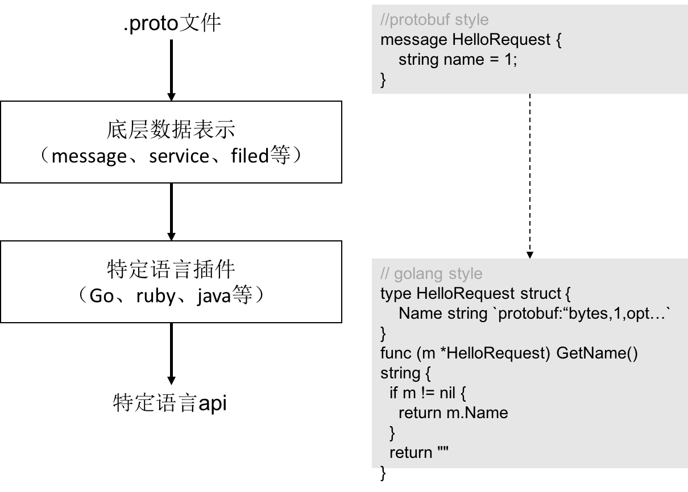

#### gRPC介绍

+ grpc是Google开源的rpc实现，基于最新的HTTP2.0协议，并支持常见的众多编程语言。与许多RPC系统类似，gRPC里客户端应用可以像调用本地对象一样直接调用另一台不同的机器上服务端应用的方法，使得开发者能够更容易地创建分布式应用和服务。  

+ gRPC客户端和服务端可以在多种环境中运行和交互，并且可以用任何 gRPC 支持的语言来编写。所以，开发者可以很容易地用 Java 创建一个 gRPC 服务端，用 Go、 Python、Ruby来创建客户端。

+ gRPC默认使用protoBuf，这是 Google 开源的一套成熟的结构数据序列化机制(当然也可以使用其他数据格式如 JSON )。

**gRPC主要有4种请求／响应模式，分别是：**

1. 简单模式（Simple RPC）

   客户端发起一次请求，服务端响应一个数据，即标准RPC通信。

2. 服务端数据流模式（Server-side streaming RPC）

   这种模式是客户端发起一次请求，服务端返回一段连续的数据流。典型的例子是客户端向服务端发送一个股票代码，服务端就把该股票的实时数据源源不断的返回给客户端。

3. 客户端数据流模式（Client-side streaming RPC）

   与服务端数据流模式相反，这次是客户端源源不断的向服务端发送数据流，而在发送结束后，由服务端返回一个响应。典型的例子是物联网终端向服务器报送数据。

4. 双向数据流模式（Bidirectional streaming RPC）

   这是客户端和服务端都可以向对方发送数据流，这个时候双方的数据可以同时互相发送，也就是可以实现实时交互。比如聊天应用。

#### protobuf介绍

1. 序列化后体积相比Json和XML很小，适合网络传输 
2. 支持跨平台多语言 
3. 消息格式升级和兼容性还不错 
4. 序列化反序列化速度很快，快于Json的处理速度 

#### protoc介绍

protoc是protobuf文件的编译器，可以借助这个工具把 .proto 文件转译成各种编程语言对应的源码，包含数据类型定义、调用接口等。



#### 安装 gRPC

```
# go 使用 grpc 的 SDK
[root@localhost /]# go get google.golang.org/grpc

# 下载 protoc 编译器
[root@localhost lihao04]# wget https://github.com/protocolbuffers/protobuf/releases/download/v3.10.1/protoc-3.10.1-linux-x86_64.zip
[root@localhost lihao04]# cp bin/protoc /usr/bin/
[root@localhost lihao04]# protoc --version
libprotoc 3.10.1

# 安装 protoc go 插件（用这个插件才能调用protoc 编译器编译器，编译成go的proto.go文件）
[root@localhost lihao04]# go get -u github.com/golang/protobuf/protoc-gen-go
```

#### 实战

契约

```
syntax = "proto3";

package protoes;

service HelloServer{
    rpc SayHi(HelloRequest)returns(HelloReplay){}
}

message HelloRequest{
    string name = 1 ;
}

message HelloReplay{
    string message = 1;
}

```

生成代码

```
protoc --go_out=plugins=grpc:. *.proto
```

考察生成的代码

```
type HelloServerClient interface {
	SayHi(ctx context.Context, in *HelloRequest, opts ...grpc.CallOption) (*HelloReplay, error)
}

type HelloServerServer interface {
	SayHi(context.Context, *HelloRequest) (*HelloReplay, error)
}
```

server端

```
package main

import (
	"fmt"
	pb "protoes"
	"net"
	"context"
	"google.golang.org/grpc"
)

// 对象要和proto内定义的服务一致
type server struct {

}

// 实现rpc的 SayHi接口
func (s *server) SayHi(ctx context.Context, in *pb.HelloRequest) (*pb.HelloReplay, error) {
	return &pb.HelloReplay{
		Message: "Hi " + in.Name,
	}, nil
}

func main() {

	// 监听网络
	ln, err := net.Listen("tcp", "127.0.0.1:3000")
	if err != nil {
		fmt.Println("网络异常：", err)
		return
	}

	// 创建grpc句柄
	srv := grpc.NewServer()

	// 将server结构体注册到grpc服务中
	pb.RegisterHelloServerServer(srv, &server{})

	// 监听服务
	err = srv.Serve(ln)  //阻塞
	if err != nil {
		fmt.Println("监听异常：", err)
		return
	}
}
```

client端

```
package main

import (
	"fmt"
	pb "protoes"
	"context"
	"google.golang.org/grpc"
)

func main() {

	// 客户端连接服务器
	conn, err := grpc.Dial("127.0.0.1:3000", grpc.WithInsecure())
	if err != nil {
		fmt.Println("连接服务器失败", err)
	}
    // defer的好处
	defer conn.Close()

	// 获得grpc句柄。连接是共享的
	c := pb.NewHelloServerClient(conn)

	// 远程单调用 SayHi 接口。比较和gorpc的差别，编译访问和字符串访问
	r1, err := c.SayHi(
		context.Background(),
		&pb.HelloRequest{
			Name: "Kitty",
		},
	)
	if err != nil {
		fmt.Println("Can not get SayHi:", err)
		return
	}
	fmt.Println("SayHi 响应：", r1)
}
```