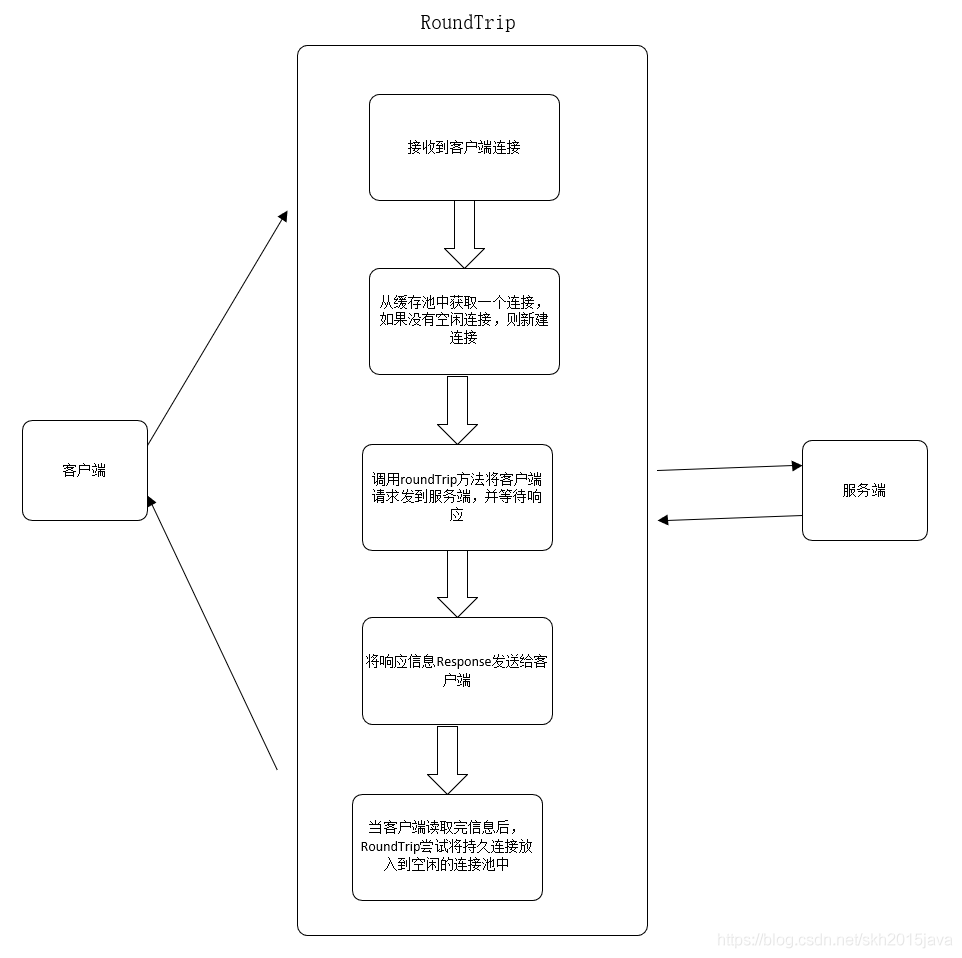

## Client结构体

```go
 type Client struct {
	
	Transport RoundTripper
 
	CheckRedirect func(req *Request, via []*Request) error
 
	Jar CookieJar
 
	Timeout time.Duration
}
```

Client表示一个HTTP客户端，它的默认值是DefaultClient会默认使用DefaultTransport的可用客户端。

Transport表示HTTP事务，用于处理客户端的请求并等待服务端的响应

CheckRedirect 用于指定处理重定向的策略

Jar指定cookie的jar

Timeout 指定客户端请求的最大超时时间，该超时时间包括连接,任何的重定向以及读取响


### RoundTripper接口

使用golang net/http库发送http请求，最后都是调用 transport的 RoundTrip方法

```go
type RoundTripper interface {
	RoundTrip(*Request) (*Response, error)
}
```

Transport的核心方法时RoundTrip方法，该方法的工作流程基本如下：




RoundTrip代表一个http事务，给一个请求返回一个响应。RoundTripper必须是并发安全的。

```go
type Transport struct {                        
	idleConn   map[connectMethodKey][]*persistConn // 可以理解成 空闲的连接池，用于存放空闲的连接，从而使连接可以复用。
	/*
	idleConnCh 用来在并发http请求的时候在多个 goroutine 里面相互发送持久连接,也就是说，
	这些持久连接是可以重复利用的， 你的http请求用某个persistConn用完了，
	通过这个channel发送给其他http请求使用这个persistConn
	*/
	idleConnCh map[connectMethodKey]chan *persistConn
  ....

}
```


#### RoundTrip方法源码如下：

该方法首先会进行一些校验，如果客户端请求的scheme有自定的RoundTrip，则使用自定义的RoundTrip处理request，并返回response。

该方法主要的请求处理逻辑在for循环里，首先会根据请求从空闲的连接池中获取一个连接或新建一个连接pconn。

```go
//RoundTrip实现了RoundTripper接口
func (t *Transport) RoundTrip(req *Request) (*Response, error) {
	//初始化TLSNextProto  http2使用
	t.nextProtoOnce.Do(t.onceSetNextProtoDefaults)
	//获取请求的上下文
	ctx := req.Context()
	trace := httptrace.ContextClientTrace(ctx)
 
	//错误处理
	if req.URL == nil {
		req.closeBody()
		return nil, errors.New("http: nil Request.URL")
	}
	if req.Header == nil {
		req.closeBody()
		return nil, errors.New("http: nil Request.Header")
	}
	scheme := req.URL.Scheme
	isHTTP := scheme == "http" || scheme == "https"
	//如果是http或https请求，对Header中的数据进行校验
	if isHTTP {
		for k, vv := range req.Header {
			if !httplex.ValidHeaderFieldName(k) {
				return nil, fmt.Errorf("net/http: invalid header field name %q", k)
			}
			for _, v := range vv {
				if !httplex.ValidHeaderFieldValue(v) {
					return nil, fmt.Errorf("net/http: invalid header field value %q for key %v", v, k)
				}
			}
		}
	}
 
	//如果该scheme有自定义的RoundTrip，则使用自定义的RoundTrip处理request，并返回response
	altProto, _ := t.altProto.Load().(map[string]RoundTripper)
	if altRT := altProto[scheme]; altRT != nil {
		if resp, err := altRT.RoundTrip(req); err != ErrSkipAltProtocol {
			return resp, err
		}
	}
 
	//如果不是http请求，则关闭并退出
	if !isHTTP {
		req.closeBody()
		return nil, &badStringError{"unsupported protocol scheme", scheme}
	}
 
	//对请求的Method进行校验
	if req.Method != "" && !validMethod(req.Method) {
		return nil, fmt.Errorf("net/http: invalid method %q", req.Method)
	}
 
	//请求的host为空，则返回
	if req.URL.Host == "" {
		req.closeBody()
		return nil, errors.New("http: no Host in request URL")
	}
 
	for {
		//初始化transportRequest,transportRequest是request的包装器
		treq := &transportRequest{Request: req, trace: trace}
		//根据用户的请求信息获取connectMethod  cm
		cm, err := t.connectMethodForRequest(treq)
		if err != nil {
			req.closeBody()
			return nil, err
		}
 
		//从缓存中获取一个连接，或者新建一个连接
		pconn, err := t.getConn(treq, cm)
		if err != nil {
			t.setReqCanceler(req, nil)
			req.closeBody()
			return nil, err
		}
 
		var resp *Response
		if pconn.alt != nil {
			// HTTP/2 path.
			t.setReqCanceler(req, nil) // not cancelable with CancelRequest
			resp, err = pconn.alt.RoundTrip(req)
		} else {
			resp, err = pconn.roundTrip(treq)
		}
		if err == nil {
			return resp, nil
		}
		if !pconn.shouldRetryRequest(req, err) {
			// Issue 16465: return underlying net.Conn.Read error from peek,
			// as we've historically done.
			if e, ok := err.(transportReadFromServerError); ok {
				err = e.err
			}
			return nil, err
		}
		testHookRoundTripRetried()
 
		if req.GetBody != nil && pconn.alt == nil {
			newReq := *req
			var err error
			newReq.Body, err = req.GetBody()
			if err != nil {
				return nil, err
			}
			req = &newReq
		}
	}
}
```


##### getConn获取或新建连接

```go
 func (t *Transport) getConn(treq *transportRequest, cm connectMethod) (*persistConn, error) {
	req := treq.Request
	trace := treq.trace
	ctx := req.Context()
 
	//GetConn是钩子函数在获取连接前调用
	if trace != nil && trace.GetConn != nil {
		trace.GetConn(cm.addr())
	}
	//如果可以获取到空闲的连接
	if pc, idleSince := t.getIdleConn(cm); pc != nil {
		if trace != nil && trace.GotConn != nil {  //GotConn是钩子函数，成功获取连接后调用
			trace.GotConn(pc.gotIdleConnTrace(idleSince))
		}
		/*
		将请求的canceler设置为某些非零函数，以便我们可以检测它是否现在和我们进入roundTrip之间被清除
		*/
		t.setReqCanceler(req, func(error) {})
		return pc, nil
	}
 
	type dialRes struct {
		pc  *persistConn
		err error
	}
	dialc := make(chan dialRes)
 
	testHookPrePendingDial := testHookPrePendingDial
	testHookPostPendingDial := testHookPostPendingDial
 
	//该内部函数handlePendingDial的主要作用是，新开启一个协程，当新建连接完成后但没有被使用，将其放到连接池（缓存）中或将其关闭
	handlePendingDial := func() {
		testHookPrePendingDial()
		go func() {
			if v := <-dialc; v.err == nil {
				t.putOrCloseIdleConn(v.pc)
			}
			testHookPostPendingDial()
		}()
	}
 
	cancelc := make(chan error, 1)
	t.setReqCanceler(req, func(err error) { cancelc <- err })
 
	go func() {//开启一个协程新建一个连接
		pc, err := t.dialConn(ctx, cm)
		dialc <- dialRes{pc, err}
	}()
 
	idleConnCh := t.getIdleConnCh(cm)
   
	select {
	case v := <-dialc: //获取新建的连接
		// Our dial finished.
		if v.pc != nil { //如果新建的连接不为nil，则返回新建的连接
			if trace != nil && trace.GotConn != nil && v.pc.alt == nil {
				trace.GotConn(httptrace.GotConnInfo{Conn: v.pc.conn})
			}
			return v.pc, nil
		}
		// Our dial failed. See why to return a nicer error
		// value.
		select {
		case <-req.Cancel:
			// It was an error due to cancelation, so prioritize that
			// error value. (Issue 16049)
			return nil, errRequestCanceledConn
		case <-req.Context().Done():
			return nil, req.Context().Err()
		case err := <-cancelc:
			if err == errRequestCanceled {
				err = errRequestCanceledConn
			}
			return nil, err
		default:
			return nil, v.err
		}
	case pc := <-idleConnCh:  //如果在新建连接的过程中，有空闲的连接，则返回该空闲的连接
		//如果在dial连接的时候，有空闲的连接，但是这个时候我们仍然正在新建连接，所以当它新建完成后将其放到连接池或丢弃
		handlePendingDial()
		if trace != nil && trace.GotConn != nil {
			trace.GotConn(httptrace.GotConnInfo{Conn: pc.conn, Reused: pc.isReused()})
		}
		return pc, nil
	case <-req.Cancel:
		handlePendingDial()
		return nil, errRequestCanceledConn
	case <-req.Context().Done():
		handlePendingDial()
		return nil, req.Context().Err()
	case err := <-cancelc:
		handlePendingDial()
		if err == errRequestCanceled {
			err = errRequestCanceledConn
		}
		return nil, err
	}
}
```

**第一步：**尝试从空闲的连接池中获取空闲连接(通过getIdleConn方法) 如果缓存中有空闲的连接，则获取空闲的连接，并从idleConn和idleLRU中删除该连接，getIdleConn方法的源码如下：

```go
func (t *Transport) getIdleConn(cm connectMethod) (pconn *persistConn, idleSince time.Time) {
	key := cm.key()
	t.idleMu.Lock()
	defer t.idleMu.Unlock()
	for {
		pconns, ok := t.idleConn[key]
		if !ok {
			return nil, time.Time{}
		}
		if len(pconns) == 1 {
			pconn = pconns[0]
			delete(t.idleConn, key) //获取空闲的连接，并从idleConn和idleLRU中删除该连接
		} else {
			pconn = pconns[len(pconns)-1]
			t.idleConn[key] = pconns[:len(pconns)-1]
		}
		t.idleLRU.remove(pconn)
		if pconn.isBroken() {  //如果该连接被关闭，则继续从缓存中查找
			continue
		}
		if pconn.idleTimer != nil && !pconn.idleTimer.Stop() {
			// We picked this conn at the ~same time it
			// was expiring and it's trying to close
			// itself in another goroutine. Don't use it.
			continue
		}
		return pconn, pconn.idleAt
	}
}
```

**第二步：**如果空闲的连接池中没有可用的连接，则会调用dialConn方法新建连接，当我们无法从空闲的连接池中获取连接，就要新建连接。新建连接的大致过程如下：首先 初始化dialc channel， 该channel用于等待新建的连接，如果连接创建成功则将创建的连接放入到dialc中

```
go func() {//开启一个协程新建一个连接
		pc, err := t.dialConn(ctx, cm)
		dialc <- dialRes{pc, err}
}()
```

**新建连接的过程：**前面我们看到新建连接时，会开启一个协程来执行dialConn方法中，新建连接的大致过程如下：

1. 首先初始化persistConn结构体

2. 创建连接，创建连接时区分https和http

3. 连接创建成功后，会开启两个协程，一个用于处理输入流writeLoop，一个用于处理输出流readLoop

   

##### 从中我们看到当客户端和服务端每建立一个连接，都会开启两个协程，一个处理输入流writeLoop，一个处理输出流readLoop。到此新建连接的大致过程已经讲解完成（相当于TCP/IP连接已经建立）。RoundTrip方法源码中的通过getConn方法获取或新建连接我们已经了解，建立连接之后就可以数据的读写了，后面http事务主要在roundTrip方法中完成

##### readLoop方法

输出流readLoop主要读取reqch   chan  requestAndChan中的数据，从网络连接中读取响应数据。

##### writeLoop方法

输入流writeLoop主要处理writech chan writeRequest中的消息，并将该消息写入到网络连接中。 

#### roundTrip方法处理请求并等待响应

1. 将请求消息写入到writech，将请求信息发送给输入流
3. resc chan就是为了等待从服务端响应的消息。
4. 返回从服务端响应的消息或错误信息

```
func (pc *persistConn) roundTrip(req *transportRequest) (resp *Response, err error) {
	testHookEnterRoundTrip()
        ......
	/*
	将请求消息写入到输入流
	*/
	startBytesWritten := pc.nwrite
	writeErrCh := make(chan error, 1)
	pc.writech <- writeRequest{req, writeErrCh, continueCh}
 
	//将请求消息发送到输出流，并等待返回
	resc := make(chan responseAndError)
	pc.reqch <- requestAndChan{
		req:        req.Request,
		ch:         resc,
		addedGzip:  requestedGzip,
		continueCh: continueCh,
		callerGone: gone,
	}
}
```


#### 我们通过一些常用的http包对外提供的方法来窥探http客户端的请求流程和机制。

#####  Post和PostForm方法

看到Post和PostForm最终都是调用默认客户端DefaultClient的Post方法，然后调用Do来处理请求并获得相应信息。

```
func Post(url string, contentType string, body io.Reader) (resp *Response, err error) {
	return DefaultClient.Post(url, contentType, body)
}
 
func (c *Client) Post(url string, contentType string, body io.Reader) (resp *Response, err error) {
	req, err := NewRequest("POST", url, body)
	if err != nil {
		return nil, err
	}
	req.Header.Set("Content-Type", contentType)
	return c.Do(req)
}
 
 
func PostForm(url string, data url.Values) (resp *Response, err error) {
	return DefaultClient.PostForm(url, data)
}
 
func (c *Client) PostForm(url string, data url.Values) (resp *Response, err error) {
	return c.Post(url, "application/x-www-form-urlencoded", strings.NewReader(data.Encode()))
}
```

##### Get方法

```
func Get(url string) (resp *Response, err error) {

       return DefaultClient.Get(url)
}
 
var DefaultClient = &Client{}
```

Get方法使用的是http包对外提供的默认客户端DefaultClient，DefaultClient的Get方法如下

```
func (c *Client) Get(url string) (resp *Response, err error) {
	req, err := NewRequest("GET", url, nil)
	if err != nil {
		return nil, err
	}
	return c.Do(req)
}
```

看到首先创建了Request结构体req，指定了请求的Method和url。

该方法的大致流程如下：

  1.首先会进行相关参数的校验

  2.参数校验通过后，会调用send方法来发送客户端请求，并获取服务端的响应信息。

  3.如果服务端回复的不需要重定向，则将该响应resp返回

  4.如果服务端回复的需要重定向，则获取重定向的Request，并进行重定向校验

  5.重定向校验通过后，会继续调用send方法来发送重定向的请求。

  6.不需要重定向时返回从服务端响应的结果resp。

```
func (c *Client) Do(req *Request) (*Response, error) {
	//如果请求的URL为nil，则关闭请求体，并且返回error
	if req.URL == nil {
		req.closeBody()
		return nil, errors.New("http: nil Request.URL")
	}
 
	var (
		deadline      = c.deadline()
		reqs          []*Request
		resp          *Response
		copyHeaders   = c.makeHeadersCopier(req)  //拷贝一份headers
		reqBodyClosed = false // have we closed the current req.Body?
 
		// Redirect behavior:
		redirectMethod string
		includeBody    bool
	)
	//错误处理函数
	uerr := func(err error) error {
		// the body may have been closed already by c.send()
		if !reqBodyClosed {
			req.closeBody()
		}
		method := valueOrDefault(reqs[0].Method, "GET")
		var urlStr string
		if resp != nil && resp.Request != nil {
			urlStr = resp.Request.URL.String()
		} else {
			urlStr = req.URL.String()
		}
		return &url.Error{
			Op:  method[:1] + strings.ToLower(method[1:]),
			URL: urlStr,
			Err: err,
		}
	}
 
	for {
		/*
		对于非第一个请求 ，创建下一个hop并且替换req
		*/
		if len(reqs) > 0 { //有重定向的情况
			loc := resp.Header.Get("Location")  //获取响应resp的Header中的Location对应的值
			if loc == "" {
				resp.closeBody()
				return nil, uerr(fmt.Errorf("%d response missing Location header", resp.StatusCode))
			}
			u, err := req.URL.Parse(loc) //将loc解析成URL
			if err != nil {
				resp.closeBody()
				return nil, uerr(fmt.Errorf("failed to parse Location header %q: %v", loc, err))
			}
			host := ""
			if req.Host != "" && req.Host != req.URL.Host {  //解析host
				if u, _ := url.Parse(loc); u != nil && !u.IsAbs() {
					host = req.Host
				}
			}
			ireq := reqs[0]
			//获取重定向的Request  req
			req = &Request{
				Method:   redirectMethod,
				Response: resp,
				URL:      u,
				Header:   make(Header),
				Host:     host,
				Cancel:   ireq.Cancel,
				ctx:      ireq.ctx,
			}
			if includeBody && ireq.GetBody != nil {
				req.Body, err = ireq.GetBody()
				if err != nil {
					resp.closeBody()
					return nil, uerr(err)
				}
				req.ContentLength = ireq.ContentLength
			}

			copyHeaders(req)

			/*
			如果不是https-> http，请将最新请求URL中的Referer标头添加到新标头中：
			*/
			if ref := refererForURL(reqs[len(reqs)-1].URL, req.URL); ref != "" {
				req.Header.Set("Referer", ref)
			}
			err = c.checkRedirect(req, reqs)
 
			if err == ErrUseLastResponse {
				return resp, nil
			}
 
			const maxBodySlurpSize = 2 << 10
			if resp.ContentLength == -1 || resp.ContentLength <= maxBodySlurpSize {
				io.CopyN(ioutil.Discard, resp.Body, maxBodySlurpSize)
			}
			resp.Body.Close()
 
			if err != nil {
				ue := uerr(err)
				ue.(*url.Error).URL = loc
				return resp, ue
			}
		}
 
		reqs = append(reqs, req)  //将req写入到reps中
		var err error
		var didTimeout func() bool
		//发送请求到服务端，并获取响应信息resp
		if resp, didTimeout, err = c.send(req, deadline); err != nil {
			// c.send() always closes req.Body
			reqBodyClosed = true
			if !deadline.IsZero() && didTimeout() {  //已超时
				err = &httpError{
					err:     err.Error() + " (Client.Timeout exceeded while awaiting headers)",
					timeout: true,
				}
			}
			return nil, uerr(err)
		}
 
		var shouldRedirect bool
		//根据请求的Method，响应的消息resp和 第一次请求req获取是否需要重定向，重定向的方法，重定向时是否包含body
		redirectMethod, shouldRedirect, includeBody = redirectBehavior(req.Method, resp, reqs[0])
		if !shouldRedirect {  //不用重发，则返回
			return resp, nil
		}
 
		req.closeBody()
	}
}
```

send方法主要调用send函数将请求发送到Transport中，并返回response。

```
func (c *Client) send(req *Request, deadline time.Time) (resp *Response, didTimeout func() bool, err error) {
	//如果Jar不为nil，则将Jar中的Cookie添加到请求中
	if c.Jar != nil {
		for _, cookie := range c.Jar.Cookies(req.URL) {
			req.AddCookie(cookie)
		}
	}
	//发送请求到服务端，并返回从服务端读取到的response信息resp
	resp, didTimeout, err = send(req, c.transport(), deadline)
	if err != nil {
		return nil, didTimeout, err
	}
	if c.Jar != nil {
		if rc := resp.Cookies(); len(rc) > 0 {
			c.Jar.SetCookies(req.URL, rc)
		}
	}
	return resp, nil, nil
}
```

send函数的主要作用是调用RoundTrip完成一个HTTP事务，并返回一个resp。

```
func send(ireq *Request, rt RoundTripper, deadline time.Time) (resp *Response, didTimeout func() bool, err error) {
	req := ireq // req is either the original request, or a modified fork  req是原始的请求或者一个拷贝
 
	/*
	条件判断：
	如果RoundTripper为nil 或者请求的URL为nil 或者 请求的RequestURI为空，则关闭请求体，返回error
	*/
 
	// forkReq forks req into a shallow clone of ireq the first
	// time it's called.
	/*
	第一次调用时，将req转换为ireq的拷贝
	*/
	forkReq := func() {
		if ireq == req {
			req = new(Request)
			*req = *ireq // shallow clone
		}
	}
	/*
	由于大多数的调用(Get,Post等)都不需要Headers，而是将其保留成为初始化状态。不过我们传输到Transport需要保证其被初始化，所以这里将
	没有Header为nil的进行初始化
	如果请求头为nil
	*/
	if req.Header == nil {
		forkReq()
		req.Header = make(Header)
	}
 
	/*
	如果URL中协议用户和密码信息，并且请求头的Authorization为空，我们需要设置Header的Authorization
	*/
	if u := req.URL.User; u != nil && req.Header.Get("Authorization") == "" {
		username := u.Username()
		password, _ := u.Password()
		forkReq()
		req.Header = cloneHeader(ireq.Header)
		req.Header.Set("Authorization", "Basic "+basicAuth(username, password))
	}
 
	//如果设置了超时时间，则需要调用forkReq，来确保req是ireq的拷贝，而不是执行同一地址的指针
	if !deadline.IsZero() {
		forkReq()
	}
 
	//根据deadline设置超时
	stopTimer, didTimeout := setRequestCancel(req, rt, deadline)
 
	//调用RoundTrip完成一个HTTP事务，并返回一个resp
	resp, err = rt.RoundTrip(req)
	if err != nil { //如果err不为nil
		stopTimer() //取消监听超时
		if resp != nil {
			log.Printf("RoundTripper returned a response & error; ignoring response")
		}
		if tlsErr, ok := err.(tls.RecordHeaderError); ok {
			if string(tlsErr.RecordHeader[:]) == "HTTP/" {
				err = errors.New("http: server gave HTTP response to HTTPS client")
			}
		}
		return nil, didTimeout, err
	}
	if !deadline.IsZero() { //如果设置了超时，则将Body转成cancelTimerBody
		resp.Body = &cancelTimerBody{
			stop:          stopTimer,
			rc:            resp.Body,
			reqDidTimeout: didTimeout,
		}
	}
	return resp, nil, nil
}
```

Request结构体

```
type Request struct {

	Method string //HTTP的方法(GET、POST、PUT等)
	
	URL *url.URL //请求解析后的url
	
	Header Header //请求到服务器携带的请求头信息,用map存储
	
	Body io.ReadCloser //请求的消息体,HTTP客户端的Transport负责调用Close方法关闭
	
	GetBody func() (io.ReadCloser, error) //GetBody 定义一个可选的方法用来返回Body的副本，当客户端的请求被多次重定向的时候，会用到该函数
	
	ContentLength int64 //ContentLength  存储消息体的字节长度 如果为 -1 则表示消息长度未知
	
	ctx context.Context   //请求的上下文
	/*
	Close对于服务端是回复此请求后是否关闭连接，对于客户端发送此请求并读取服务端的响应后是否关闭连接，对于服务器请求，HTTP服务器自动处理此请求，
	处理程序不需要此字段。对于客户端请求，设置此字段可防止在对相同主机的请求之间重复使用TCP连接，就像设置了Transport.DisableKeepAlives一样。
	*/
	Close bool
	/*
	储存解析后的表单数据，包括URL字段查询的参数和 POST或PUT表单数据
	该字段仅在调用ParseForm后可用。 HTTP客户端忽略Form并使用Body。
	*/
	Form url.Values
	/*
	PostForm储存了 从POST,PATCH,PUT解析后表单数据
	该字段仅在调用ParseForm后可用，HTTP客户端会忽略PostForm而是使用Body
	*/
	PostForm url.Values
	
	/*
	MultipartForm是解析的多部分表单，包括文件上载。 该字段仅在调用ParseMultipartForm后可用。
	HTTP客户端忽略MultipartForm而使用Body
	*/
	MultipartForm *multipart.Form
	
	Response *Response //重定向时使用该字段
	
}
```

