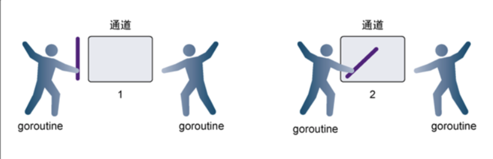
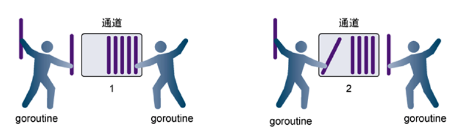

#### go语言的CSP模型

+ 这是一种用于描述两个独立的并发实体通过共享的通讯 Channel（管道）进行通信的并发模型。
+ Go的CSP模型实现与原始的CSP实现有点差别：原始的CSP中channel里的任务都是立即执行的，而go语言为其增加了一个缓存，即任务可以先暂存起来，等待执行线程准备好再顺序执行。
+ channel是Go语言中各个并发结构体(goroutine)之前的通信机制。 通俗的讲，就是各个goroutine之间通信的”管道“
+ 可以把channel理解成一个管子可以存放任何类型的数据即可

#### channel

+ 当申明一个channel时会在全局区产生一个hchan结构体的指针`8个字节`指向虚拟内存
  + buf 环形队列指针：就是管道内的数据在内存中存储的位置
  + sendx和recvx就是元素在这个管道队列里读出和写入的位置
  + recvq：
    + 存放读取管道数据的协程队列
    + 当多个goroutine在读取某一个管道时会排队读取，如果没有数据则阻塞
    + 被阻塞的goroutine将会挂在channel的等待队列中
    + 因读阻塞的goroutine会被向channel写入数据的goroutine唤醒
  + sendq：
    + 存放写管道数据的协程队列
    + 就是当多个goroutinee往管道写数据时会排队写入，如果管道满了则阻塞
    + 被阻塞的goroutine将会挂在channel的等待队列中
    + 因写阻塞的goroutine会被从channel读数据的goroutine唤醒
  + 

#### 向一个channel中写数据简单过程如下：

如果recvq队列不为空（有空闲的读协程），说明管道里没有数据（读协程大于写协程），那么直接从recvq取出G，并把写协程的数据写入该G（无需再放入管道），最后把G唤醒，结束读取过程；

#### 从一个channel读数据简单过程如下：

如果sendq队列不为空（有空闲的写协程），管道里数据已满（写协程大于读协程），从管道里首部读出数据到读协程里，把写协程中数据写入管道里尾部，把G唤醒，结束读取过程

#### 关闭管道

+ 释放所有接收者：将所有读取的goroutine全部销毁，进行垃圾回收
+ 释放所有发送者：将所有写入的goroutine全部销毁，进行垃圾回收

#### 使用channel出现panic的常见场景有

+ 关闭已经被关闭的channel：因为此时的管道已经关闭，所以没法关闭
+ 向已经关闭的channel写数据：因为此时的管道已经关闭，没法写入
+ 读取没有关闭且为nil的channel：因为接收者和发送者的资源没有进行释放，SELECT内置的方默认将channel的资源已经释放所以可以用SELECT遍历管道

#### channel注意事项

##### 基本语法

```
var intchan chan int //定义管道
intchan=make(chan int,3)//给管道分配内存空间
intchan <- 10	//写入管道数据
firstDara:= <- intchan	//从管道里面读取数据
fmt.Println(firstDara)
```

##### 无缓冲管道

无缓冲管道就是必须读写同时操作才会有效果，如果只进行读或者只进行写那么会被阻塞，被暂时停顿等待另外一方的操作，是一个同步的过程，降低传输效率

```
ch:=make(chan int) //无缓冲管道
```




##### 有缓冲管道

channel 中自带缓冲区。创建时可以指定缓冲区的大小。写：直到缓冲区被填满后，写端才会阻塞。读：缓冲区被读空，读端才会阻塞。
len：代表缓冲区中剩余元素个数，cap：代表缓冲区的容量。是一个异步步的过程，提高传输效率

```
ch:=make(chan int,10)//有缓冲管道
```





#### channel实战

+ 异常处理：当一个单体应用系统的某个功能发生异常，此时启动一个协程将数据传给管道，同时专门有一个处理异常消息的协程进行处理各种类型的异常消息
+ 消息发送处理：当系统中有各种短信发送，此时启动一个协程将短信类型传给管道，同时专门有一个处理短信发送的协程进行各种类型的短信发送
+ 进行数据去重汇总处理：启动N个协程读取大量数据往管道写入数据，同时专门有一个去重的协程进行数据的去重操作
