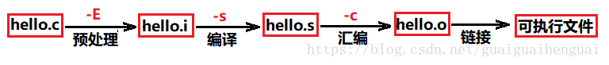
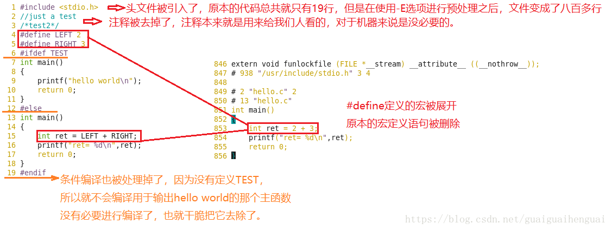

#### 整个过程





#### 预处理： 【gcc -E 源码.c -o 预处理.i】

	宏定义展开：将代码加载到 .i 文件中
	头文件展开：将代码中引入的代码加载到 .i文件中
	条件编译 ：对系统的判断（linux，mac,windows）
	去掉注释：去掉注释


#### 编译： 【gcc -S 预处理.i -o 汇编.s】

	检查语法 
	将源码变成汇编语言
	将文本文件.i翻译成文本文件.s，它包含一个汇编语言程序。
#### 汇编： 【gcc -c 汇编.s -o 二进制.o】

	汇编过程调用汇编器as来完成，是用于将汇编代码转换成机器可以执行的指令（二进制语言），每一个汇编语句几乎都对应一条机器指令。
	hello.o文件是一个二进制文件，它的字节编码是机器语言指令而不是字符，如果我们在文本文件中打开hello.o文件，看到的将是一堆乱码。
#### 链接： 【gcc 二进制.o -o 可执行程序】

````
某个源文件中的函数可能引用了另一个源文件中定义的某个符号（如变量或者函数调用等）；

在程序中可能调用了某个库文件中的函数等等。所有的这些问题，都需要经链接程序的处理方能得以解决。

链接器（ld）负责处理合并目标代码，生成一个可执行目标文件，使得所有的这些目标文件成为一个能够按操作系统装入执行的统一整体，可以被加载到内存中，由系统执行。
````

