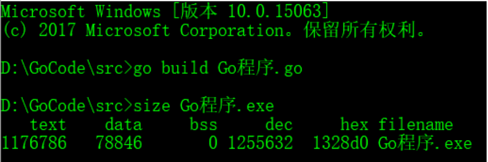

代码经过预处理、编译、汇编、链接4步后⽣成⼀个可执⾏程序。程序是⼀个普通的可执⾏⽂件，以下列出⼀个⼆进制可执⾏⽂件的基本情况：

通过上图可以得知，也就是说程序没有加载到内存前，可执⾏程序内部已经分好三段信息，分别为代码区（**text**）、数据区（**data**）和未初始化数据区（**bss**）3 个部分。

#### 程序进入内存时

+ **代码区：**代码区就相当于一张盖房的图纸（代码）

+ **栈区：**

  1. 栈区主要是施工机器需要的活动空间（程序内部的函数）
  2. 函数的参数以及局部变量会在调用时加载到内存中
  3. 存放函数的参数值、返回值和局部变量，在程序运行过程中实时分配和释放，栈区由操作系统自动管理，无须程序员手动管理。

+ **堆区：**堆区主要是搭建房子时需要开辟的占地面积（实例化一个结构体、map等等）由程序员手动分配/释放。若程序员不释放，程序结束时可能由操作系统回收。

+ **全局区：**主要存放施工器械、材料等的地方（存放常量等等）

  1. 常量区：存放已初始化的全局变量、静态变量（全局和局部）、常量数据、结构体等等。

  2. 未初始化数据区：存放的是未初始化的全局变量和静态变量。

  

+ **内存四区模型**

