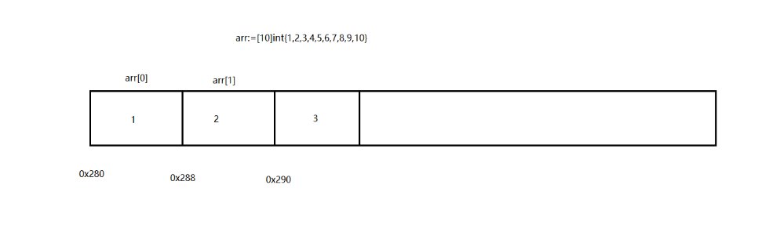

#### 数组：

一组具有相同**数据类型**在内存中**有序存储**的-----数据集合，数组的**长度在定义后不可以修改**。

#### **指针**：

+ 只要将数据存储在内存中都会为其分配内存地址。可以使用运算符 & 来获取数据的内存地址。

+ 引用类型：指针、切片、管道、map定义时都是存储在内存的0段位置，没有分配空间，得需要new和make分配空间，让0值得地址指向新开辟的空间

+ make和new的区别：都是给引用类型开辟内存空间，只不过make可对复杂类型的内存空间大小进行设置，比如：make([]map[string]int64,10,20)
+ 指针占用8个字节的内存空间

##### 