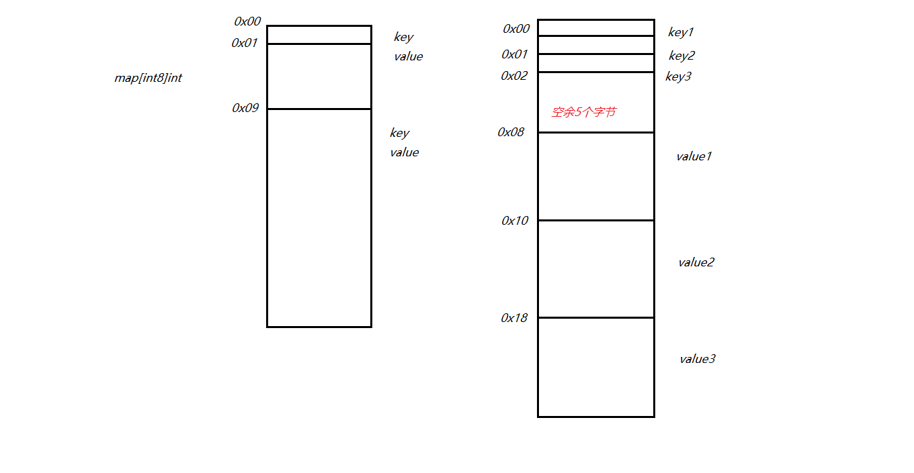

+ go语言的map就是hash数据结构思想（链表和数组的组合）

+ 当申明一个map时会在全局区产生一个map结构体的指针`8个字节`指向虚拟内存的桶【桶就是存放数据的节点】：

  ```
  //这个桶（结构体）存储的主要内容
  //	1、hash函数算出来的哈希值的高8位
  //	2、哈希数组
  //	3、hash函数算出来的哈希值的低8位
  type hmap struct {
      count     int    // 元素的个数
      flags     uint8  // 状态标志
      B         uint8  // 可以最多容纳 6.5 * 2 ^ B 个元素，6.5为装载因子
      noverflow uint16 // 溢出的个数
      hash0     uint32 // 哈希种子
   
      buckets    unsafe.Pointer // 桶的地址
      oldbuckets unsafe.Pointer // 旧桶的地址，用于扩容
      nevacuate  uintptr        // 搬迁进度，小于nevacuate的已经搬迁
      overflow *[2]*[]*bmap 
  }
  ```

+ 存储原理

  + 以`key0、key1、key2... value0、value1、value2`这种形式存储，目的是为了内存对齐，节省资源提高读取速度，
  + 内存对齐：比如一个int32占用四个字节，一个int64占用八个字节，内存空间以八个字节为一组，如果int32和int64交叉存储那么就会浪费掉int32所在组的内存
  + 图是go语言的map存储方式

  

  + map通过哈希结构进行存储数据，如果桶不够添加时会对会进行扩容，删除时不会删除多余的桶

+ map中key查找的流程

  1. 根据传入的key用对应的hash函数算出哈希值，取哈希值的低8位定为到是哪一个bucket（使用散列函数，确定查找的节点在哪个链表）。
  3. 定位到bucket之后，取哈希值的高8位，和bucket中的uint[8]数组中存储的高8位进行比对，根据接收的index在key和value字节数组中查找对应的key，若匹配上则返回 key，value，否则当前map不含有此key，（遍历每个节点直到某一个节点和查找的节点相等即可）。

  
