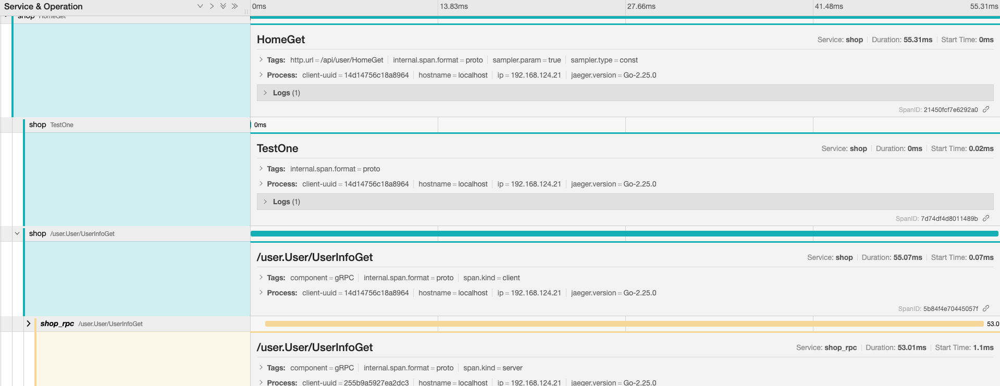

#### 1. 初始化Jaeger

```
//初始化Jaeger
tracer, _ := initJaeger("shop")
opentracing.SetGlobalTracer(tracer)
//拦截器用于跨服务调用
dialOpts := []grpc.DialOption{grpc.WithInsecure()}
if tracer != nil {
   dialOpts = append(dialOpts, grpc.WithUnaryInterceptor(models.OpenTracingClientInterceptor(tracer)))
}

//grpc调用
var err error
UserRpcConn, err = grpc.Dial(viper.GetString("rpc_server.user.port"), dialOpts...)
if err != nil {
   return err
}

// initJaeger
func initJaeger(service string) (opentracing.Tracer, io.Closer) {
   cfg := &config.Configuration{
      Sampler: &config.SamplerConfig{
         Type:  "const",
         Param: 1,
      },
      Reporter: &config.ReporterConfig{
         LogSpans: true,
      },
   }
   tracer, closer, err := cfg.New(service, config.Logger(jaeger.StdLogger))
   if err != nil {
      panic(fmt.Sprintf("ERROR: cannot init Jaeger: %v\n", err))
   }
   return tracer, closer
}
```

#### 2. 编写请求接口

```
// @Description  测试
// @Success 200 {object} utils.ResponseData
// @router /api/user/HomeGet [get]
func HomeGet(c *gin.Context) {
   span := opentracing.StartSpan("HomeGet")
   defer span.Finish()
   ctx := context.Background()
   ctx = opentracing.ContextWithSpan(ctx, span)
   span.SetTag("http.url", c.Request.URL.Path)
   span.LogFields(
      log.String("请求参数", "前端传过来的参数"),
   )
   num := TestOne(ctx, 10)
   //grpc调用
   req := new(user_api.UserInfoGetReq)
   req.UserId = 1
   reply, err := user_api.NewUserClient(utils.UserRpcConn).UserInfoGet(ctx, req) //使用一条链路的ctx
   if err != nil {
      utils.ResponseErrorWithMsg(c, utils.CodeServerBusy, err.Error())
      return
   }
   fmt.Println(num)
   utils.ResponseSuccess(c, reply)
}

func TestOne(ctx context.Context, num int64) int64 {
   // 第二个返回值是ctx，用于进一步传递
   span, _ := opentracing.StartSpanFromContext(ctx, "TestOne")
   defer span.Finish()
   span.LogFields(
      log.String("TestOne", "TestOne请求参数"),
   )
   num += 10
   return num
}
```

#### 3.初始化rpc服务

```
/***增加一个拦截器**/
//var opts []grpc.ServerOption
//fmt.Println("init global tracer...")
//tracer, _ := initJaeger("shop_rpc")
//opentracing.SetGlobalTracer(tracer)
//open tracing
//if tracer != nil {
// opts = append(opts, grpc.UnaryInterceptor(OpentracingServerInterceptor(tracer)))
//}
//// 拦截器捕获异常
//var interceptor grpc.UnaryServerInterceptor
//interceptor = func(ctx context.Context, req interface{}, info *grpc.UnaryServerInfo, handler grpc.UnaryHandler) (
// resp interface{}, err error) {
// defer func() (interface{}, error) {
//    //恢复程序的控制权
//    err := recover()
//    if err != nil {
//       fmt.Println(err)
//    }
//    return nil, nil
// }()
// // 继续处理请求
// return handler(ctx, req)
//}
//opts = append(opts, grpc.UnaryInterceptor(interceptor))

/***增加多个拦截器**/
fmt.Println("init global tracer...")
tracer, _ := initJaeger("shop_rpc")
opentracing.SetGlobalTracer(tracer)
var interceptor grpc.UnaryServerInterceptor
interceptor = func(ctx context.Context, req interface{}, info *grpc.UnaryServerInfo, handler grpc.UnaryHandler) (
   resp interface{}, err error) {
   defer func() (interface{}, error) {
      //恢复程序的控制权
      err := recover()
      if err != nil {
         fmt.Println(err)
      }
      return nil, nil
   }()
   // 继续处理请求
   return handler(ctx, req)
}
//增加多个拦截器
opts := []grpc.ServerOption{
   grpc_middleware.WithUnaryServerChain(
      interceptor,
      OpentracingServerInterceptor(tracer),
   ),
}
//启动rpc服务
rpcScerver := grpc.NewServer(opts...)
user_api.RegisterUserServer(rpcScerver, new(controllers.UserInfo))
lis, _ := net.Listen("tcp", viper.GetString("app.port"))


/** 封装好的接口***/
var (
	//TracingComponentTag tags  ext.Component="component"
	TracingComponentTag = opentracing.Tag{Key: string(ext.Component), Value: "gRPC"}
)

//MDReaderWriter metadata Reader and Writer
type MDReaderWriter struct {
	metadata.MD
}

//ForeachKey range all keys to call handler
func (c MDReaderWriter) ForeachKey(handler func(key, val string) error) error {
	for k, vs := range c.MD {
		for _, v := range vs {
			if err := handler(k, v); err != nil {
				return err
			}
		}
	}
	return nil
}

// Set implements Set() of opentracing.TextMapWriter
func (c MDReaderWriter) Set(key, val string) {
	key = strings.ToLower(key)
	c.MD[key] = append(c.MD[key], val)
}

//OpentracingServerInterceptor rewrite server's interceptor with open tracing
func OpentracingServerInterceptor(tracer opentracing.Tracer) grpc.UnaryServerInterceptor {
	return func(
		ctx context.Context,
		req interface{},
		info *grpc.UnaryServerInfo,
		handler grpc.UnaryHandler,
	) (resp interface{}, err error) {
		//从context中取出metadata
		md, ok := metadata.FromIncomingContext(ctx)
		if !ok {
			md = metadata.New(nil)
		}
		//从metadata中取出最终数据，并创建出span对象
		spanContext, err := tracer.Extract(opentracing.TextMap, MDReaderWriter{md})
		if err != nil && err != opentracing.ErrSpanContextNotFound {
			grpclog.Errorf("extract from metadata err %v", err)
		}
		//初始化server 端的span
		serverSpan := tracer.StartSpan(
			info.FullMethod,
			ext.RPCServerOption(spanContext),
			TracingComponentTag,
			ext.SpanKindRPCServer,
		)
		defer serverSpan.Finish()
		ctx = opentracing.ContextWithSpan(ctx, serverSpan)
		//将带有追踪的context传入应用代码中进行调用
		return handler(ctx, req)
	}
}

// initJaeger returns an instance of Jaeger Tracer that samples 100% of traces and logs all spans to stdout.
func initJaeger(service string) (opentracing.Tracer, io.Closer) {
	cfg := &config.Configuration{
		Sampler: &config.SamplerConfig{
			Type:  "const",
			Param: 1,
		},
		Reporter: &config.ReporterConfig{
			LogSpans: true,
		},
	}
	tracer, closer, err := cfg.New(service, config.Logger(jaeger.StdLogger))
	if err != nil {
		panic(fmt.Sprintf("ERROR: cannot init Jaeger: %v\n", err))
	}
	return tracer, closer
}

```

#### 4. rpc接口处理

```
//获取用户信息
func (this *UserInfo) UserInfoGet(ctx context.Context, req *user_api.UserInfoGetReq) (*user_api.UserInfoGetReply, error) {
   user := new(models.User)
   span, _ := opentracing.StartSpanFromContext(ctx, "UserInfoGet")
   defer span.Finish()
   span.SetTag("sql", "rpc_sql")
   if err := mysql.GetUserInfoById(user, req); err != nil {
      return &user_api.UserInfoGetReply{}, err
   }
   return &user_api.UserInfoGetReply{UserInfo: models.UserToPb(user)}, nil
}
```

#### 5. 整体效果展示

