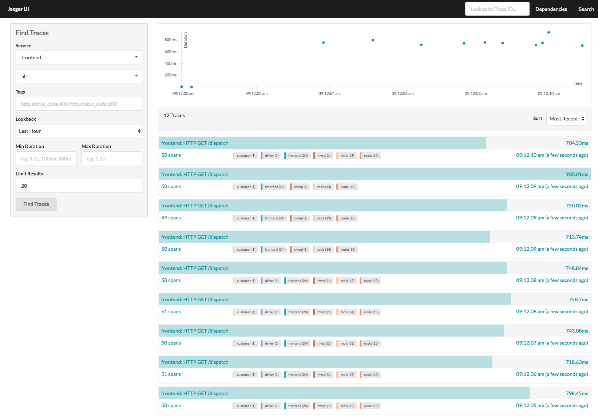
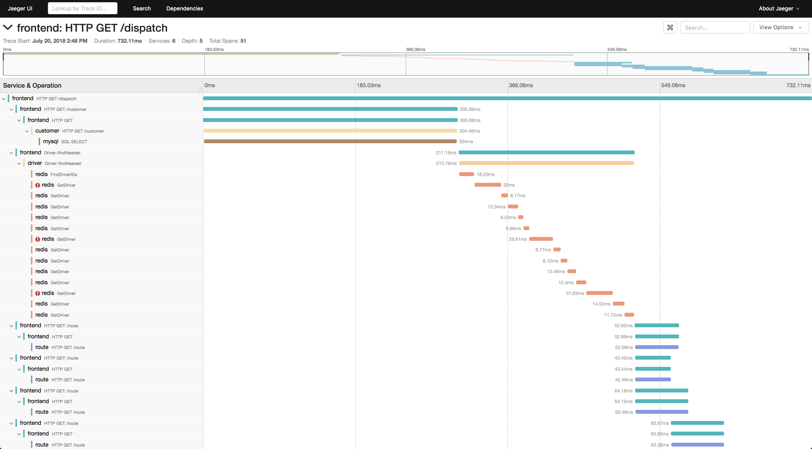

[TOC]

## 一、课前准备

1. 下载安装jaeger

   https://www.jaegertracing.io/download/

2. 安装golang package

   ```
   go get github.com/opentracing/opentracing-go
   go get github.com/uber/jaeger-client-go
   ```

4. 

## 二、课堂主题

1. 为什么需要
2. opentracing 原理
3. jaeger 工具包
4. golang实践

## 三、课堂目标

1. 理解链路跟踪的作用和意义
2. 理解opentracing的各个组件
3. 跨服务的原理
4. 掌握运行，配置
5. 掌握写代码
6. 会使用jaeger网页观察、查询结果

## 四、知识点（1小时40分钟）

### 1. opentracing介绍（20分钟）

### 2. jaeger介绍

### 解决的问题

1. 分布式事务的监控
2. 性能优化
3. 根本原因的分析
4. 服务依赖的分析
5. 上下文数据的传播

### 架构


### Trace & Span


### Traces View

[](https://www.jaegertracing.io/img/traces-ss.png)

### Trace Detail View

[](https://www.jaegertracing.io/img/trace-detail-ss.png)

### 3. jaeger安装和运行

1. 官网下载二进制包

   https://www.jaegertracing.io/download/

2. 指定用ES存储

   我们使用es来存储数据，需要配置环境变量

   ```
   export SPAN_STORAGE_TYPE=elasticsearch
   export ES_SERVER_URLS=http://127.0.0.1:9200
   ```

   在windows下，手工配置环境变量

3. 命令行指定es存储分片

   ```
   jaeger-all-in-one --es.num-replicas 0 --es.num-shards 1
   ```

   

4. 打开浏览器

   ```
   http://localhost:16686/
   ```

   

5. 打开es索引列表，查看新增的jaeger索引

   ```
   http://localhost:9200/_cat/indices
   ```

   


### 4. 小结

1. tracing的意义
2. opentracing的元素构成
3. jaeger安装运行

## 五、拓展点（10分钟）

## 六、总结（5分钟）

## 七、作业
## 八、集中答疑

## 九、下节课预告

jaeger golang 开发
