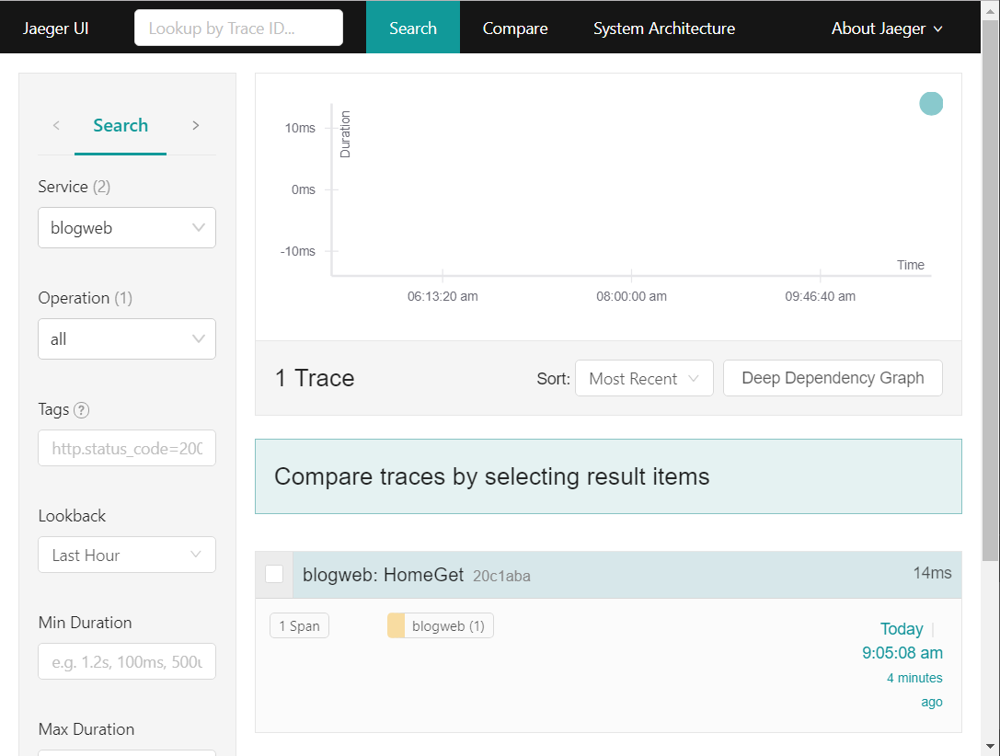
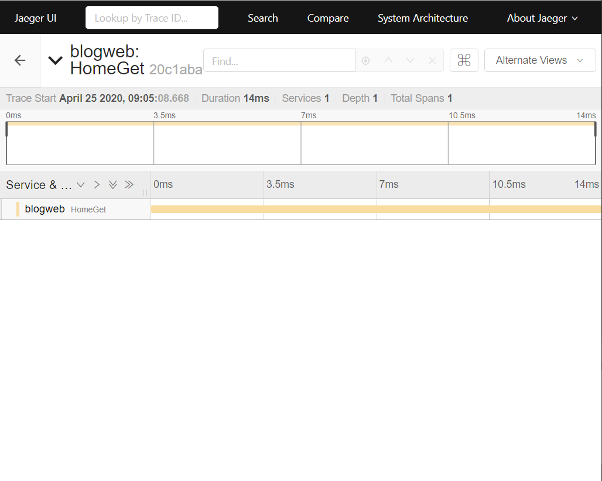
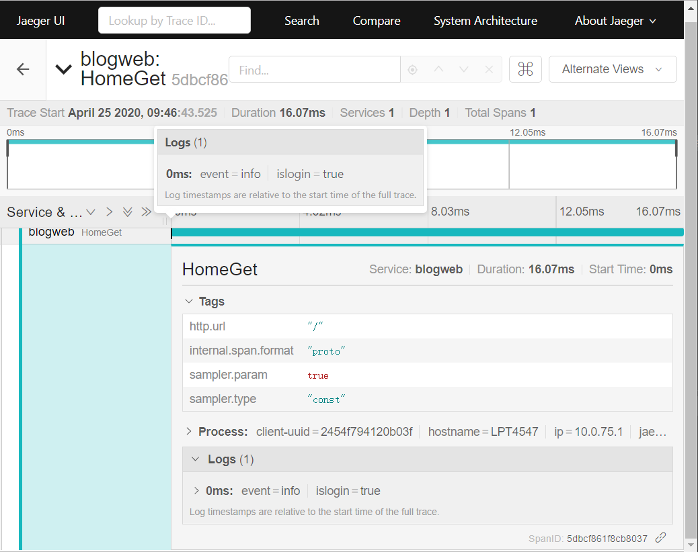
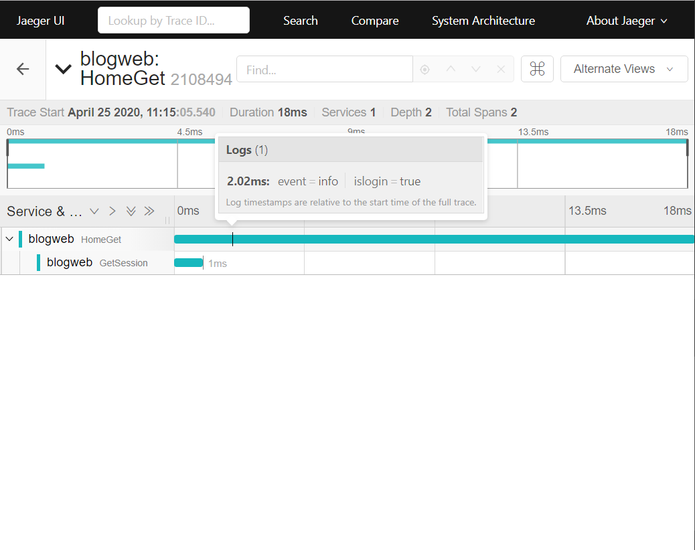
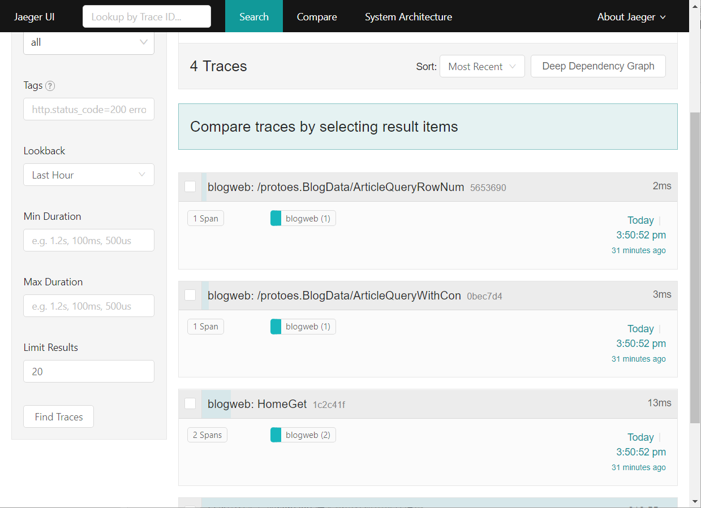
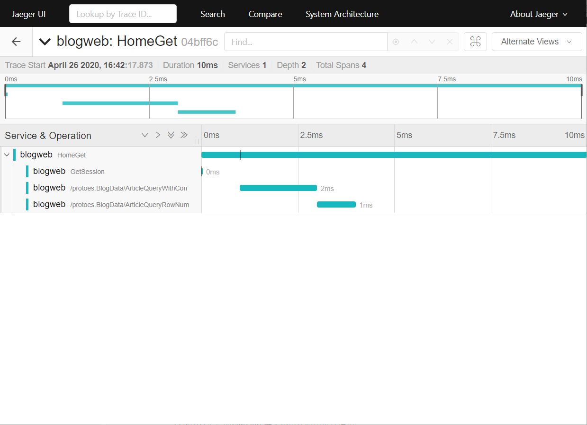
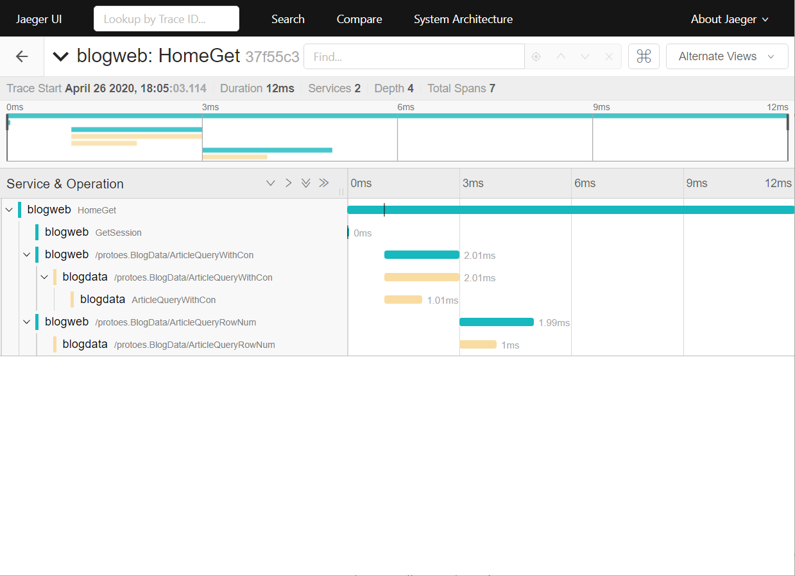
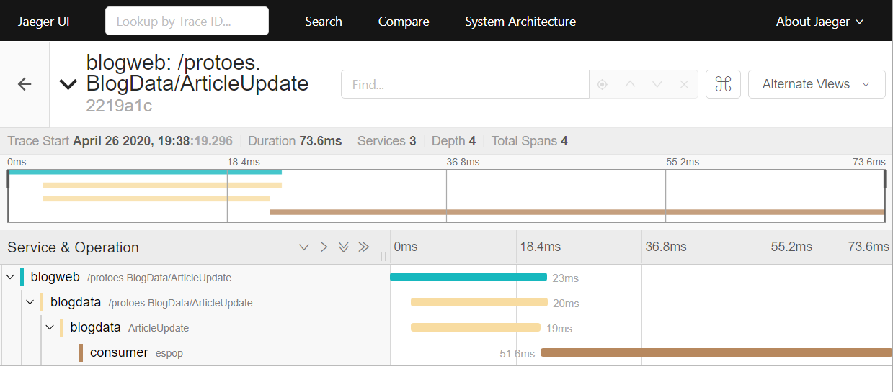

[TOC]

## 一、课前准备

1. 下载安装jaeger

   https://www.jaegertracing.io/download/

2. 安装golang package

   ```
   go get github.com/opentracing/opentracing-go
   go get github.com/uber/jaeger-client-go
   ```

4. 


## 二、课堂主题

1. 在golang应用jaeger client包
2. 初始化
3. 创建span
4. 传递span
5. tag和log
6. 跨进程传输

## 三、课堂目标

1. 理解tracing
2. 代码实践
3. 能够自己编写

## 四、知识点（2小时40分钟）

### 1. 接入jaeger（20分钟）

1. 找到首页 home_controller.go -> HomeGet，写下第一个span

   ```go
   package controllers
   
   import (
   	"blogweb_gin/models"
   	"fmt"
   	"net/http"
   	"strconv"
   
   	"github.com/gin-gonic/gin"
   	"github.com/opentracing/opentracing-go"
   )
   
   //可以通过翻页来获取该网页，也可以通过tag标签获取
   //传page参数代表翻页，传tag参数代表标签
   //首先判断page有值那么就是翻页，否则判断tag有值就是标签，否则就是默认的第一页
   func HomeGet(c *gin.Context) {
   	tracer := opentracing.GlobalTracer()
   	span := tracer.StartSpan("HomeGet")
   	defer span.Finish()
   	//获取session，判断用户是否登录
   	islogin := GetSession(c)
   	tag := c.Query("tag")
   	fmt.Println("tag:", tag)
   	page, _ := strconv.Atoi(c.Query("page"))
   	var artList []*models.Article
   
   	var hasFooter bool
   
   	if len(tag) > 0 {
   		//按照指定的标签搜索
   		artList, _ = models.QueryArticlesWithTag(tag)
   		hasFooter = false
   	} else {
   		if page <= 0 {
   			page = 1
   		}
   		artList, _ = models.FindArticleWithPage(page)
   		hasFooter = true
   	}
   
   	homeFooterPageCode := models.ConfigHomeFooterPageCode(page)
   	html := models.MakeHomeBlocks(artList, islogin)
   
   	c.HTML(http.StatusOK, "home.html", gin.H{"IsLogin": islogin, "Content": html, "HasFooter": hasFooter, "PageCode": homeFooterPageCode})
   }
   
   ```

   运行我们blogweb，记得先运行gRPC server

   访问主页，工作正常

   查看jaeger ui，没有任何结果。

   说明，`opentracing.GlobalTracer()` 默认返回一个没有任何行为的tracer，但不影响我们写代码。

2. 初始化一个真正的tracer

   ```go
   package controllers
   
   import (
       ...
   	"github.com/gin-gonic/gin"
   	"github.com/opentracing/opentracing-go"
   	"github.com/uber/jaeger-client-go"
   	"github.com/uber/jaeger-client-go/config"
   )
   
   //可以通过翻页来获取该网页，也可以通过tag标签获取
   //传page参数代表翻页，传tag参数代表标签
   //首先判断page有值那么就是翻页，否则判断tag有值就是标签，否则就是默认的第一页
   func HomeGet(c *gin.Context) {
   	tracer, closer := initJaeger("blogweb")
   	defer closer.Close()
   	span := tracer.StartSpan("HomeGet")
   	defer span.Finish()
       ...
   }
   
   // initJaeger returns an instance of Jaeger Tracer that samples 100% of traces and logs all spans to stdout.
   func initJaeger(service string) (opentracing.Tracer, io.Closer) {
   	cfg := &config.Configuration{
   		Sampler: &config.SamplerConfig{
   			Type:  "const",
   			Param: 1,
   		},
   		Reporter: &config.ReporterConfig{
   			LogSpans: true,
   		},
   	}
   	tracer, closer, err := cfg.New(service, config.Logger(jaeger.StdLogger))
   	if err != nil {
   		panic(fmt.Sprintf("ERROR: cannot init Jaeger: %v\n", err))
   	}
   	return tracer, closer
   }
   
   ```

   运行，访问首页，查看终端输出

   ```
   [GIN-debug] Listening and serving HTTP on :8082
   2020/04/25 09:05:08 Initializing logging reporter
   loginuser: danny
   tag:
   ---------->page 0
   ArticleQueryWithCon 响应：
   ArticleQueryRowNum 响应：3
   tag--> hello1
   tag--> go
   tag--> es
   2020/04/25 09:05:08 Reporting span 20c1aba21350df0f:20c1aba21350df0f:0:1
   [GIN] 2020/04/25 - 09:05:08 | 200 |     41.9977ms |             ::1 | GET      "/"
   ```

   查看jaeger ui

   

   

3. 添加tag和log

   Span的tag作用于 **整个Span**，也就是说，它会覆盖Span的整个事件周期，所以无需指定特别的时间戳。

   一些常用的tag

   | Span tag 名称             | 类型    | 描述与实例                                                   |
   | ------------------------- | ------- | ------------------------------------------------------------ |
   | `component`               | string  | 生成此Span所相关的软件包，框架，类库或模块。如 `"grpc"`, `"django"`, `"JDBI"`. |
   | `db.instance`             | string  | 数据库实例名称。以Java为例，如果 jdbc.url=`"jdbc:mysql://127.0.0.1:3306/customers"`，实例名为 `"customers"`. |
   | `db.statement`            | string  | 一个针对给定数据库类型的数据库访问语句。例如， 针对数据库类型 `db.type="sql"`，语句可能是 `"SELECT * FROM wuser_table"`; 针对数据库类型为 `db.type="redis"`，语句可能是 `"SET mykey 'WuValue'"`. |
   | `db.type`                 | string  | 数据库类型。对于任何支持SQL的数据库，取值为 `"sql"`. 否则，使用小写的数据类型名称，如 `"cassandra"`, `"hbase"`, or `"redis"`. |
   | `db.user`                 | string  | 访问数据库的用户名。如 `"readonly_user"` 或 `"reporting_user"` |
   | `error`                   | bool    | 设置为`true`，说明整个Span失败。译者注：Span内发生异常不等于error=true，这里由被监控的应用系统决定 |
   | `http.method`             | string  | Span相关的HTTP请求方法。例如 `"GET"`, `"POST"`               |
   | `http.status_code`        | integer | Span相关的HTTP返回码。例如 200, 503, 404                     |
   | `http.url`                | string  | 被处理的trace片段锁对应的请求URL。 例如 `"https://domain.net/path/to?resource=here"` |
   | `message_bus.destination` | string  | 消息投递或交换的地址。例如，在Kafka中，在生产者或消费者两端，可以使用此tag来存储`"topic name"`。 |
   | `peer.address`            | string  | 远程地址。 适合在网络调用的客户端使用。存储的内容可能是`"ip:port"`， `"hostname"`，域名，甚至是一个JDBC的连接串，如 `"mysql://prod-db:3306"` |
   | `peer.hostname`           | string  | 远端主机名。例如 `"opentracing.io"`, `"internal.dns.name"`   |
   | `peer.ipv4`               | string  | 远端 IPv4 地址，使用 `.` 分隔。例如 `"127.0.0.1"`            |
   | `peer.ipv6`               | string  | 远程 IPv6 地址，使用冒号分隔的元祖，每个元素为4位16进制数。例如 `"2001:0db8:85a3:0000:0000:8a2e:0370:7334"` |
   | `peer.port`               | integer | 远程端口。如 `80`                                            |
   | `peer.service`            | string  | 远程服务名（针对没有被标准化定义的`"service"`）。例如 `"elasticsearch"`, `"a_custom_microservice"`, `"memcache"` |
   | `sampling.priority`       | integer | 如果大于0，Tracer实现应该尽可能捕捉这个调用链。如果等于0，则表示不需要捕捉此调用链。如不存在，Tracer使用自己默认的采样机制。 |
   | `span.kind`               | string  | 基于RPC的调用角色，`"client"` 或 `"server"`. 基于消息的调用角色，`"producer"` 或 `"consumer"` |

   每个Span的log操作，都具有一个特定的时间戳（这个时间戳必须在Span的开始时间和结束时间之间），并包含一个或多个 **field**。下面是标准的field。

   | Span log field 名称 | 类型   | 描述和实例                                                   |
   | ------------------- | ------ | ------------------------------------------------------------ |
   | `error.kind`        | string | 错误类型（仅在`event="error"`时使用）。如 `"Exception"`, `"OSError"` |
   | `error.object`      | object | 如果当前语言支持异常对象（如 Java, Python），则为实际的Throwable/Exception/Error对象实例本身。例如 一个 `java.lang.UnsupportedOperationException` 实例, 一个python的 `exceptions.NameError` 实例 |
   | `event`             | string | Span生命周期中，特定时刻的标识。例如，一个互斥锁的获取与释放，或 在[Performance.timing](https://developer.mozilla.org/en-US/docs/Web/API/PerformanceTiming) 规范中描述的，浏览器页面加载过程中的各个事件。 还例如，Zipkin中 `"cs"`, `"sr"`, `"ss"`, 或 `"cr"`. 或者其他更抽象的 `"initialized"` 或 `"timed out"`。出现错误时，设置为 `"error"` |
   | `message`           | string | 简洁的，具有高可读性的一行事件描述。如 `"Could not connect to backend"`, `"Cache invalidation succeeded"` |
   | `stack`             | string | 针对特定平台的栈信息描述，不强制要求与错误相关。如 `"File \"example.py\", line 7, in \\ncaller()\nFile \"example.py\", line 5, in caller\ncallee()\nFile \"example.py\", line 2, in callee\nraise Exception(\"Yikes\")\n"` |

   在我们代码中，添加一个tag，一个log

   ```go
   import (
   	"github.com/opentracing/opentracing-go"
   	"github.com/opentracing/opentracing-go/log"
   )
   
   func HomeGet(c *gin.Context) {
   	tracer, closer := initJaeger("blogweb")
   	defer closer.Close()
   	span := tracer.StartSpan("HomeGet")
   	defer span.Finish()
   	span.SetTag("http.url", c.Request.URL.Path)
   	//获取session，判断用户是否登录
   	islogin := GetSession(c)
   	span.LogFields(
   		log.String("event", "info"),
   		log.Bool("islogin", islogin),
   	)
   
   	tag := c.Query("tag")
   	fmt.Println("tag:", tag)
   	page, _ := strconv.Atoi(c.Query("page"))
   	var artList []*models.Article
   
   	var hasFooter bool
   
   	if len(tag) > 0 {
   		//按照指定的标签搜索
   		artList, _ = models.QueryArticlesWithTag(tag)
   		hasFooter = false
   	} else {
   		if page <= 0 {
   			page = 1
   		}
   		artList, _ = models.FindArticleWithPage(page)
   		hasFooter = true
   	}
   
   	homeFooterPageCode := models.ConfigHomeFooterPageCode(page)
   	html := models.MakeHomeBlocks(artList, islogin)
   
   	c.HTML(http.StatusOK, "home.html", gin.H{"IsLogin": islogin, "Content": html, "HasFooter": hasFooter, "PageCode": homeFooterPageCode})
   }
   ```

   再次运行，观察jaeger ui

   

4. 

### 2. 创建父子关系

1. 传递span

   HomeGet -> GetSession

   增加了参数之后，依赖的编译大量报错，为了保证旧代码工作，我们需要增加新的function

   ```go
   session_controller.go
   
   //获取session
   func GetSessionV2(rootSpan opentracing.Span, c *gin.Context) bool {
   	span := rootSpan.Tracer().StartSpan("GetSession",
   		opentracing.ChildOf(rootSpan.Context()))
   	defer span.Finish()
   
   	session := sessions.Default(c)
   	loginuser := session.Get("loginuser")
   
   	fmt.Println("loginuser:", loginuser)
   	span.LogFields(
   		log.String("event", "checklogin"),
   		log.String("loginuser", fmt.Sprintf("%v", loginuser)),
   	)
   	if loginuser != nil {
   		return true
   	}
   	return false
   }
   
   home_controller.go
   
   	//获取session，判断用户是否登录
   	islogin := GetSessionV2(span, c)
   
   ```

   编译运行，刷新主页，观察终端窗口

   ```
   [GIN-debug] Listening and serving HTTP on :8082
   2020/04/25 11:15:05 Initializing logging reporter
   loginuser: danny
   2020/04/25 11:15:05 Reporting span 2108494dbcf15ef7:2614f17d6c92dd7:2108494dbcf15ef7:1
   tag--> hello1
   tag--> go
   tag--> es
   2020/04/25 11:15:05 Reporting span 2108494dbcf15ef7:2108494dbcf15ef7:0:1
   [GIN] 2020/04/25 - 11:15:05 | 200 |     48.9962ms |             ::1 | GET      "/"
   ```

   可以看到两个id相同的span

   继续查看 jaeger ui

   

   观察到了有父子关系的span

2. 传递context

   可以通过传递context，使代码更加通用（毕竟在golang环境下，无法做到什么都不传，这就要求我们设计系统时，要更早地考虑使用tracing框架）

   ```go
   session_controller.go
   
   //获取session
   func GetSessionV3(ctx context.Context, c *gin.Context) bool {
       // 第二个返回值是ctx，用于进一步传递
   	span, _ := opentracing.StartSpanFromContext(ctx, "GetSession")
   	defer span.Finish()
   
   	session := sessions.Default(c)
   	loginuser := session.Get("loginuser")
   
   	fmt.Println("loginuser:", loginuser)
   	span.LogFields(
   		log.String("event", "checklogin"),
   		log.String("loginuser", fmt.Sprintf("%v", loginuser)),
   	)
   	if loginuser != nil {
   		return true
   	}
   	return false
   }
   
   
   home_controller.go
   
   func HomeGet(c *gin.Context) {
   	span := opentracing.StartSpan("HomeGet")
   	defer span.Finish()
   	ctx := context.Background()
   	ctx = opentracing.ContextWithSpan(ctx, span)
   	span.SetTag("http.url", c.Request.URL.Path)
   	//获取session，判断用户是否登录
   	islogin := GetSessionV3(ctx, c)
   	span.LogFields(
   		log.String("event", "info"),
   		log.Bool("islogin", islogin),
   	)
   
   	tag := c.Query("tag")
   	fmt.Println("tag:", tag)
   	page, _ := strconv.Atoi(c.Query("page"))
   	var artList []*models.Article
   
   	var hasFooter bool
   
   	if len(tag) > 0 {
   		//按照指定的标签搜索
   		artList, _ = models.QueryArticlesWithTag(tag)
   		hasFooter = false
   	} else {
   		if page <= 0 {
   			page = 1
   		}
   		artList, _ = models.FindArticleWithPage(page)
   		hasFooter = true
   	}
   
   	homeFooterPageCode := models.ConfigHomeFooterPageCode(page)
   	html := models.MakeHomeBlocks(artList, islogin)
   
   	c.HTML(http.StatusOK, "home.html", gin.H{"IsLogin": islogin, "Content": html, "HasFooter": hasFooter, "PageCode": homeFooterPageCode})
   }
   
   // 补充初始化代码
   func init() {
   	fmt.Println("init global tracer...")
   	tracer, _ := initJaeger("blogweb")
   	opentracing.SetGlobalTracer(tracer)
   }
   
   ```
   
   使用context，可以简化代码，保持传递信息一致，但不要忘了初始化全局默认tracer
   
   运行，可以看到相同的结果。
   
      接下来，我们要解决跨服务的数据传递问题
### 3. gRPC

1. 客户端创建通用拦截器

   拦截器代码 blogweb_gin\models\opentracing.go


```go
   package models
   
   import (
   	"context"
   	"strings"
   
   	"google.golang.org/grpc/grpclog"
   
   	opentracing "github.com/opentracing/opentracing-go"
   	"github.com/opentracing/opentracing-go/ext"
   	"github.com/opentracing/opentracing-go/log"
   	"google.golang.org/grpc"
   	"google.golang.org/grpc/metadata"
   )
   
   var (
   	//TracingComponentTag tags  ext.Component="component"
   	TracingComponentTag = opentracing.Tag{Key: string(ext.Component), Value: "gRPC"}
   )
   
   //MDReaderWriter metadata Reader and Writer
   type MDReaderWriter struct {
   	metadata.MD
   }
   
   //ForeachKey range all keys to call handler
   func (c MDReaderWriter) ForeachKey(handler func(key, val string) error) error {
   	for k, vs := range c.MD {
   		for _, v := range vs {
   			if err := handler(k, v); err != nil {
   				return err
   			}
   		}
   	}
   	return nil
   }
   
   // Set implements Set() of opentracing.TextMapWriter
   func (c MDReaderWriter) Set(key, val string) {
   	key = strings.ToLower(key)
   	c.MD[key] = append(c.MD[key], val)
   }
   
   //OpenTracingClientInterceptor  rewrite client's interceptor with open tracing
   func OpenTracingClientInterceptor(tracer opentracing.Tracer) grpc.UnaryClientInterceptor {
   	return func(
   		ctx context.Context,
   		method string,
   		req, resp interface{},
   		cc *grpc.ClientConn,
   		invoker grpc.UnaryInvoker,
   		opts ...grpc.CallOption,
   	) error {
   		//从context中获取spanContext,如果上层没有开启追踪，则这里新建一个
   		//追踪，如果上层已经有了，测创建子span．
   		var parentCtx opentracing.SpanContext
   		if parent := opentracing.SpanFromContext(ctx); parent != nil {
   			parentCtx = parent.Context()
   		}
   		cliSpan := tracer.StartSpan(
   			method,
   			opentracing.ChildOf(parentCtx),
   			TracingComponentTag,
   			ext.SpanKindRPCClient,
   		)
   		defer cliSpan.Finish()
   		//将之前放入context中的metadata数据取出，如果没有则新建一个metadata
   		md, ok := metadata.FromOutgoingContext(ctx)
   		if !ok {
   			md = metadata.New(nil)
   		} else {
   			md = md.Copy()
   		}
   		mdWriter := MDReaderWriter{md}
   
   		//将追踪数据注入到metadata中
   		err := tracer.Inject(cliSpan.Context(), opentracing.TextMap, mdWriter)
   		if err != nil {
   			grpclog.Errorf("inject to metadata err %v", err)
   		}
   		//将metadata数据装入context中
   		ctx = metadata.NewOutgoingContext(ctx, md)
   		//使用带有追踪数据的context进行grpc调用．
   		err = invoker(ctx, method, req, resp, cc, opts...)
   		if err != nil {
   			cliSpan.LogFields(log.String("err", err.Error()))
   		}
   		return err
   	}
   }
```

返回类型 - 柯里化

```go
// UnaryClientInterceptor intercepts the execution of a unary RPC on the client. invoker is the handler to complete the RPC
// and it is the responsibility of the interceptor to call it.
// This is an EXPERIMENTAL API.
type UnaryClientInterceptor func(ctx context.Context, method string, req, reply interface{}, cc *ClientConn, invoker UnaryInvoker, opts ...CallOption) error

```


在我们的grpcclient代码中，应用拦截器，同时，把初始化tracer的代码，移动到grpcclient

   ```go
   package models
   
   import (
   	"flag"
   	"fmt"
   	"grpcdemo/etcdservice"
   	"io"
   
   	opentracing "github.com/opentracing/opentracing-go"
   	"github.com/uber/jaeger-client-go"
   	"github.com/uber/jaeger-client-go/config"
   	"google.golang.org/grpc"
   	"google.golang.org/grpc/resolver"
   )
   
   var (
   	// RPCConn Shared gRPC connection
   	RPCConn     *grpc.ClientConn
   	ServiceName = flag.String("ServiceName", "hello_service", "service name")
   	EtcdAddr    = flag.String("EtcdAddr", "127.0.0.1:2379", "register etcd address")
   )
   
   // initJaeger returns an instance of Jaeger Tracer that samples 100% of traces and logs all spans to stdout.
   func initJaeger(service string) (opentracing.Tracer, io.Closer) {
   	cfg := &config.Configuration{
   		Sampler: &config.SamplerConfig{
   			Type:  "const",
   			Param: 1,
   		},
   		Reporter: &config.ReporterConfig{
   			LogSpans: true,
   		},
   	}
   	tracer, closer, err := cfg.New(service, config.Logger(jaeger.StdLogger))
   	if err != nil {
   		panic(fmt.Sprintf("ERROR: cannot init Jaeger: %v\n", err))
   	}
   	return tracer, closer
   }
   
   func init() {
   	fmt.Println("init global tracer...")
   	tracer, _ := initJaeger("blogweb")
   	opentracing.SetGlobalTracer(tracer)
   
   	fmt.Println("gRPC connection init...")
   	flag.Parse()
   	r := etcdservice.NewResolver(*EtcdAddr)
   	resolver.Register(r)
   
   	dialOpts := []grpc.DialOption{grpc.WithBalancerName("round_robin"), grpc.WithInsecure()}
   
   	if tracer != nil {
   		dialOpts = append(dialOpts, grpc.WithUnaryInterceptor(OpenTracingClientInterceptor(tracer)))
   	}
   
   	// 客户端连接服务器
   	// conn, err := grpc.Dial("127.0.0.1:3000", grpc.WithInsecure())
   	var err error
   	RPCConn, err = grpc.Dial(r.Scheme()+"://author/"+*ServiceName, dialOpts...)
   
   	if err != nil {
   		fmt.Println("连接服务器失败", err)
   	}
   	// defer RPCConn.Close()
   }
   ```

   应用了拦截器以后，所有的grpc调用，都会生成tracing记录。运行blogweb，刷新主页，观察jaeger ui

   

   但是没有和HomeGet方法关联起来

2. 与已有span串联

   我们需要在整个调用链传递context

   article_model.go

   ```go
   package models
   
   import (
   	"blogweb_gin/config"
   	"blogweb_gin/database"
   	"context"
   	"errors"
   	"fmt"
   	"log"
   	pb "protoes"
   )
   
   type Article struct {
   	Id         int
   	Title      string
   	Tags       string
   	Short      string
   	Content    string
   	Author     string
   	Createtime int64
   	//Status int //Status=0为正常，1为删除，2为冻结
   }
   
   //---------添加文章-----------
   func AddArticle(article Article) (int64, error) {
   	// i, err := insertArticle(article)
   	// SetArticleRowsNum()
   	// return i, err
   
   	c := pb.NewBlogDataClient(RPCConn)
   	r1, err := c.ArticleAdd(
   		context.Background(),
   		&pb.ArticleAddRequest{
   			Article: ArticleToPb(article),
   		},
   	)
   	if err != nil {
   		fmt.Println("Can not get ArticleAdd:", err)
   		return 0, err
   	}
   	fmt.Printf("ArticleAdd 响应：%d\n", r1.GetId())
   
   	var e error = nil
   	if r1.Msg != "" {
   		e = errors.New(r1.Msg)
   	}
   	SetArticleRowsNum(int(r1.TotalNum))
   	return r1.GetId(), e
   }
   
   //插入一篇文章
   // func insertArticle(article Article) (int64, error) {
   // 	return database.ModifyDB("insert into article(title,tags,short,content,author,createtime) values(?,?,?,?,?,?)",
   // 		article.Title, article.Tags, article.Short, article.Content, article.Author, article.Createtime)
   // }
   
   //-----------查询文章---------
   
   //根据页码查询文章
   func FindArticleWithPage(ctx context.Context, page int) ([]*Article, error) {
   	page--
   	fmt.Println("---------->page", page)
   	//从配置文件中获取每页的文章数量
   	return QueryArticleWithPage(ctx, page, config.NUM)
   }
   
   /**
   分页查询数据库
   limit分页查询语句，
   	语法：limit m，n
   
   	m代表从多少位开始获取，与id值无关
   	n代表获取多少条数据
   
   注意limit前面咩有where
   */
   func QueryArticleWithPage(ctx context.Context, page, num int) ([]*Article, error) {
   	sql := fmt.Sprintf("limit %d,%d", page*num, num)
   	return QueryArticlesWithCon(ctx, sql)
   }
   
   func QueryArticlesWithCon(ctx context.Context, sql string) ([]*Article, error) {
   	// sql = "select id,title,tags,short,content,author,createtime from article " + sql
   	// rows, err := database.QueryDB(sql)
   	// if err != nil {
   	// 	return nil, err
   	// }
   	// var artList []Article
   	// for rows.Next() {
   	// 	id := 0
   	// 	title := ""
   	// 	tags := ""
   	// 	short := ""
   	// 	content := ""
   	// 	author := ""
   	// 	var createtime int64
   	// 	createtime = 0
   	// 	rows.Scan(&id, &title, &tags, &short, &content, &author, &createtime)
   	// 	art := Article{id, title, tags, short, content, author, createtime}
   	// 	artList = append(artList, art)
   	// }
   	// return artList, nil
   
   	c := pb.NewBlogDataClient(RPCConn)
   
   	r1, err := c.ArticleQueryWithCon(
   		ctx,
   		&pb.ArticleQueryWithConRequest{
   			Sql: sql,
   		},
   	)
   	if err != nil {
   		fmt.Println("Can not get ArticleQueryWithCon:", err)
   		return []*Article{}, err
   	}
   	fmt.Printf("ArticleQueryWithCon 响应：%s\n", r1.GetMsg())
   
   	var e error = nil
   	if r1.Msg != "" {
   		e = errors.New(r1.Msg)
   	}
   	return ArticleListFromPb(r1.GetArticle()), e
   }
   
   //------翻页------
   
   //存储表的行数，只有自己可以更改，当文章新增或者删除时需要更新这个值
   var artcileRowsNum = 0
   
   //只有首次获取行数的时候采取统计表里的行数
   func GetArticleRowsNum(ctx context.Context) int {
   	if artcileRowsNum == 0 {
   		artcileRowsNum = QueryArticleRowNum(ctx)
   	}
   	return artcileRowsNum
   }
   
   //查询文章的总条数
   func QueryArticleRowNum(ctx context.Context) int {
   	// row := database.QueryRowDB("select count(id) from article")
   	// num := 0
   	// row.Scan(&num)
   	// return num
   	c := pb.NewBlogDataClient(RPCConn)
   	r1, err := c.ArticleQueryRowNum(
   		ctx,
   		&pb.ArticleQueryRowNumRequest{},
   	)
   	if err != nil {
   		fmt.Println("Can not get ArticleQueryRowNum:", err)
   		return 0
   	}
   	fmt.Printf("ArticleQueryRowNum 响应：%d\n", r1.GetCount())
   	return int(r1.GetCount())
   }
   
   //设置页数
   func SetArticleRowsNum(num int) {
   	artcileRowsNum = num
   }
   
   //----------查询文章-------------
   
   func QueryArticleWithId(id int) *Article {
   	// row := database.QueryRowDB("select id,title,tags,short,content,author,createtime from article where id=" + strconv.Itoa(id))
   	// title := ""
   	// tags := ""
   	// short := ""
   	// content := ""
   	// author := ""
   	// var createtime int64
   	// createtime = 0
   	// row.Scan(&id, &title, &tags, &short, &content, &author, &createtime)
   	// art := Article{id, title, tags, short, content, author, createtime}
   	// return art
   	c := pb.NewBlogDataClient(RPCConn)
   	r1, err := c.ArticleQueryWithId(
   		context.Background(),
   		&pb.ArticleQueryWithIdRequest{
   			Id: int64(id),
   		},
   	)
   	if err != nil {
   		fmt.Println("Can not get ArticleQueryWithId:", err)
   		return nil
   	}
   	fmt.Printf("ArticleQueryWithId 响应：%v\n", r1.GetArticle())
   
   	return ArticleFromPb(r1.GetArticle())
   }
   
   //----------修改数据----------
   
   func UpdateArticle(article Article) (int64, error) {
   	//数据库操作
   	// return database.ModifyDB("update article set title=?,tags=?,short=?,content=? where id=?",
   	// 	article.Title, article.Tags, article.Short, article.Content, article.Id)
   	fmt.Println("UpdateArticle")
   	c := pb.NewBlogDataClient(RPCConn)
   	r1, err := c.ArticleUpdate(
   		context.Background(),
   		&pb.ArticleUpdateRequest{
   			Article: ArticleToPb(article),
   		},
   	)
   	if err != nil {
   		fmt.Println("Can not get ArticleUpdate:", err)
   		return 0, err
   	}
   	fmt.Printf("ArticleUpdate 响应：%d\n", r1.GetId())
   
   	var e error = nil
   	if r1.Msg != "" {
   		e = errors.New(r1.Msg)
   	}
   	return r1.GetId(), e
   }
   
   //----------删除文章---------
   func DeleteArticle(artID int) (int64, error) {
   	// i, err := deleteArticleWithArtId(artID)
   	// SetArticleRowsNum()
   	// return i, err
   	c := pb.NewBlogDataClient(RPCConn)
   	r1, err := c.ArticleDelete(
   		context.Background(),
   		&pb.ArticleDeleteRequest{
   			Id: int64(artID),
   		},
   	)
   	if err != nil {
   		fmt.Println("Can not get ArticleDelete:", err)
   		return 0, err
   	}
   	fmt.Printf("ArticleDelete 响应：%d\n", r1.GetId())
   
   	var e error = nil
   	if r1.Msg != "" {
   		e = errors.New(r1.Msg)
   	}
   	SetArticleRowsNum(int(r1.TotalNum))
   	return r1.GetId(), e
   }
   
   func deleteArticleWithArtId(artID int) (int64, error) {
   	return database.ModifyDB("delete from article where id=?", artID)
   }
   
   //查询标签，返回一个字段的列表
   func QueryArticleWithParam(param string) []string {
   	rows, err := database.QueryDB(fmt.Sprintf("select %s from article", param))
   	if err != nil {
   		log.Println(err)
   	}
   	var paramList []string
   	for rows.Next() {
   		arg := ""
   		rows.Scan(&arg)
   		paramList = append(paramList, arg)
   	}
   	return paramList
   }
   
   //--------------按照标签查询--------------
   /*
   通过标签查询首页的数据
   有四种情况
   	1.左右两边有&符和其他符号
   	2.左边有&符号和其他符号，同时右边没有任何符号
   	3.右边有&符号和其他符号，同时左边没有任何符号
   	4.左右两边都没有符号
   
   通过%去匹配任意多个字符，至少是一个
   */
   func QueryArticlesWithTag(ctx context.Context, tag string) ([]*Article, error) {
   
   	sql := " where tags like '%&" + tag + "&%'"
   	sql += " or tags like '%&" + tag + "'"
   	sql += " or tags like '" + tag + "&%'"
   	sql += " or tags like '" + tag + "'"
   	fmt.Println(sql)
   	return QueryArticlesWithCon(ctx, sql)
   }
   
   ```

   home_model.go

   ```go
   package models
   
   import (
   	"blogweb_gin/config"
   	"blogweb_gin/utils"
   	"bytes"
   	"context"
   	"fmt"
   	"html/template"
   	"strconv"
   	"strings"
   )
   
   type HomeBlockParam struct {
   	Id         int
   	Title      string
   	Tags       []TagLink
   	Short      string
   	Content    string
   	Author     string
   	CreateTime string
   	//查看文章的地址
   	Link string
   
   	//修改文章的地址
   	UpdateLink string
   	DeleteLink string
   
   	//记录是否登录
   	IsLogin bool
   }
   
   type TagLink struct {
   	TagName string
   	TagUrl  string
   }
   
   type HomeFooterPageCode struct {
   	HasPre   bool
   	HasNext  bool
   	ShowPage string
   	PreLink  string
   	NextLink string
   }
   
   //----------首页显示内容---------
   func MakeHomeBlocks(articles []*Article, isLogin bool) template.HTML {
   	htmlHome := ""
   	for _, art := range articles {
   		//将数据库model转换为首页模板所需要的model
   		homeParam := HomeBlockParam{}
   		homeParam.Id = art.Id
   		homeParam.Title = art.Title
   		homeParam.Tags = createTagsLinks(art.Tags)
   		fmt.Println("tag-->", art.Tags)
   		homeParam.Short = art.Short
   		homeParam.Content = art.Content
   		homeParam.Author = art.Author
   		homeParam.CreateTime = utils.SwitchTimeStampToData(art.Createtime)
   		//homeParam.Link = "/article/show/" + strconv.Itoa(art.Id)
   		homeParam.Link = "/show/" + strconv.Itoa(art.Id)
   		homeParam.UpdateLink = "/article/update?id=" + strconv.Itoa(art.Id)
   		homeParam.DeleteLink = "/article/delete?id=" + strconv.Itoa(art.Id)
   		homeParam.IsLogin = isLogin
   
   		//处理变量
   		//ParseFile解析该文件，用于插入变量
   		t, _ := template.ParseFiles("views/home_block.html")
   		buffer := bytes.Buffer{}
   		//就是将html文件里面的比那两替换为穿进去的数据
   		t.Execute(&buffer, homeParam)
   		htmlHome += buffer.String()
   	}
   	return template.HTML(htmlHome)
   }
   
   //将tags字符串转化成首页模板所需要的数据结构
   func createTagsLinks(tags string) []TagLink {
   	var tagLink []TagLink
   	tagsPamar := strings.Split(tags, "&")
   	for _, tag := range tagsPamar {
   		tagLink = append(tagLink, TagLink{tag, "/?tag=" + tag})
   	}
   	return tagLink
   }
   
   //-----------翻页-----------
   //page是当前的页数
   func ConfigHomeFooterPageCode(ctx context.Context, page int) HomeFooterPageCode {
   	pageCode := HomeFooterPageCode{}
   	//查询出总的条数
   	num := GetArticleRowsNum(ctx)
   	//从配置文件中读取每页显示的条数
   	//pageRow := config.NUM
   	//计算出总页数
   	allPageNum := (num-1)/config.NUM + 1
   
   	pageCode.ShowPage = fmt.Sprintf("%d/%d", page, allPageNum)
   
   	//当前页数小于等于1，那么上一页的按钮不能点击
   	if page <= 1 {
   		pageCode.HasPre = false
   	} else {
   		pageCode.HasPre = true
   	}
   
   	//当前页数大于等于总页数，那么下一页的按钮不能点击
   	if page >= allPageNum {
   		pageCode.HasNext = false
   	} else {
   		pageCode.HasNext = true
   	}
   
   	pageCode.PreLink = "/?page=" + strconv.Itoa(page-1)
   	pageCode.NextLink = "/?page=" + strconv.Itoa(page+1)
   	return pageCode
   
   }
   
   ```

   

   

   home_controller.go

   ```go
   package controllers
   
   import (
   	"blogweb_gin/models"
   	"context"
   	"fmt"
   	"net/http"
   	"strconv"
   
   	"github.com/gin-gonic/gin"
   	"github.com/opentracing/opentracing-go"
   	"github.com/opentracing/opentracing-go/log"
   )
   
   //可以通过翻页来获取该网页，也可以通过tag标签获取
   //传page参数代表翻页，传tag参数代表标签
   //首先判断page有值那么就是翻页，否则判断tag有值就是标签，否则就是默认的第一页
   func HomeGet(c *gin.Context) {
   	span := opentracing.StartSpan("HomeGet")
   	defer span.Finish()
   	ctx := context.Background()
   	ctx = opentracing.ContextWithSpan(ctx, span)
   	span.SetTag("http.url", c.Request.URL.Path)
   	//获取session，判断用户是否登录
   	islogin := GetSessionV3(ctx, c)
   	span.LogFields(
   		log.String("event", "info"),
   		log.Bool("islogin", islogin),
   	)
   
   	tag := c.Query("tag")
   	fmt.Println("tag:", tag)
   	page, _ := strconv.Atoi(c.Query("page"))
   	var artList []*models.Article
   
   	var hasFooter bool
   
   	if len(tag) > 0 {
   		//按照指定的标签搜索
   		artList, _ = models.QueryArticlesWithTag(ctx, tag)
   		hasFooter = false
   	} else {
   		if page <= 0 {
   			page = 1
   		}
   		artList, _ = models.FindArticleWithPage(ctx, page)
   		hasFooter = true
   	}
   
   	homeFooterPageCode := models.ConfigHomeFooterPageCode(ctx, page)
   	html := models.MakeHomeBlocks(artList, islogin)
   
   	c.HTML(http.StatusOK, "home.html", gin.H{"IsLogin": islogin, "Content": html, "HasFooter": hasFooter, "PageCode": homeFooterPageCode})
   }
   
   ```

   

   运行blogweb，刷新主页，观察jaeger ui

   

3. 服务端

   创建server端拦截器 grpcdemo\server\opentracing.go

   ```go
   package main
   
   import (
   	"context"
   	"strings"
   
   	"google.golang.org/grpc/grpclog"
   
   	opentracing "github.com/opentracing/opentracing-go"
   	"github.com/opentracing/opentracing-go/ext"
   	"github.com/opentracing/opentracing-go/log"
   	"google.golang.org/grpc"
   	"google.golang.org/grpc/metadata"
   )
   
   var (
   	//TracingComponentTag tags  ext.Component="component"
   	TracingComponentTag = opentracing.Tag{Key: string(ext.Component), Value: "gRPC"}
   )
   
   //MDReaderWriter metadata Reader and Writer
   type MDReaderWriter struct {
   	metadata.MD
   }
   
   //ForeachKey range all keys to call handler
   func (c MDReaderWriter) ForeachKey(handler func(key, val string) error) error {
   	for k, vs := range c.MD {
   		for _, v := range vs {
   			if err := handler(k, v); err != nil {
   				return err
   			}
   		}
   	}
   	return nil
   }
   
   // Set implements Set() of opentracing.TextMapWriter
   func (c MDReaderWriter) Set(key, val string) {
   	key = strings.ToLower(key)
   	c.MD[key] = append(c.MD[key], val)
   }
   
   //OpentracingServerInterceptor rewrite server's interceptor with open tracing
   func OpentracingServerInterceptor(tracer opentracing.Tracer) grpc.UnaryServerInterceptor {
   	return func(
   		ctx context.Context,
   		req interface{},
   		info *grpc.UnaryServerInfo,
   		handler grpc.UnaryHandler,
   	) (resp interface{}, err error) {
   		//从context中取出metadata
   		md, ok := metadata.FromIncomingContext(ctx)
   		if !ok {
   			md = metadata.New(nil)
   		}
   		//从metadata中取出最终数据，并创建出span对象
   		spanContext, err := tracer.Extract(opentracing.TextMap, MDReaderWriter{md})
   		if err != nil && err != opentracing.ErrSpanContextNotFound {
   			grpclog.Errorf("extract from metadata err %v", err)
   		}
   		//初始化server 端的span
   		serverSpan := tracer.StartSpan(
   			info.FullMethod,
   			ext.RPCServerOption(spanContext),
   			TracingComponentTag,
   			ext.SpanKindRPCServer,
   		)
   		defer serverSpan.Finish()
   		ctx = opentracing.ContextWithSpan(ctx, serverSpan)
   		//将带有追踪的context传入应用代码中进行调用
   		return handler(ctx, req)
   	}
   }
   
   ```

   主程序初始化jaeger

   ```go
   package main
   
   import (
   	"blogweb_gin/database"
   	"flag"
   	"fmt"
   	"grpcdemo/etcdservice"
   	pb "grpcdemo/protoes"
   	"io"
   	"net"
   	"os"
   	"os/signal"
   	"syscall"
   
   	"github.com/opentracing/opentracing-go"
   	"github.com/uber/jaeger-client-go"
   	"github.com/uber/jaeger-client-go/config"
   	"google.golang.org/grpc"
   )
   
   const (
   	TIME_FORMAT = "2006-01-02 15:04:05"
   )
   
   var host = "127.0.0.1"
   var (
   	ServiceName = flag.String("ServiceName", "hello_service", "service name")
   	Port        = flag.Int("Port", 3000, "listening port")
   	EtcdAddr    = flag.String("EtcdAddr", "127.0.0.1:2379", "register etcd address")
   )
   
   // initJaeger returns an instance of Jaeger Tracer that samples 100% of traces and logs all spans to stdout.
   func initJaeger(service string) (opentracing.Tracer, io.Closer) {
   	cfg := &config.Configuration{
   		Sampler: &config.SamplerConfig{
   			Type:  "const",
   			Param: 1,
   		},
   		Reporter: &config.ReporterConfig{
   			LogSpans: true,
   		},
   	}
   	tracer, closer, err := cfg.New(service, config.Logger(jaeger.StdLogger))
   	if err != nil {
   		panic(fmt.Sprintf("ERROR: cannot init Jaeger: %v\n", err))
   	}
   	return tracer, closer
   }
   
   func main() {
   	flag.Parse()
   	// 监听网络
   	ln, err := net.Listen("tcp", fmt.Sprintf("127.0.0.1:%d", *Port))
   	if err != nil {
   		fmt.Println("网络异常：", err)
   		return
   	}
   	defer ln.Close()
   	database.InitMysql()
   
   	fmt.Println("init global tracer...")
   	tracer, _ := initJaeger("blogdata")
   	opentracing.SetGlobalTracer(tracer)
   
   	// 创建grpc句柄
   
   	var servOpts []grpc.ServerOption
   	//open tracing
   	if tracer != nil {
   		servOpts = append(servOpts, grpc.UnaryInterceptor(OpentracingServerInterceptor(tracer)))
   	}
   
   	srv := grpc.NewServer(servOpts...)
   	defer srv.GracefulStop()
   
   	// 将server结构体注册到grpc服务中
   	pb.RegisterBlogDataServer(srv, &BlogDataServer{})
   	addr := fmt.Sprintf("%s:%d", host, *Port)
   	fmt.Printf("server addr:%s\n", addr)
   	go etcdservice.Register(*EtcdAddr, *ServiceName, addr, 5)
   
   	ch := make(chan os.Signal, 1)
   	signal.Notify(ch, syscall.SIGTERM, syscall.SIGINT, syscall.SIGKILL, syscall.SIGHUP, syscall.SIGQUIT)
   	go func() {
   		s := <-ch
   		etcdservice.UnRegister(*ServiceName, addr)
   
   		if i, ok := s.(syscall.Signal); ok {
   			os.Exit(int(i))
   		} else {
   			os.Exit(0)
   		}
   
   	}()
   
   	// 监听服务
   	err = srv.Serve(ln)
   	if err != nil {
   		fmt.Println("监听异常：", err)
   		return
   	}
   
   }
   
   ```

   手工创建一个span  blogdataimpl.go

   ```
   // ArticleQueryWithCon
   func (s *BlogDataServer) ArticleQueryWithCon(ctx context.Context, in *pb.ArticleQueryWithConRequest) (*pb.ArticleQueryWithConResponse, error) {
   	span, _ := opentracing.StartSpanFromContext(ctx, "ArticleQueryWithCon")
   	defer span.Finish()
   	now := time.Now()
   	fmt.Printf("ArticleQueryWithCon: %s\n", now.Format(TIME_FORMAT))
   	list, err := models.QueryArticlesWithCon(in.Sql)
   	span.SetTag("sql", in.Sql)
   	msg := ""
   	if err != nil {
   		msg = err.Error()
   	}
   	fmt.Printf("duration: %v\n", time.Now().Sub(now))
   	return &pb.ArticleQueryWithConResponse{
   		Article: models.ArticleListToPb(list),
   		Msg:     msg,
   	}, nil
   }
   
   ```

   重启server，运行，观察jaeger ui

   

   可以观察到，即使不手工创建span，也已经串联起来了。

4. 小结

### 4. 跨越nsq

1. 需要给消息体增加字段，来保存传递的tracing信息

   grpcdemo\nsqutil\message.go

   ```go
   package nsqutil
   
   import "fmt"
   
   const (
   	TopicEs                     = "es"
   	ActionArticleModified int32 = 1 // 文章创建修改
   	ActionArticleRemoved  int32 = 3 // 文章删除
   
   )
   
   type MessageEs struct {
   	Header map[string]string `json:"hearder"`
   	Action int32             `json:"action"`
   	Id     int64             `json:"id"`
   }
   
   func SendEsMessage(header map[string]string, action int32, id int64) error {
   	qMsg := &MessageEs{
   		Header: header,
   		Action: action,
   		Id:     id,
   	}
   	if err := PublishJson(TopicEs, qMsg); err != nil {
   		fmt.Errorf("send error: %s", err.Error())
   		return err
   	}
   	return nil
   }
   
   ```

   

2. 提供一个注入携带信息的公共方法

   grpcdemo\nsqutil\nsq.go

   ```go
   import (
   	"encoding/json"
   	"fmt"
   
   	"github.com/nsqio/go-nsq"
   	"github.com/opentracing/opentracing-go"
   	"github.com/opentracing/opentracing-go/log"
   )
   
   func GetInjectedHeader(span opentracing.Span) map[string]string {
   	header := map[string]string{}
   	carrier := opentracing.TextMapCarrier(header)
   	err := span.Tracer().Inject(
   		span.Context(), opentracing.TextMap, carrier)
   	if err != nil {
   		span.LogFields(
   			log.String("event", "error"),
   			log.String("message", err.Error()),
   		)
   
   	}
   	return header
   }
   
   ```

   

3. 更新发送消息的代码

   创建span，注入头信息，发送消息

   grpcdemo\server\blogdataimpl.go

   ```
   package main
   
   import (
   	"fmt"
   	"grpcdemo/models"
   	"grpcdemo/nsqutil"
   	pb "grpcdemo/protoes"
   	"time"
   
   	"github.com/opentracing/opentracing-go"
   	"context"
   )
   
   // 对象要和proto内定义的服务一致
   type BlogDataServer struct {
   }
   
   // UserInsert
   func (s *BlogDataServer) UserInsert(ctx context.Context, in *pb.UserInsertRequest) (*pb.UserInsertResponse, error) {
   	fmt.Printf("UserInsert: %s\n", time.Now().Format(TIME_FORMAT))
   	return &pb.UserInsertResponse{}, nil
   }
   
   // UserQueryWithUsername
   func (s *BlogDataServer) UserQueryWithUsername(ctx context.Context, in *pb.UserQueryWithUsernameRequest) (*pb.UserQueryWithUsernameResponse, error) {
   	now := time.Now()
   	fmt.Printf("UserQueryWithUsername: %s\n", now.Format(TIME_FORMAT))
   
   	id := models.QueryUserWithUsername(in.Username)
   	return &pb.UserQueryWithUsernameResponse{
   		Id: int64(id),
   	}, nil
   }
   
   // UserQueryWithParam
   func (s *BlogDataServer) UserQueryWithParam(ctx context.Context, in *pb.UserQueryWithParamRequest) (*pb.UserQueryWithParamResponse, error) {
   	now := time.Now()
   	fmt.Printf("UserQueryWithParam: %s\n", now.Format(TIME_FORMAT))
   	id := models.QueryUserWithParam(in.Username, in.Password)
   	fmt.Printf("duration: %v\n", time.Now().Sub(now))
   	return &pb.UserQueryWithParamResponse{
   		Id: int64(id),
   	}, nil
   }
   
   // ArticleAdd
   func (s *BlogDataServer) ArticleAdd(ctx context.Context, in *pb.ArticleAddRequest) (*pb.ArticleAddResponse, error) {
   	span, _ := opentracing.StartSpanFromContext(ctx, "ArticleAdd")
   	defer span.Finish()
   	now := time.Now()
   	fmt.Printf("ArticleAdd: %s\n", now.Format(TIME_FORMAT))
   	id, count, err := models.AddArticle(models.ArticleFromPb(in.Article))
   	msg := ""
   	if err != nil {
   		msg = err.Error()
   	} else {
   		nsqutil.SendEsMessage(nsqutil.GetInjectedHeader(span), nsqutil.ActionArticleModified, id)
   	}
   	fmt.Printf("duration: %v\n", time.Now().Sub(now))
   	return &pb.ArticleAddResponse{
   		Id:       id,
   		TotalNum: int64(count),
   		Msg:      msg,
   	}, nil
   }
   
   // ArticleQueryWithCon
   func (s *BlogDataServer) ArticleQueryWithCon(ctx context.Context, in *pb.ArticleQueryWithConRequest) (*pb.ArticleQueryWithConResponse, error) {
   	span, _ := opentracing.StartSpanFromContext(ctx, "ArticleQueryWithCon")
   	defer span.Finish()
   	now := time.Now()
   	fmt.Printf("ArticleQueryWithCon: %s\n", now.Format(TIME_FORMAT))
   	list, err := models.QueryArticlesWithCon(in.Sql)
   	span.SetTag("sql", in.Sql)
   	msg := ""
   	if err != nil {
   		msg = err.Error()
   	}
   	fmt.Printf("duration: %v\n", time.Now().Sub(now))
   	return &pb.ArticleQueryWithConResponse{
   		Article: models.ArticleListToPb(list),
   		Msg:     msg,
   	}, nil
   }
   
   // ArticleQueryRowNum
   func (s *BlogDataServer) ArticleQueryRowNum(ctx context.Context, in *pb.ArticleQueryRowNumRequest) (*pb.ArticleQueryRowNumResponse, error) {
   	now := time.Now()
   	fmt.Printf("ArticleQueryRowNum: %s\n", now.Format(TIME_FORMAT))
   	fmt.Printf("duration: %v\n", time.Now().Sub(now))
   	return &pb.ArticleQueryRowNumResponse{
   		Count: int64(models.QueryArticleRowNum()),
   	}, nil
   }
   
   // ArticleQueryWithId
   func (s *BlogDataServer) ArticleQueryWithId(ctx context.Context, in *pb.ArticleQueryWithIdRequest) (*pb.ArticleQueryWithIdResponse, error) {
   	now := time.Now()
   	fmt.Printf("ArticleQueryWithId: %s\n", now.Format(TIME_FORMAT))
   	article := models.QueryArticleWithId(int(in.Id))
   	fmt.Printf("duration: %v\n", time.Now().Sub(now))
   	return &pb.ArticleQueryWithIdResponse{
   		Article: models.ArticleToPb(article),
   	}, nil
   }
   
   // ArticleUpdate
   func (s *BlogDataServer) ArticleUpdate(ctx context.Context, in *pb.ArticleUpdateRequest) (*pb.ArticleUpdateResponse, error) {
   	span, _ := opentracing.StartSpanFromContext(ctx, "ArticleUpdate")
   	defer span.Finish()
   	now := time.Now()
   	fmt.Printf("ArticleUpdate: %s\n", now.Format(TIME_FORMAT))
   	id := in.Article.Id
   	count, err := models.UpdateArticle(models.ArticleFromPb(in.Article))
   	msg := ""
   	if err != nil {
   		msg = err.Error()
   	} else {
   		if count > 0 {
   			nsqutil.SendEsMessage(nsqutil.GetInjectedHeader(span), nsqutil.ActionArticleModified, int64(id))
   		}
   	}
   	fmt.Printf("duration: %v\n", time.Now().Sub(now))
   	return &pb.ArticleUpdateResponse{
   		Id:  count,
   		Msg: msg,
   	}, nil
   }
   
   // ArticleDelete
   func (s *BlogDataServer) ArticleDelete(ctx context.Context, in *pb.ArticleDeleteRequest) (*pb.ArticleDeleteResponse, error) {
   	span, _ := opentracing.StartSpanFromContext(ctx, "ArticleDelete")
   	defer span.Finish()
   	now := time.Now()
   	fmt.Printf("ArticleDelete: %s\n", now.Format(TIME_FORMAT))
   	id := in.Id
   	_, count, err := models.DeleteArticle(int(in.Id))
   	msg := ""
   	if err != nil {
   		msg = err.Error()
   	} else {
   		nsqutil.SendEsMessage(nsqutil.GetInjectedHeader(span), nsqutil.ActionArticleRemoved, id)
   	}
   	fmt.Printf("duration: %v\n", time.Now().Sub(now))
   	return &pb.ArticleDeleteResponse{
   		Id:       id,
   		TotalNum: int64(count),
   		Msg:      msg,
   	}, nil
   }
   
   ```

   

4. 消费者解码

   初始化trace

   提供解码公共方法

   创建span

   ```go
   package main
   
   import (
   	"blogweb_gin/database"
   	"encoding/json"
   	"fmt"
   	"io"
   	"os"
   	"os/signal"
   	"syscall"
   	"time"
   
   	"models"
   	"nsqutil"
   
   	"github.com/nsqio/go-nsq"
   	"github.com/opentracing/opentracing-go"
   	"github.com/opentracing/opentracing-go/log"
   	"github.com/uber/jaeger-client-go"
   	"github.com/uber/jaeger-client-go/config"
   )
   
   // 消费者
   type ConsumerEsT struct{}
   
   //处理消息
   func (*ConsumerEsT) HandleMessage(msg *nsq.Message) error {
   	fmt.Println("receive", msg.NSQDAddress, "message:", string(msg.Body))
   	var data nsqutil.MessageEs
   	err := json.Unmarshal([]byte(msg.Body), &data)
   	if err != nil {
   		return err
   	}
   
   	span := GetSpan(data.Header, "espop")
   	defer span.Finish()
   
   	switch data.Action {
   	case nsqutil.ActionArticleModified:
   		models.SearchArticleUpdate(int(data.Id))
   	case nsqutil.ActionArticleRemoved:
   		models.SearchArticleRemoveOne(data.Id)
   	default:
   		fmt.Errorf("unknow queue action: %d", data.Action)
   
   	}
   
   	return nil
   }
   
   func GetSpan(header map[string]string, spanName string) opentracing.Span {
   	// tracing
   	tracer := opentracing.GlobalTracer()
   	spanContext, err := tracer.Extract(opentracing.TextMap, opentracing.TextMapCarrier(header))
   	var span opentracing.Span
   	if err == nil {
   		span = opentracing.StartSpan(spanName, opentracing.ChildOf(spanContext))
   	} else {
   		span = opentracing.StartSpan(spanName)
   		span.LogFields(
   			log.String("event", "error"),
   			log.String("error.kind", "Exception"),
   			log.String("message", err.Error()),
   		)
   	}
   	return span
   }
   
   //初始化消费者
   func InitConsumer(address string) {
   	cfg := nsq.NewConfig()
   	cfg.LookupdPollInterval = time.Second                                                        //设置重连时间
   	c1, err := nsq.NewConsumer(nsqutil.TopicEs, fmt.Sprintf("%s-channel", nsqutil.TopicEs), cfg) // 新建一个消费者
   	if err != nil {
   		panic(err)
   	}
   	c1.SetLogger(nil, 0)          //屏蔽系统日志
   	c1.AddHandler(&ConsumerEsT{}) // 添加消费者接口
   
   	// 建立NSQLookupd连接
   	if err := c1.ConnectToNSQLookupd(address); err != nil {
   		panic(err)
   	}
   
   	// if err := c1.ConnectToNSQD(address); err != nil {
   	// 	panic(err)
   	// }
   }
   
   // initJaeger returns an instance of Jaeger Tracer that samples 100% of traces and logs all spans to stdout.
   func initJaeger(service string) (opentracing.Tracer, io.Closer) {
   	cfg := &config.Configuration{
   		Sampler: &config.SamplerConfig{
   			Type:  "const",
   			Param: 1,
   		},
   		Reporter: &config.ReporterConfig{
   			LogSpans: true,
   		},
   	}
   	tracer, closer, err := cfg.New(service, config.Logger(jaeger.StdLogger))
   	if err != nil {
   		panic(fmt.Sprintf("ERROR: cannot init Jaeger: %v\n", err))
   	}
   	return tracer, closer
   }
   
   func main() {
   	tracer, _ := initJaeger("consumer")
   	opentracing.InitGlobalTracer(tracer)
   
   	database.InitMysql()
   	InitConsumer("127.0.0.1:4161")
   	// InitConsumer("127.0.0.1:4150")
   	ch := make(chan os.Signal, 1)
   	signal.Notify(ch, syscall.SIGTERM, syscall.SIGINT, syscall.SIGKILL, syscall.SIGHUP, syscall.SIGQUIT)
   	<-ch
   }
   
   ```

   

5. 运行代码

   1. 启动es

   2. 启动nsq

      ```
      bin\nsqlookupd.exe
      ```

      ```
      bin\nsqd --lookupd-tcp-address=127.0.0.1:4160
      ```

      ```
      bin\nsqadmin --lookupd-http-address=127.0.0.1:4161
      ```

   3. 重启gRPC server

   4. 启动consumer

   5. 重启web

   6. 添加/修改文章

   7. 查看 jaeger ui

      

      这是自动gRPC触发的源头，如果手工创建span，会多一个

6. 小结

## 五、拓展点（10分钟）


## 六、总结（5分钟）


## 七、作业
1. 完全理解课程内容
2. 例子自己运行一遍
3. 在nsq例子中，找到controller触发的点，从源头补上span

## 八、集中答疑


