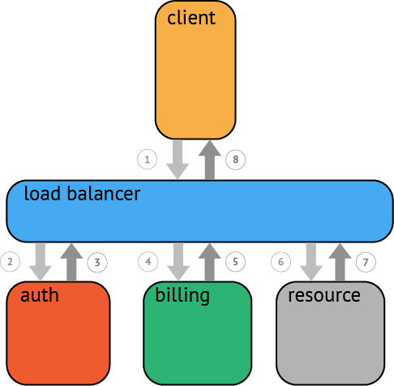
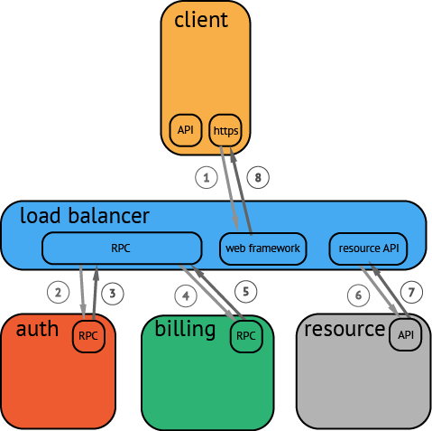
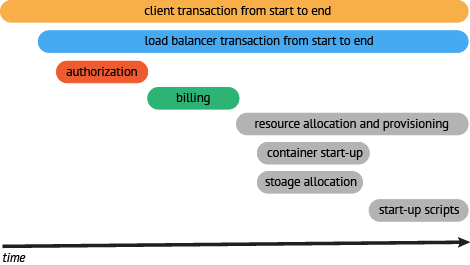

[toc]

# 介绍

## 为什么需要Tracing？

1. 单机系统 -> 集群 -> 微服务
2. 顺序日志的挑战。跨进程，高并发
3. 调用链查看，故障查找，性能分析

## 为什么需要OpenTracing？

OpenTracing通过提供平台无关、厂商无关的API，使得开发人员能够方便的添加（或更换）追踪系统的实现。 OpenTracing提供了用于运营支撑系统的和针对特定平台的辅助程序库。程序库的具体信息请参考详细的规范。


## 什么是一个Trace?

在广义上，一个trace代表了一个事务或者流程在（分布式）系统中的执行过程。在OpenTracing标准中，trace是多个span组成的一个有向无环图（DAG），每一个span代表trace中被命名并计时的连续性的执行片段。


分布式追踪中的每个组件都包含自己的一个或者多个span。例如，在一个常规的RPC调用过程中，OpenTracing推荐在RPC的客户端和服务端，至少各有一个span，用于记录RPC调用的客户端和服务端信息。



一个父级的span会显示的并行或者串行启动多个子span。在OpenTracing标准中，甚至允许一个子span有个多父span（例如：并行写入的缓存，可能通过一次刷新操作写入动作）。

## 一个典型的Trace案例



在一个分布式系统中，追踪一个事务或者调用流一般如上图所示。虽然这种图对于看清各组件的组合关系是很有用的，但是，它不能很好显示组件的调用时间，是串行调用还是并行调用，如果展现更复杂的调用关系，会更加复杂，甚至无法画出这样的图。另外，这种图也无法显示调用间的时间间隔以及是否通过定时调用来启动调用。一种更有效的展现一个典型的trace过程，如下图所示：



这种展现方式增加显示了执行时间的上下文，相关服务间的层次关系，进程或者任务的串行或并行调用关系。这样的视图有助于发现系统调用的关键路径。通过关注关键路径的执行过程，项目团队可能专注于优化路径中的关键位置，最大幅度的提升系统性能。例如：可以通过追踪一个资源定位的调用情况，明确底层的调用情况，发现哪些操作有阻塞的情况。


# 概念和术语

```
一个tracer过程中，各span的关系


        [Span A]  ←←←(the root span)
            |
     +------+------+
     |             |
 [Span B]      [Span C] ←←←(Span C 是 Span A 的孩子节点, ChildOf)
     |             |
 [Span D]      +---+-------+
               |           |
           [Span E]    [Span F] >>> [Span G] >>> [Span H]
                                       ↑
                                       ↑
                                       ↑
                         (Span G 在 Span F 后被调用, FollowsFrom)
上述tracer与span的时间轴关系


––|–––––––|–––––––|–––––––|–––––––|–––––––|–––––––|–––––––|–> time

 [Span A···················································]
   [Span B··············································]
      [Span D··········································]
    [Span C········································]
         [Span E·······]        [Span F··] [Span G··] [Span H··]
```

## Traces

一个trace代表一个潜在的，分布式的，存在并行数据或并行执行轨迹（潜在的分布式、并行）的系统。一个trace可以认为是多个span的有向无环图（DAG）。

## Spans

一个span代表系统中具有开始时间和执行时长的逻辑运行单元。span之间通过嵌套或者顺序排列建立逻辑因果关系。

### Operation Names

每一个span都有一个操作名称，这个名称简单，并具有可读性高。（例如：一个RPC方法的名称，一个函数名，或者一个大型计算过程中的子任务或阶段）。span的操作名应该是一个抽象、通用的标识，能够明确的、具有统计意义的名称；更具体的子类型的描述，请使用Tags

例如，假设一个获取账户信息的span会有如下可能的名称：

| 操作名            | 指导意见                                                     |
| :---------------- | :----------------------------------------------------------- |
| `get`             | 太抽象                                                       |
| `get_account/792` | 太明确                                                       |
| `get_account`     | 正确的操作名，关于`account_id=792`的信息应该使用[Tag](https://wu-sheng.gitbooks.io/opentracing-io/content/pages/spec.html#tags)操作 |


### Inter-Span References

一个span可以和一个或者多个span间存在因果关系。OpenTracing定义了两种关系：`ChildOf` 和 `FollowsFrom`。**这两种引用类型代表了子节点和父节点间的直接因果关系**。未来，OpenTracing将支持非因果关系的span引用关系。（例如：多个span被批量处理，span在同一个队列中，等等）

**`ChildOf` 引用:** 一个span可能是一个父级span的孩子，即"ChildOf"关系。在"ChildOf"引用关系下，父级span某种程度上取决于子span。下面这些情况会构成"ChildOf"关系：

- 一个RPC调用的服务端的span，和RPC服务客户端的span构成ChildOf关系
- 一个sql insert操作的span，和ORM的save方法的span构成ChildOf关系
- 很多span可以并行工作（或者分布式工作）都可能是一个父级的span的子项，他会合并所有子span的执行结果，并在指定期限内返回

下面都是合理的表述一个"ChildOf"关系的父子节点关系的时序图。

```
    [-Parent Span---------]
         [-Child Span----]

    [-Parent Span--------------]
         [-Child Span A----]
          [-Child Span B----]
        [-Child Span C----]
         [-Child Span D---------------]
         [-Child Span E----]
```

### Logs

每个span可以进行多次**Logs**操作，每一次**Logs**操作，都需要一个带时间戳的时间名称，以及可选的任意大小的存储结构。

标准中定义了一些日志（logging）操作的一些常见用例和相关的log事件的键值。


### Tags

每个span可以有多个键值对（key:value）形式的**Tags**，**Tags**是没有时间戳的，支持简单的对span进行注解和补充。

和使用**Logs**的场景一样，对于应用程序特定场景已知的键值对**Tags**，tracer可以对他们特别关注一下。

## SpanContext

每个span必须提供方法访问**SpanContext**。SpanContext代表跨越进程边界，传递到下级span的状态。(例如，包含``元组)，并用于封装**Baggage** (关于Baggage的解释，请参考下文)。SpanContext在跨越进程边界，和在追踪图中创建边界的时候会使用。

### Baggage

**Baggage**是存储在SpanContext中的一个键值对(SpanContext)集合。它会在一条追踪链路上的所有span内*全局*传输，包含这些span对应的SpanContexts。在这种情况下，"Baggage"会随着trace一同传播，他因此得名（Baggage可理解为随着trace运行过程传送的行李）。鉴于全栈OpenTracing集成的需要，Baggage通过透明化的传输任意应用程序的数据，实现强大的功能。例如：可以在最终用户的手机端添加一个Baggage元素，并通过分布式追踪系统传递到存储层，然后再通过反向构建调用栈，定位过程中消耗很大的SQL查询语句。

Baggage拥有强大功能，也会有很大的*消耗*。由于Baggage的全局传输，如果包含的数量量太大，或者元素太多，它将降低系统的吞吐量或增加RPC的延迟。

## Baggage vs. Span Tags

- Baggage在全局范围内，（伴随业务系统的调用）跨进程传输数据。Span的tag不会进行传输，因为他们不会被子级的span继承。
- span的tag可以用来记录业务相关的数据，并存储于追踪系统中。实现OpenTracing时，可以选择是否存储Baggage中的非业务数据，OpenTracing标准不强制要求实现此特性。

## Inject and Extract

SpanContexts可以通过**Injected**操作向**Carrier**增加，或者通过**Extracted**从**Carrier**中获取，跨进程通讯数据（例如：HTTP头）。通过这种方式，SpanContexts可以跨越进程边界，并提供足够的信息来建立跨进程的span间关系（因此可以实现跨进程连续追踪）。

