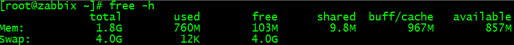
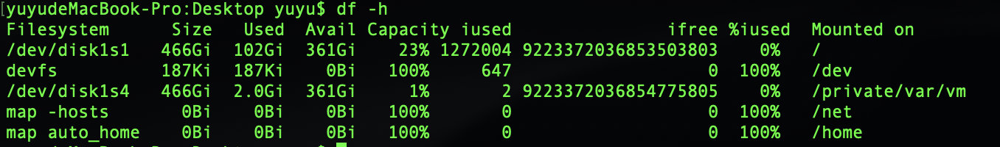

##### free命令查看内存使用状态

```
$ free -h
$ free -m
$ free -h -s 3 #有时我们需要持续的观察内存的状况，每隔 3 秒输出一次内存的使用情况，此时可以使用 -s 选项并指定间隔的秒数
```



输出参数说明

```
Mem 行(第二行)是内存的使用情况。
Swap 行(第三行)是交换空间的使用情况。

#total 列显示系统总的可用物理内存和交换空间大小。
#used 列显示已经被使用的物理内存和交换空间。
#free 列显示还有多少物理内存和交换空间可用使用。
#shared 列显示被共享使用的物理内存大小。
#buff/cache 列显示被 buffer 和 cache 使用的物理内存大小。
#available 列显示还可以被应用程序使用的物理内存大小。
```

##### df 命令用于显示目前在 Linux 系统上的文件系统磁盘使用情况统计



##### 查看CPU信息

```
# 查看物理CPU个数
cat /proc/cpuinfo| grep "physical id"| sort| uniq| wc -l

# 查看每个物理CPU核数
cat /proc/cpuinfo| grep "cpu cores"| uniq

# 查看逻辑CPU的个数
cat /proc/cpuinfo| grep "processor"| wc -l
```


##### 查看系统与内核相关信息

```
#-a：查看系统所有相关信息
[root@localhost ~]# uname -a 
Linux iZ2ze8w1n1tjmyfb6nue9kZ 3.10.0-957.5.1.el7.x86_64 #1 SMP Fri Feb 1 14:54:57 UTC 2019 x86_64 x86_64 x86_64 GNU/Linux

# -s：查看内核名称
[root@localhost ~]# uname -r 
3.10.0-957.5.1.el7.x86_64

#-r：查看内核版本；
[root@localhost ~]# uname -s
Linux
```


##### 缓存和缓冲的区别

+ 缓存是用来加速数据从硬盘中读取的
+ 缓冲是用来加速数据写入硬盘的。

##### 处理速度

+ 64位的cpu每秒能处理100GB数据 
+ 64位的内存每秒能处理1.6GB数据
+ 硬盘每秒能处理80MB-100MB数据
+ 固态硬盘每秒能处理400MB数据(苹果能达到1GB)