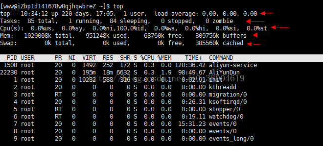
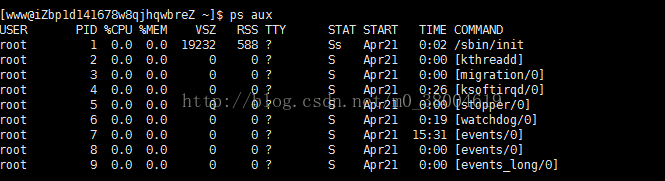
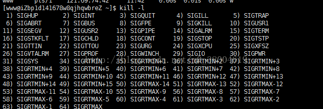

#### 判断服务器健康状态  

查看命令 top

```
top   #可以判断出当前系统健康状态（前几行）
top -b -n 2 >top.log #所有都存放到top.log文件里刷新2次的信息
```

输出参数说明



```
第一行：任务队列信息
10:34:12：系统当前日期
up 220 days，17:05： 系统的运行时间，本机已经运行220天，17小时5分钟
1users ：当前登录了几个用户
load average : 0.00,0.00,0.00 系统在1分钟 5分钟 15分钟的平均负载 （数字越高，说明服务器的负载越大，1为承受范围内，重要）。

第二行：进程信息
Tasks: 85 total ：系统中的进程总数
1 running：正在运行的进程树（cpu决定）
84sleeping：睡眠的进程
0 stopped：正在停止的进程
0 zombie：僵尸进程，如果不是0 , 需要手工检查僵尸进程

第三行：CPU信息
99.7%id 空闲CPU的CPU百分比（重要80%）

第四行：内存信息
6700k free, 内存空闲(重要）

第五行：swamp 内存信息
80000k free swamp内存空闲(重要）
```


#### 查看系统中所有的进程

```
ps aux #查看系统中所有进程，使用BSD操作格式（没有-）
ps -le #查看系统中所有进程，使用linux标准命令格式
```

输出参数说明

 

```
USER: 该进程是由哪个用户产生的
PID: 进程的ID号
%CPU：该进程占用CPU资源的百分比，占用越高，进程越耗费资源。
%MEN：该进程占用物理内存的百分比，占用越高，进程越耗费资源。
VSZ:该进程占用虚拟内存的大小，单位KB
RSS: 该进程占用实际物理内存的大小，单位KB
TTY:该进程是在哪个终端中运行的。其中tty1-tty7代表本地控制台终端，tty1-tty6是本地的字符界面终端，tty7是图形终端。pts/0-255代表虚拟终端。
STAT:进程状态
START: 时间
TIME :运行时间
COMMAND :进程名
```


#### 杀死进程（强制执行关闭）



+ SIGHUP：该信号让进程立即关闭，然后重新读取配置文件之后重启 （平滑重启）`kill -1 进程号`
+ SIGKILL： 该信号强制终止 `kill -9 进程号`


