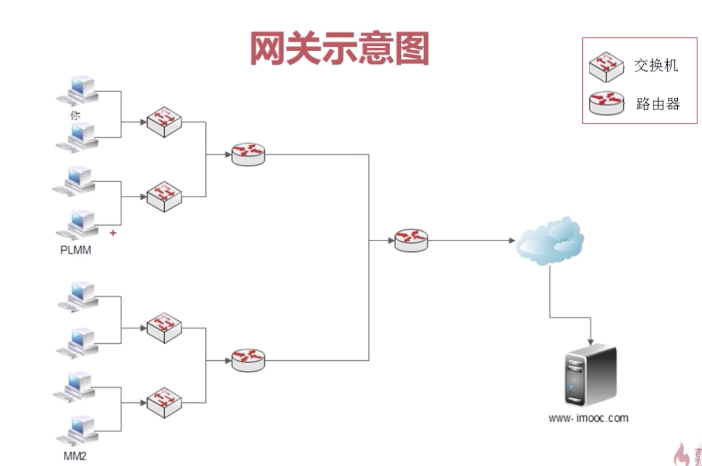

#### 网关

##### MAC地址

MAC地址称为局域网地址，它是一个用来确认网络设备位置的位址，MAC地址用于在网络中唯一标识一个网卡，一台设备若有一或多个网卡，则每个网卡都需要有一个唯一的MAC地址。

#####  网卡

网卡是一块被设计用来允许计算机在计算机网络上进行通讯的计算机硬件。由于其拥有MAC地址，因此属于OSI模型的第1层和2层之间。它使得用户可以通过电缆或无线相互连接。

每一个网卡都有一个被称为MAC地址的独一无二的48位串行号，它被写在卡上的一块ROM中。在网络上的每一个计算机都必须拥有一个独一无二的MAC地址。没有任何两块被生产出来的网卡拥有同样的地址。这是因为电气电子工程师协会（IEEE）负责为网络接口控制器（网卡）销售商分配唯一的MAC地址。

#####  交换机

交换机负责连接网络设备（路由器、防火墙、无线AP等）和终端设备（如计算机、服务器、摄像头、网络打印机等）；

交换机位于OSI参考模型中的第二层（数据链路层），交换机的工作依赖于对MAC地址的识别（所有的网络设备都有一个唯一的MAC地址，通常是由厂商直接烧录进网卡中）

#####  防火墙

防火墙负责网络访问限制，它可以禁止来自特殊站点的访问，从而防止来自不明入侵者的所有通信。

#####  网关的作用



1. 网关是能让两个不同网段的设备进行网络通信的一个设备，网关（路由器）实现局域网与局域网的互联，局域网与Internet的互联；
2. 网关负责将内网IP转换为公网IP，公网IP转换内网IP


### IP地址配置方法

##### Ifconfig命令

使用ifconfig命令配置网卡的ip地址。此命令通常用来零时的测试用，计算机启动后，ip地址的配置将自动失效。具体用法如下：

```
// 配置网卡的临时生效的IP地址
#ifconfig eth0 192.168.0.200 netmask 255.255.255. 0

// 配置网关
route add default gw 192.168.0.1 
```

##### 网络配置文件

```
inet 192.168.0.252 #ip地址
gaway 192.168.0.1 #路由器ip用来和往外通信
netmask 255.255.255.0 #子网掩码

// 重启网卡使配置生效
#/etc/init.d/networking restart 
```


#### 网络管理命令

```
// 查看当前计算机所有网卡的配置信息
#ifconfig
eth0: 	flags=4163<UP,BROADCAST,RUNNING,MULTICAST>  mtu 1500 #默认网卡的参数
        inet 172.17.36.64  netmask 255.255.240.0  broadcast 172.17.47.255 #IP地址 子网掩码 广播地址
        ether 00:16:3e:12:cd:41  txqueuelen 1000  (Ethernet)  #mac地址
        RX packets 115105970  bytes 72212627824 (67.2 GiB) #当前接收的数据包
        RX errors 0  dropped 0  overruns 0  frame 0 #当前接收的数据包的状态
        TX packets 79625525  bytes 56559753451 (52.6 GiB) #当前发送的数据包
        TX errors 0  dropped 0 overruns 0  carrier 0  collisions 0 #当前接收的数据包的状态
。。。

// 查看某网卡的配置信息，如eth0
#ifconfig eth0


// 禁用和启用网卡命令
#ifdown eth0 
#ifup eth0


//网络状态
nestat 选项
  -t ：列出TCP协议端口
  -u：列出UDP协议端口
  -n：不适用域名与服务名，而是用IP地址和端口号
  -l ：仅列出监听状态网络服务
  -a：列出所有网络连接

// 查看当前网络TCP监听和UDP连接状态
#netstat -tuln 
Proto 	Recv-Q 		Send-Q 	Local Address           Foreign Address         State     
tcp        0      0 			0.0.0.0:22              0.0.0.0:*               LISTEN     
tcp6       0      0 			:::80                  	:::*                    LISTEN     
tcp6       0      0 			:::3306                 :::*                    LISTEN   
udp        0      0 			127.0.0.1:323           0.0.0.0:*                          
udp6       0      0 			::1:323                 :::*                               

//查看当前正在连接服务器的ip
netstat -an|grep ESTABLISHED
Proto 	Recv-Q 		Send-Q 	Local Address           Foreign Address         State 
tcp6       0      0 			172.17.36.64:4044       172.19.0.4:54516        ESTABLISHED
tcp6       0      0 			172.17.36.64:4041       172.19.0.4:49370        ESTABLISHED
tcp6       0      0 			172.17.36.64:4044       172.19.0.3:58064        ESTABLISHED


// 查看当前正在连接服务器的ip的连接个数
#netstat -an|grep ESTABLISHED|wc -l
3
```

#### 网络测试命令

```
//探测指定IP或域名的网络状况
#ping 192.168.0.253 // CTRL+C终止ping

// ping 4次
#ping 192.168.0.253  -c 4 
```

#### wget命令

```
#wget url
```

#### SSH

```
远程管理指定Linux服务器：ssh 用户名@ip

下载文件：scp [-r] 用户名@ip:文件路径 本地路径

上传文件：scp [-r] 本地文件 用户名@ip:上传路径 //scp -r 本地目录/  root@39.97.234.228:/远程目录
```