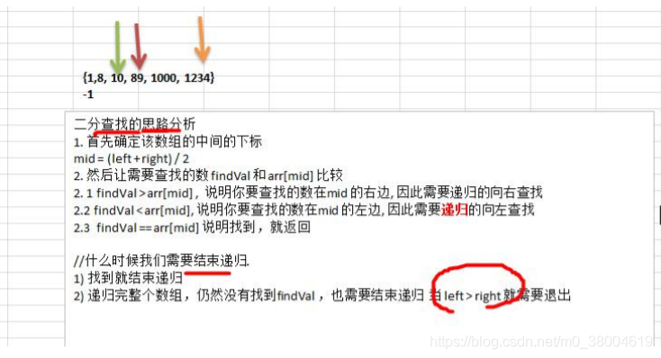

#### 思路



```
package main
 
import "fmt"
 
func BinarySearch(arr *[6]int,leftIndex int,rightIndex int ,findVal int ){
   if  leftIndex > rightIndex{
      fmt.Printf("%v中找不到\t元素%v\n",(*arr),findVal)
      return
   }
 
   //先找到中间下标
   midddle := (leftIndex+rightIndex)/2
   if   (*arr)[midddle] >findVal {
      //说明要查找的数在左边  就应该向 leftIndex ---- (middle - 1)再次查找
      BinarySearch(arr,leftIndex,midddle-1,findVal)
   }else if  (*arr)[midddle] < findVal{
      //如果 arr[middle] < findVal , 就应该向 middel+1---- rightIndex
      BinarySearch(arr,midddle+1,rightIndex,findVal)
   }else {
      //找到了
      fmt.Printf("%v中找到元素%v,下标为%v\n",(*arr),findVal,midddle)
   }
}
 
func main() {
     ArraryNum := [6]int{1,8, 10, 89, 1000, 1234}
   BinarySearch(&ArraryNum,0,len(ArraryNum),1234)
 
}
```

