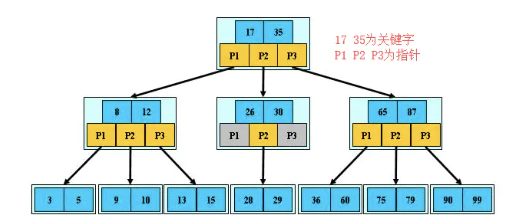

 #### BTREE 结构

BTree又叫多路平衡搜索树，BTree的每个叶子节点都绑定着对应的数据

BTREE树和 二叉树相比， 查询数据的效率更高， 因为对于相同的数据量来说，BTREE的层级结构比二叉树小，因此搜索速度快。

#### B+TREE 结构

B+Tree为BTree的变种，B+Tree与BTree的区别为：

2. B+Tree的叶子节点保存所有的key信息，依key大小顺序排列。
5. B+Tree可以将索引存在内存里，数据存在硬盘里，不但节省内存开销，而且查询速度不受影响，B树的索引和数据都和节点绑定着，没法分离，占用内存
3. 由于B+Tree只有叶子节点保存key信息，查询任何key都要从root走到叶子。所以B+Tree的查询效率更加稳定。

 

