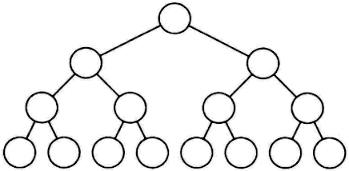
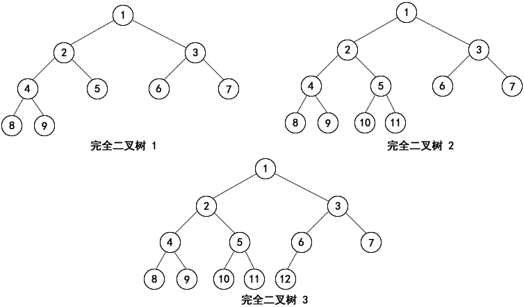

#### 二叉树介绍

+ 每个结点最多有两个子节点的树结构，通常子树被称作“左子树”和“右子树”。
+ 二叉树常被用于实现二叉查找，可以缩短查找时间、节省资源。
+ 二叉树可能出现类似一条链表的情况，这样的二叉查找树的查找时间复杂度顿时变成了 O(n)，可使用平衡二叉树解决一边极端的情况，（**平衡二叉树**的每个节点的左子树和右子树的高度差至多等于1）

**满二叉树**

在一棵二叉树中，所有的分支结点都存在左子树和右子树，并且所有的叶子结点都在同一层上，这样的二叉树称为满二叉树。就是完美圆满的意思。



**完全二叉树**

在一棵二叉树中，除最后一层外，若其余各层都是满的，最后一层要么是满的，要么在右边缺少若干个连续的节点，这样的二叉树被称为完全二叉树。满二叉树必须是完全二叉树，而完全二叉树不一定是满二叉树。




**创建二叉树**

```
package main

import "fmt"

//定义二叉树的节点
type Node struct {
	value int
	left *Node
	right *Node
}
func main() {
	//创建一颗树
	root := CreateNode(5)
	root.left = CreateNode(2)
	root.right = CreateNode(4)
	root.left.right = CreateNode(7)
	root.left.right.left = CreateNode(6)
	root.right.left = CreateNode(8)
	root.right.right = CreateNode(9)
	
	root.PreOrder(root) //前序 5 2 7 6 4 8 9 
	root.InOrder(root) //中序 2 6 7 5 8 4 9 
	root.PostOrder(root) //后序 6 7 2 8 9 4 5 
}
```

**前序遍历二叉树**

前序的规则就是：根结点 ---> 左子树 ---> 右子树

```
//功能：递归前序遍历二叉树
//参数：根节点
//返回值：nil
func (node *Node)PreOrder(n *Node) {
	if n != nil {
		fmt.Printf("%d ", n.value)
		node.PreOrder(n.left)
		node.PreOrder(n.right)
	}
}
```

**中序遍历二叉树**

前序的规则就是：左子树---> 根结点 ---> 右子树

```
//功能：递归中序遍历二叉树
//参数：根节点
//返回值：nil
func (node *Node)InOrder(n *Node) {
	if n != nil {
		node.InOrder(n.left)
		fmt.Printf("%d ", n.value)
		node.InOrder(n.right)
	}
}
```

**后序遍历二叉树**

后序的规则就是：左子树->右子树->根节点

```
//功能：递归后序遍历二叉树
//参数：根节点
//返回值：nil
func (node *Node)PostOrder(n *Node) {
	if n != nil {
		node.PostOrder(n.left)
		node.PostOrder(n.right)
		fmt.Printf("%d ", n.value)
	}
}
```


 #### BTREE 树介绍

BTree又叫多路平衡搜索树，BTree的每个叶子节点都绑定着对应的数据

BTREE树和 二叉树相比， 查询数据的效率更高， 因为对于相同的数据量来说，BTREE的层级结构比二叉树小，因此搜索速度快。


#### B+TREE 结构

B+Tree为BTree的变种，B+Tree与BTree的区别为：

1. B+Tree可以将索引存在内存里，数据存在硬盘里，不但节省内存开销，而且查询速度不受影响，B树的索引和数据都和节点绑定着，没法分离，占用内存
2. 由于B+Tree只有叶子节点保存key信息，查询任何key都要从root走到叶子。所以B+Tree的查询效率更加稳定。

 
