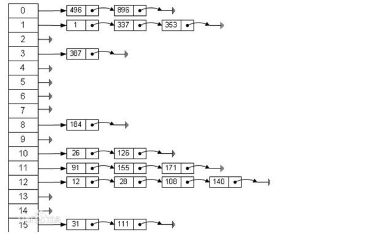

#### 哈希表结构

散列表（也叫哈希表），是根据关键码值(Key value)而直接进行访问的数据结构。



#### 哈希表结构添加思路

+ 分别定义一个节点用来存放对象、一个数组用来存放连接好的对象链表
+ 使用散列函数，确定将该雇员添加到哪个链表
+ 进行链表连接，遍历每个节点直到下一个节点为空，赋值当前节点即可

```
//定义 emp 节点
type Emp struct {
	Id int
	Name string
	Next *Emp
}

//定义 hashtable ,含有一个链表数组
type HashTable struct {
	LinkArr [7]Emp
}

//方法待定 //1. 添加员工的方法, 保证添加时，编号从小到大
func (this *Emp) Insert(emp *Emp) {
	temp := this.Next
	if this.Next == nil {
		this.Next = emp //完成
		return
	}
	//如果不是一个空链表,给 emp 找到对应的位置并插入
	for {
		if temp.Next == nil {
			temp.Next = emp
			break
		}
		temp = temp.Next
	}
}

//给 HashTable 编写 Insert 雇员的方法.
func (this *HashTable) Insert(emp *Emp) {
	//使用散列函数，确定将该雇员添加到哪个链表
	linkNo := this.HashFun(emp.Id)
	//使用对应的链表添加
	this.LinkArr[linkNo].Insert(emp)
}

//编写一个散列方法
func (this *HashTable) HashFun(id int) int {
	return id % 7 //得到一个值，就是对于的链表的下标
}
```

#### 哈希表结构查找思路

+ 使用散列函数，确定查找的节点在哪个链表
+ 遍历每个节点直到某一个节点和查找的节点相等即可

```
//查找链表的信息
func (this *Emp) Show(no int) {
   if this.Next == nil {
      fmt.Printf("链表%d 为空\n", no)
      return
   }
   //变量当前的链表，并显示数据
   temp := this.Next // 辅助的指针
   for {
      if temp.Id == no {
         fmt.Println(temp)
         break
      }
      temp = temp.Next
   }
   fmt.Println() //换行处理
}

//编写方法，显示 hashtable 的所有雇员
func (this *HashTable) find(id int) {
	//使用散列函数，确定将该雇员添加到哪个链表
	linkNo := this.HashFun(id)
	this.LinkArr[linkNo].Show(linkNo)
}
```