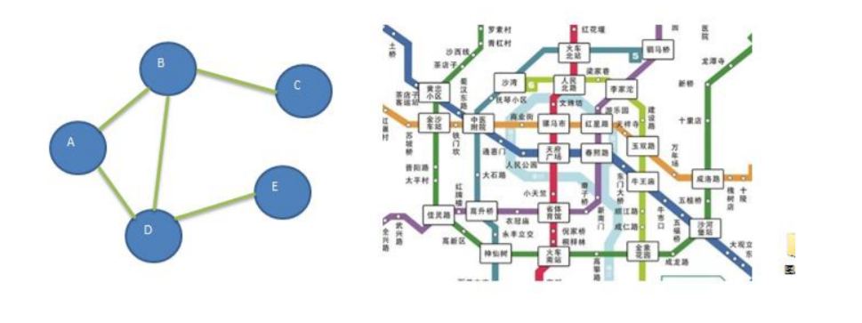
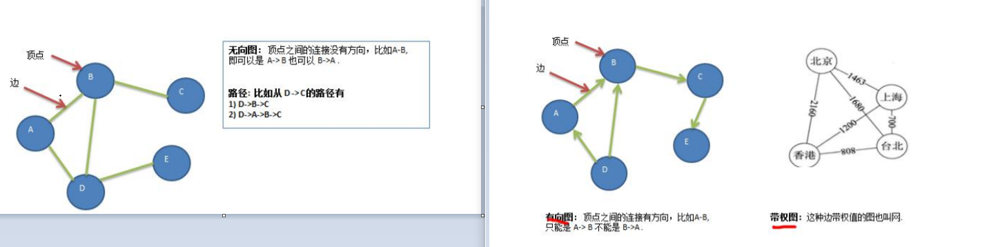
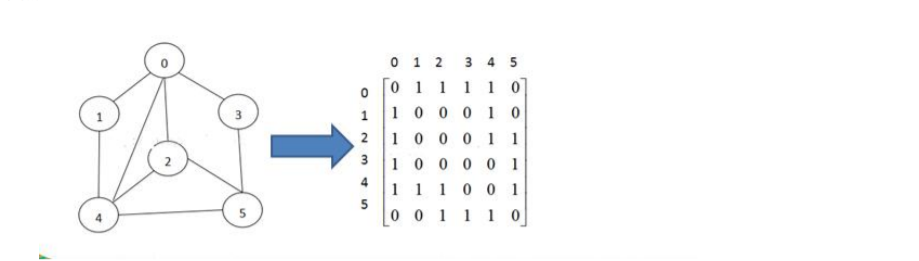
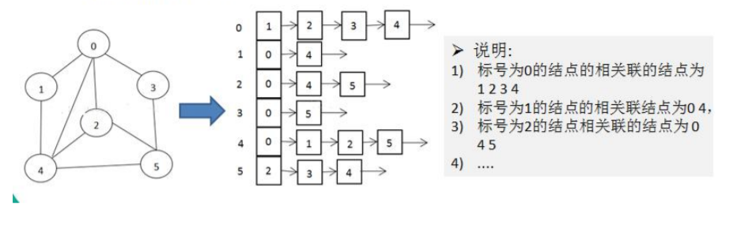

#### 图的概念

图是一种数据结构，其中结点可以具有零个或多个相邻元素。两个结点之间的连接称为边。 结点也可以称为顶点

#### 图的常用概念

+ 顶点(vertex) 、边(edge) 、路径 、无向图、有向图 、带权图

#### 图的表示方式

**二维数组表示（邻接矩阵）**

矩阵的 row代表顶点 ，col 代表和row有关系的顶点 坐标点1代表有关系 ，0代表没有关系

**链表表示（邻接表）**

+ 邻接表的实现只关心存在的边，不关心不存在的边。因此没有空间浪费，邻接表由数组+链表组成

