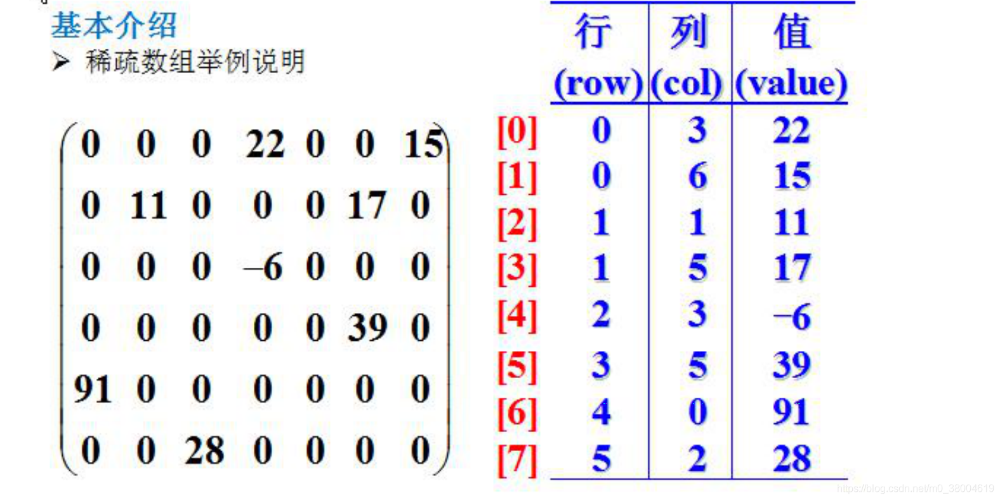

#### 稀疏数组思路

+ 脑海浮现一个棋盘数组和一个稀疏数组。

- 把棋盘数组大于0值的元素的行列及值记录在稀疏数组中，从而缩小程序的规模。



#### 应用实例

```
package main

import "fmt"

type ValNode struct {
   row int
   col int
   val int
}

func main() {
   //1. 先创建一个原始数组
   var chessMap [11][11]int
   chessMap[1][2] = 1 //黑子
   chessMap[2][3] = 2 //蓝子
   //2. 输出看看原始的数组
   for _, v := range chessMap {
      for _, v2 := range v {
         fmt.Printf("%d\t", v2)
      }
      fmt.Println()
   }

	 //3. 转成稀疏数组。想-> 算法
   // 思路
   //(1). 遍历 chessMap, 如果我们发现有一个元素的值不为 0，创建一个 node 结构体
   //(2). 将其放入到对应的切片即可
   var sparseArr []ValNode
   for i, v := range chessMap {
      for j, v2 := range v {
         if v2 != 0 {
            //创建一个 ValNode 值结点
            valNode := ValNode{row: i, col: j, val: v2,}
            sparseArr = append(sparseArr, valNode)
         }
      }
   }
   
   //输出稀疏数组
   fmt.Println("当前的稀疏数组是:::::")
   for _, valNode := range sparseArr {
      fmt.Println(valNode.row, valNode.col, valNode.val)
   }

   // 先创建一个原始数组
   var chessMap2 [11][11]int
   // 遍历 sparseArr [遍历文件每一行]
   for _, valNode := range sparseArr {
      chessMap2[valNode.row][valNode.col] = valNode.val
   }

   // 看看 chessMap2 是不是恢复. fmt.Println("恢复后的原始数据......")
   for _, v := range chessMap2 {
      for _, v2 := range v {
         fmt.Printf("%d\t", v2)
      }
      fmt.Println()
   }
} 
```

